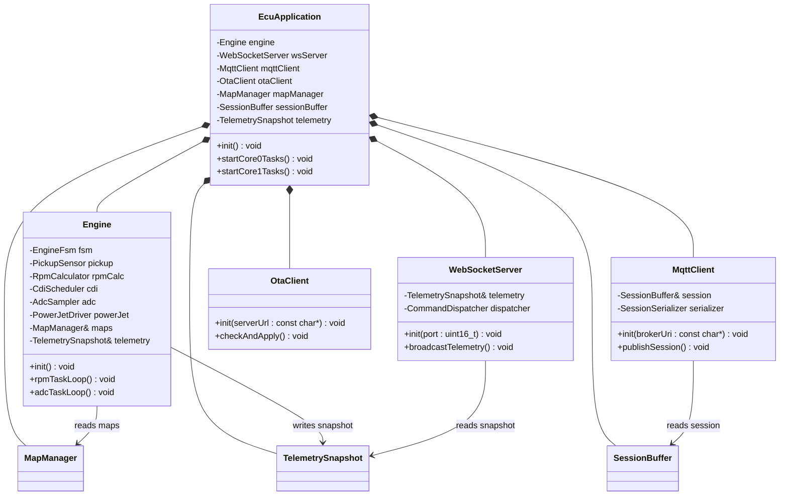
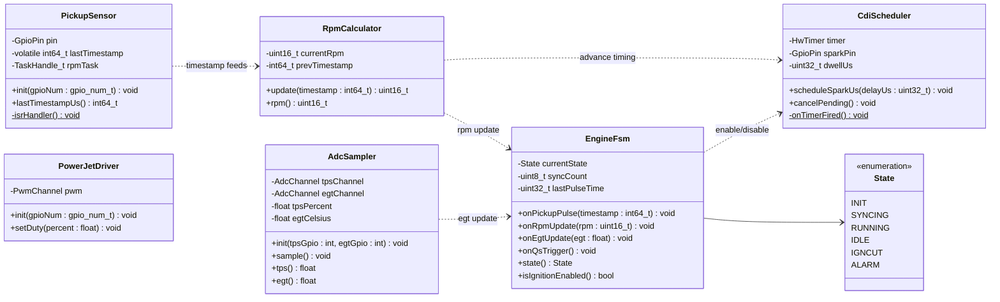
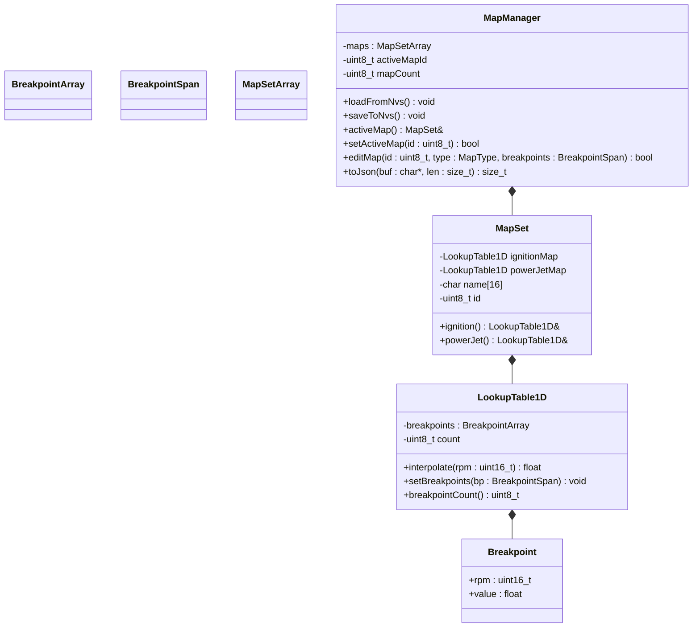
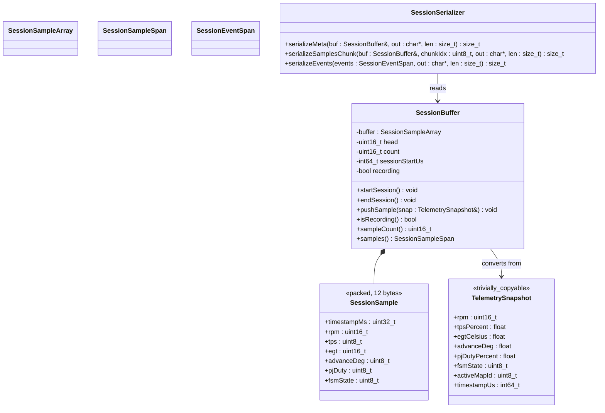
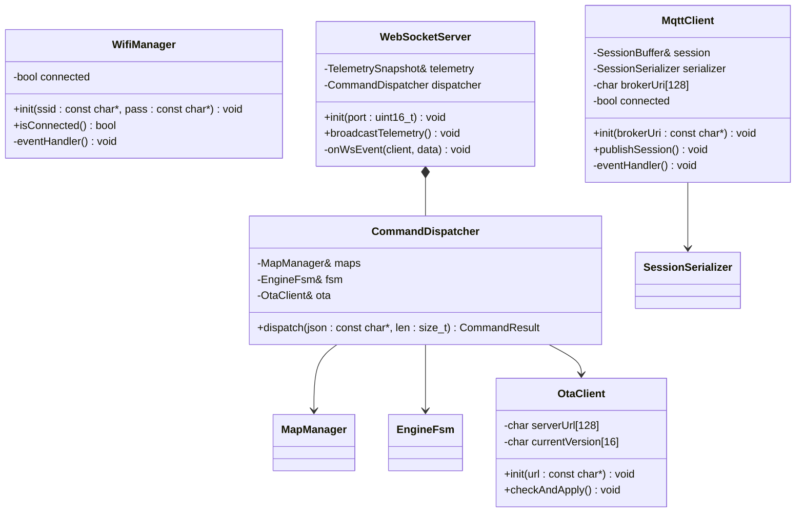
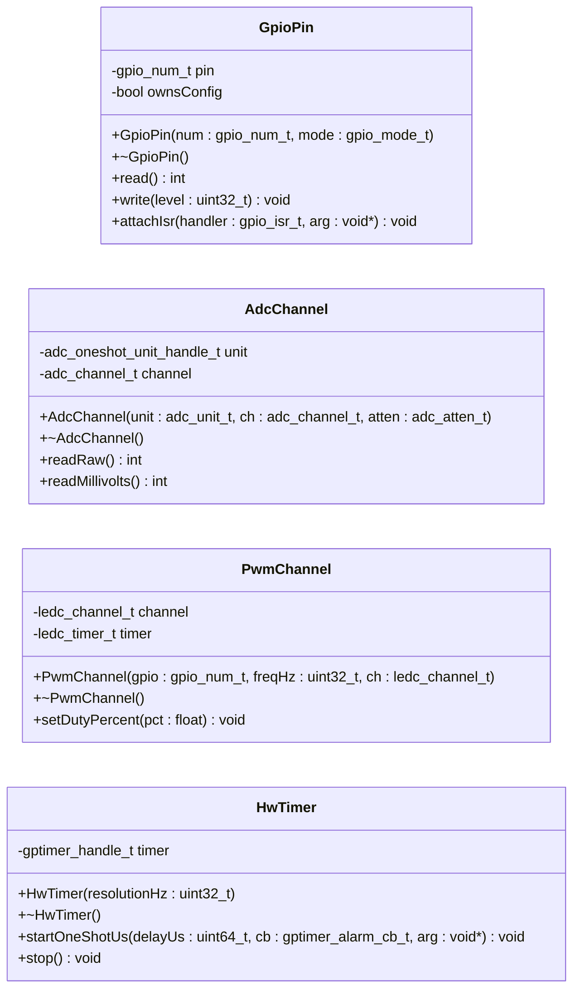

# OOP Architecture Plan — ECU Firmware (ESP-IDF / C++)

## 1. Current State Assessment

The project is at **ground zero** — [main.c](../main/main.c) contains an empty `app_main()`, and the full specification lives in [elaborato.md](elaborato.md) and [ECU.md](ECU.md). This is the **ideal** moment to choose an architecture: there is no legacy code to refactor, only a well-defined spec to implement.

The specification already reveals natural domain boundaries:
- A **sensor input layer** (Pick-up ISR, TPS ADC, EGT ADC)
- An **actuator output layer** (CDI timer, Power Jet PWM)
- An **engine state machine** (6-state FSM)
- A **map/lookup system** (1D tables in NVS with interpolation)
- A **communication stack** (WebSocket server, MQTT client, OTA client)
- A **telemetry/session buffer** (circular buffer, packed structs)
- A **shared data buffer** (cross-core telemetry snapshot)

Each of these maps directly to a class or small group of classes.

---

## 2. Proposed Module & Class Decomposition

### 2.1 Directory Layout

```
main/
├── CMakeLists.txt
├── main.cpp                       // app_main() — creates and wires everything
│
├── core/                          // Engine-critical, Core 0
│   ├── Engine.h / .cpp            // Top-level engine orchestrator
│   ├── EngineFsm.h / .cpp         // 6-state FSM
│   ├── PickupSensor.h / .cpp      // ISR + timestamp capture
│   ├── RpmCalculator.h / .cpp     // RPM from timestamps
│   ├── CdiScheduler.h / .cpp      // HW timer for spark
│   ├── AdcSampler.h / .cpp        // TPS + EGT periodic read
│   └── PowerJetDriver.h / .cpp    // PWM output for PJ solenoid
│
├── maps/                          // Lookup tables & interpolation
│   ├── LookupTable1D.h / .cpp     // Single 1D table with lerp
│   └── MapManager.h / .cpp        // Multi-map storage, NVS persistence
│
├── telemetry/                     // Data sharing & session logging
│   ├── TelemetrySnapshot.h        // POD struct (the shared buffer)
│   ├── SessionBuffer.h / .cpp     // Circular buffer of session_sample_t
│   └── SessionSerializer.h / .cpp // Binary → JSON for MQTT publish
│
├── comms/                         // Communication, Core 1
│   ├── WifiManager.h / .cpp       // STA connection management
│   ├── WebSocketServer.h / .cpp   // HTTP + WS via EspAsyncWebServer
│   ├── CommandDispatcher.h / .cpp  // JSON cmd parsing + routing
│   ├── MqttClient.h / .cpp        // Session publish to broker
│   └── OtaClient.h / .cpp         // Poll + download + apply
│
├── hal/                           // Hardware Abstraction Layer
│   ├── GpioPin.h                  // RAII GPIO wrapper
│   ├── AdcChannel.h               // RAII ADC oneshot wrapper
│   ├── PwmChannel.h               // RAII LEDC/MCPWM wrapper
│   └── HwTimer.h                  // RAII GP timer wrapper
│
└── util/                          // Shared utilities
    ├── FreeRtosTask.h             // CRTP or simple RAII task wrapper
    ├── Mutex.h                    // RAII mutex (std::lock_guard-style)
    ├── RingBuffer.h               // Generic fixed-capacity ring buffer
    └── Config.h                   // Compile-time constants (constexpr)
```

### 2.2 Rationale

Each directory represents a **module** with a clear responsibility boundary. Dependencies flow **downward**:

```
main.cpp
  ├── core/   (depends on: hal/, maps/, telemetry/)
  ├── comms/  (depends on: telemetry/, maps/)
  ├── maps/   (depends on: hal/ for NVS)
  └── telemetry/ (depends on: util/)
```

No circular dependencies. `hal/` and `util/` depend on nothing project-internal.

---

## 3. Class Diagrams

### 3.1 Top-Level Architecture



### 3.2 Engine Core (Core 0)



### 3.3 Map & Lookup System



### 3.4 Telemetry & Session Logging



### 3.5 Communication Stack (Core 1)



### 3.6 Hardware Abstraction Layer (HAL)



---

## 4. Heap Usage & Modern C++ on ESP32 — Guidelines

> **Important:**
> ESP32-S3 has ~512 KB SRAM total. After FreeRTOS kernel, WiFi/TLS stack, and LittleFS, only **~100–150 KB** remain. Every `new`/`malloc` competes for this pool and fragments it. The OOP design must be **allocation-aware**.

### 4.1 Strategies to Avoid Dynamic Allocation

| Technique | Where Applied | Example |
|---|---|---|
| **Stack-allocated objects** | All HAL wrappers, FSM, RPM calculator | `GpioPin pin{GPIO_NUM_4, GPIO_MODE_INPUT};` on stack or as member |
| **`std::array` over `std::vector`** | `LookupTable1D`, `MapManager`, `SessionBuffer` | `std::array<Breakpoint, 16> breakpoints;` — fixed capacity, zero heap |
| **Composition by value** | `Engine` owns `EngineFsm`, `PickupSensor`, etc. | Members live inline inside the parent object |
| **Placement in static storage** | `EcuApplication` singleton | `static EcuApplication app;` in `main.cpp` or use placement-new on a `static alignas` buffer |
| **`etl::string<N>` / `etl::vector<N>`** | Any place needing "dynamic-like" containers | [Embedded Template Library](https://www.etlcpp.com/) — fixed-capacity, no allocator, no exceptions |
| **`std::span` for non-owning views** | Function parameters that receive arrays | `void setBreakpoints(std::span<Breakpoint> bp)` — zero-copy, no ownership |
| **`constexpr` config** | Pin assignments, timing constants, buffer sizes | `constexpr gpio_num_t PICKUP_PIN = GPIO_NUM_4;` — resolved at compile time |
| **RAII destructors** | HAL wrappers release HW resources | `~GpioPin()` calls `gpio_reset_pin()` — no leak even on error paths |
| **Avoid `std::string`** | JSON serialization, MQTT topics | Use `char[]` buffers + `snprintf()` or `etl::string<N>` |
| **Avoid `std::function`** | Callbacks | Use function pointers + `void* arg` (C-style) or CRTP templates |
| **Delete copy, allow move** | HAL wrappers (non-copyable HW resource) | `GpioPin(const GpioPin&) = delete; GpioPin(GpioPin&&) = default;` |

### 4.2 Where Heap *Is* Acceptable

Not all allocation is evil. These ESP-IDF subsystems already allocate internally:

- **WiFi stack** — allocates buffers at init (~50 KB)
- **MQTT client** — internal send/receive buffers
- **HTTP/WS server** — per-connection buffers
- **OTA** — flash write buffers
- **NVS** — page cache

You can't avoid these. Focus on keeping **your** code heap-free so the ESP-IDF subsystems have maximum room.

### 4.3 Compile-Time Size Check Pattern

```cpp
// In Config.h
constexpr size_t MAX_BREAKPOINTS   = 16;
constexpr size_t MAX_MAPS          = 4;
constexpr size_t MAX_SAMPLES       = 8500;  // ~100 KB at 12 bytes each
constexpr size_t SESSION_BUF_BYTES = MAX_SAMPLES * sizeof(SessionSample);

static_assert(SESSION_BUF_BYTES <= 102400,
    "Session buffer exceeds 100 KB budget!");
```

This catches budget overruns **at compile time**, not at runtime when you're already on the bike.

---

## 5. Answers to Strategic Questions

### Q1: Is OOP worth the trade-off, given that this is a base for a bigger project?

**Yes — emphatically.** Here's the reasoning structured around the specific future features you mentioned:

| Future Feature | Without OOP (Procedural C) | With OOP (C++) |
|---|---|---|
| **Digital Twin** | The twin needs to replicate engine state. With procedural code, you must manually extract every global variable and pack it. If someone adds a new global, the twin silently goes stale. | `TelemetrySnapshot` is already a well-defined struct. The `Engine` class exposes `snapshot()`. The twin subscribes to the same interface. Adding a field means adding it in **one** place. |
| **More telemetry channels** | Every new sensor means: new global var, new ADC read in the big task function, new JSON field in the serializer, new entry in the session buffer. Miss any step → silent bug. | Add a new `SensorBase`-derived class, register it with `Engine`. The telemetry pipeline picks it up through the interface. |
| **Better ECU spark handling** | CDI logic is interleaved with RPM calculation and FSM transitions in one monolithic function. Changing spark strategy risks breaking FSM logic. | `CdiScheduler` is an isolated class. You can swap the scheduling algorithm (e.g., multi-spark, dwell control) without touching `EngineFsm`. |
| **3D maps (RPM × TPS)** | Rewrite the interpolation code, the NVS storage code, the JSON serializer, the WebSocket command handler — all separately, all tightly coupled. | Create `LookupTable2D` alongside `LookupTable1D`. Both conform to the same interface. `MapManager` stores either. The rest of the system is unaware. |

**Performance concern**: C++ classes on ESP32 have **zero runtime overhead** compared to C structs + function pointers — there's no vtable unless you use `virtual`, and even vtables are just a single pointer indirection (same cost as a function pointer in C). The ESP-IDF framework itself is increasingly C++ internally.

**The trade-off is real but small**:
- Slightly more upfront design time (but you're investing that *now*, which is free since there's no code yet)
- C++ compiler errors can be more cryptic
- Team members need C++ familiarity

**Bottom line**: The project is explicitly designed to grow. OOP gives you **compile-time guarantees** that procedural C cannot: if you add a sensor and forget to wire it, the compiler tells you (missing constructor argument, uninitialized member). In procedural C, you discover it on the dyno — or worse, on the track.

---

### Q2: How can we be sure to not leave anything behind when designing this OOP structure?

This is the right question. Here is a **systematic verification checklist** I used, and that you should apply as a discipline:

#### A. Specification Tracing Matrix

Every item in the specification must map to exactly one class. Here's the trace:

| Spec Item (from elaborato.md) | Mapped Class | Status |
|---|---|---|
| `pick_up_isr` | `PickupSensor` | ✅ |
| `rpm_task` | `RpmCalculator` + `Engine::rpmTaskLoop()` | ✅ |
| `adc_task` | `AdcSampler` + `Engine::adcTaskLoop()` | ✅ |
| `ws_task` | `WebSocketServer` | ✅ |
| `mqtt_task` | `MqttClient` | ✅ |
| `ota_task` | `OtaClient` | ✅ |
| FSM (6 states) | `EngineFsm` | ✅ |
| Ignition lookup table | `LookupTable1D` | ✅ |
| Power Jet lookup table | `LookupTable1D` (second instance) | ✅ |
| NVS persistence | `MapManager::loadFromNvs/saveToNvs` | ✅ |
| `ecu_telemetry_t` shared buffer | `TelemetrySnapshot` | ✅ |
| CDI timer scheduling | `CdiScheduler` | ✅ |
| Power Jet PWM | `PowerJetDriver` | ✅ |
| WebSocket telemetry broadcast | `WebSocketServer::broadcastTelemetry()` | ✅ |
| WebSocket command handling | `CommandDispatcher` | ✅ |
| Session circular buffer | `SessionBuffer` | ✅ |
| MQTT session publish (chunked) | `SessionSerializer` + `MqttClient` | ✅ |
| WiFi STA connection | `WifiManager` | ✅ |
| HTTP static file serving | `WebSocketServer` (LittleFS) | ✅ |
| OTA poll + apply | `OtaClient` | ✅ |
| QS trigger handling | `CommandDispatcher` → `EngineFsm::onQsTrigger()` | ✅ |
| Map editing via WS | `CommandDispatcher` → `MapManager::editMap()` | ✅ |
| Map switching | `CommandDispatcher` → `MapManager::setActiveMap()` | ✅ |
| EGT alarm threshold | `EngineFsm::onEgtUpdate()` | ✅ |

#### B. Data Flow Verification

Trace every data path from the spec and ensure it flows through the class graph:

```
Pick-up pulse → PickupSensor (ISR) → RpmCalculator → EngineFsm (state transition)
                                    → CdiScheduler (spark timing from MapManager)
                                    → TelemetrySnapshot (rpm field)

ADC sample → AdcSampler → EngineFsm (EGT alarm check)
                        → PowerJetDriver (duty from MapManager)
                        → TelemetrySnapshot (tps, egt fields)

TelemetrySnapshot → WebSocketServer (JSON broadcast to dashboard)
                  → SessionBuffer (downsampled recording)

SessionBuffer → SessionSerializer → MqttClient (end-of-session publish)

Dashboard cmd → WebSocketServer → CommandDispatcher → MapManager / EngineFsm / OtaClient
```

#### C. Ongoing Discipline — Rules to Follow

1. **"No orphan globals" rule**: Every piece of mutable state must live inside a class. If you catch yourself writing `static int foo;` at file scope, stop — it belongs in a class.

2. **Constructor = contract**: If a class needs a dependency, take it as a constructor reference parameter. This makes the dependency graph explicit and compiler-enforced. You *cannot* forget to wire something.

3. **Integration tests per data path**: For each arrow in the data flow diagram above, write a test that pushes data through it. If a path has no test, it will rot.

4. **Review against spec on every PR**: Keep the tracing matrix above in version control (e.g., as a table in a `docs/tracing.md`). On every PR, check: does this PR add a spec item? If yes, update the table. If the table has unchecked items, the PR is incomplete.

5. **Future-proofing protocol**: When adding a future feature (e.g., knock sensor), the checklist is:
   - [ ] Create a new class (e.g., `KnockSensor`)
   - [ ] Add it as a member of `Engine`
   - [ ] Wire it in `Engine`'s constructor
   - [ ] Add its data to `TelemetrySnapshot`
   - [ ] Update `SessionSample` if it should be logged
   - [ ] Update `SessionSerializer`
   - [ ] Update `CommandDispatcher` if it has WS commands
   - [ ] Update the tracing matrix

---

## 6. Open Questions

> **Important:**
> **C++ Standard version**: ESP-IDF v5.x supports C++20 (`-std=gnu++20`). Do you want to target C++20 (enables `std::span`, concepts, `consteval`) or stay conservative with C++17?

> **Important:**
> **ETL (Embedded Template Library)**: Do you want to add [etl](https://www.etlcpp.com/) as a dependency? It provides heap-free containers (`etl::vector<T,N>`, `etl::string<N>`, `etl::map<K,V,N>`) that are more ergonomic than raw `std::array`. The trade-off is one more dependency.

> **Important:**
> **Virtual dispatch**: The HAL classes (`GpioPin`, `AdcChannel`, etc.) could use `virtual` methods to enable mock-based unit testing (inject a `MockAdcChannel` in tests). This adds a vtable pointer (4 bytes per object) and one indirection per call. Is testability via mocks a priority, or do you prefer zero-virtual, template-based (CRTP) static dispatch?

> **Warning:**
> **Thread safety model**: The `TelemetrySnapshot` cross-core shared buffer can be protected with either:
> - A **FreeRTOS mutex** (safe, simple, adds ~1 µs latency per access)
> - An **atomic copy** via `std::atomic` on a packed struct (lock-free, but struct must be ≤ 8 bytes for true atomicity on Xtensa — yours is 26 bytes, so not viable)
> - A **double-buffer swap** (lock-free: Core 0 writes to buffer A, then atomically swaps a pointer; Core 1 always reads the "published" buffer)
>
> Which model do you prefer?

---

## 7. Verification Plan

### Automated
- `idf.py build` must compile with `-std=gnu++20 -Wall -Wextra -Werror`
- `static_assert` checks on buffer sizes, struct packing, alignment
- Unit tests for `LookupTable1D::interpolate()`, `EngineFsm` transitions, `SessionSerializer` output

### Manual
- Trace every row in the Specification Tracing Matrix (§5 Q2.A)
- Walk through each data flow path with the class diagram
- Review constructor dependency graph for completeness
