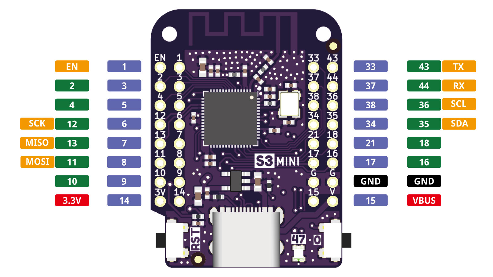

# ESP32-S3 Mini Development Board

Compact ESP32-S3 development board based on the ESP32-S3FH4R2 package. It
provides 2.4 GHz Wi-Fi, Bluetooth LE, native USB, 4 MB flash, 2 MB PSRAM, and
3.3 V GPIO broken out on two side headers.

## Board Summary

| Item | Value |
| --- | --- |
| Main chip | ESP32-S3FH4R2 |
| CPU | Dual-core Xtensa LX7, up to 240 MHz |
| Wireless | 2.4 GHz Wi-Fi and Bluetooth LE |
| Flash | 4 MB |
| PSRAM | 2 MB |
| Logic voltage | 3.3 V |
| USB | Native USB through USB-C; VBUS is exposed on the right header |
| Exposed GPIO | 27 GPIO pins plus EN, 3V3, GND, and VBUS |
| On-board LED | RGB LED on GPIO47 |
| Board size | 34.3 x 25.4 mm |

## Reference Files

- [Schematic V1.0.0](sch_s3_mini_v1.0.0.pdf)
- [Pin tables extracted from the ESP32-S3 datasheet](tables.md)
- [ESP32-S3 datasheet](https://documentation.espressif.com/esp32-s3_datasheet_en.pdf)

## Pin Priority Legend

The notes below use the ESP32-S3 datasheet priority labels from `tables.md`.

| Priority | Meaning |
| --- | --- |
| P1 | Fixed peripheral function through IO MUX or RTC IO MUX. |
| P2 | General-purpose GPIO with no special restriction in the datasheet table. |
| P3 | Usable with caution because the pin may overlap with strapping, USB/JTAG, JTAG, UART0, or 8-line SPI/PSRAM-related functions. |
| P4 | Avoid for ordinary GPIO; allocated or not recommended because of flash/PSRAM SPI0/1 use. |

## Left Header Pins

| Header pin | Board label | Chip pin | RTC GPIO | Reset state | Main functions | Notes |
| --- | --- | ---: | --- | --- | --- | --- |
| EN | Reset/chip enable |  |  |  | Pull low to reset the chip; keep high for run | Board control pin |
| GPIO1 |  | 6 | RTC_GPIO1 | IE | ADC1_CH0; TOUCH1 | P2: general GPIO |
| GPIO2 |  | 7 | RTC_GPIO2 | IE | ADC1_CH1; TOUCH2 | P2: general GPIO |
| GPIO4 |  | 9 | RTC_GPIO4 |  | ADC1_CH3; TOUCH4 | P2: general GPIO |
| GPIO12 | SCK | 17 | RTC_GPIO12 |  | ADC2_CH1; TOUCH12; SPI: SUBSPICLK, FSPICLK, FSPIIO6 | P2: general GPIO |
| GPIO13 | MISO | 18 | RTC_GPIO13 |  | ADC2_CH2; TOUCH13; SPI: SUBSPIQ, FSPIQ, FSPIIO7 | P2: general GPIO |
| GPIO11 | MOSI | 16 | RTC_GPIO11 |  | ADC2_CH0; TOUCH11; SPI: SUBSPID, FSPID, FSPIIO5 | P2: general GPIO |
| GPIO10 |  | 15 | RTC_GPIO10 |  | ADC1_CH9; TOUCH10; SPI: SUBSPICS0, FSPICS0, FSPIIO4 | P2: general GPIO |
| 3V3 | 3.3 V output/input |  |  |  | Regulated 3.3 V rail | Power |
| GPIO3 |  | 8 | RTC_GPIO3 | IE | ADC1_CH2; TOUCH3 | P3: caution, strapping pin |
| GPIO5 |  | 10 | RTC_GPIO5 |  | ADC1_CH4; TOUCH5 | P2: general GPIO |
| GPIO6 |  | 11 | RTC_GPIO6 |  | ADC1_CH5; TOUCH6 | P2: general GPIO |
| GPIO7 |  | 12 | RTC_GPIO7 |  | ADC1_CH6; TOUCH7 | P2: general GPIO |
| GPIO8 |  | 13 | RTC_GPIO8 |  | ADC1_CH7; TOUCH8; SPI: SUBSPICS1 | P2: general GPIO |
| GPIO9 |  | 14 | RTC_GPIO9 |  | ADC1_CH8; TOUCH9; SPI: SUBSPIHD, FSPIHD | P2: general GPIO |
| GPIO14 |  | 19 | RTC_GPIO14 |  | ADC2_CH3; TOUCH14; SPI: SUBSPIWP, FSPIWP, FSPIDQS | P2: general GPIO |

## Right Header Pins

| Header pin | Board label | Chip pin | RTC GPIO | Reset state | Main functions | Notes |
| --- | --- | ---: | --- | --- | --- | --- |
| GPIO33 |  | 38 |  |  | SPI: SPIIO4, SUBSPIHD, FSPIHD | P3: caution, 8-line SPI/PSRAM related |
| GPIO37 |  | 42 |  |  | SPI: SPIDQS, SUBSPIQ, FSPIQ | P3: caution, 8-line SPI/PSRAM related |
| GPIO38 |  | 43 |  |  | GPIO38; SPI: SUBSPIWP, FSPIWP | P2: general GPIO |
| GPIO34 |  | 39 |  |  | SPI: SPIIO5, SUBSPICS0, FSPICS0 | P3: caution, 8-line SPI/PSRAM related |
| GPIO21 |  | 27 | RTC_GPIO21 |  | GPIO21 | P2: general GPIO |
| GPIO17 |  | 23 | RTC_GPIO17 |  | ADC2_CH6; U1TXD | P2: general GPIO |
| GND | Ground |  |  |  | 0 V reference | Power |
| GPIO15 |  | 21 | RTC_GPIO15 |  | ADC2_CH4; U0RTS | P2: general GPIO |
| GPIO43 | TX | 49 |  | WPU,IE | U0TXD | P3: caution, UART0 console |
| GPIO44 | RX | 50 |  | WPU,IE | U0RXD | P3: caution, UART0 console |
| GPIO36 | SCL | 41 |  |  | SPI: SPIIO7, SUBSPICLK, FSPICLK | P3: caution, 8-line SPI/PSRAM related |
| GPIO35 | SDA | 40 |  |  | SPI: SPIIO6, SUBSPID, FSPID | P3: caution, 8-line SPI/PSRAM related |
| GPIO18 |  | 24 | RTC_GPIO18 |  | ADC2_CH7; U1RXD | P2: general GPIO |
| GPIO16 |  | 22 | RTC_GPIO16 |  | ADC2_CH5; U0CTS | P2: general GPIO |
| GND | Ground |  |  |  | 0 V reference | Power |
| VBUS | USB 5 V |  |  |  | USB bus voltage | Power |

## Practical Notes

- GPIO3 is a strapping pin. Avoid external circuits that force the wrong level during reset.
- GPIO43 and GPIO44 are UART0 TX/RX and are commonly used for the serial console.
- GPIO33 through GPIO37 are marked P3 in the ESP32-S3 datasheet because they can overlap with 8-line SPI/PSRAM-related functions.
- GPIO19 and GPIO20 are the native USB D- and D+ pins. They are used by the USB-C connection and are not broken out on these headers.
- GPIO47 is connected to the on-board RGB LED and is not part of the side-header pin list.
