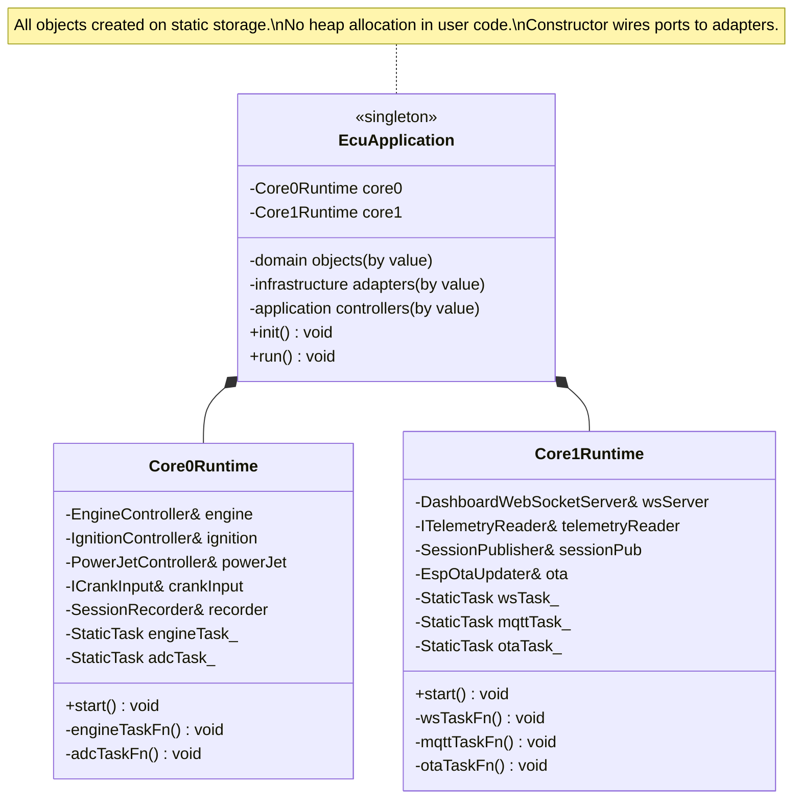

# OOP Architecture Plan v2 — SOLID ECU Firmware

## 1. Architectural Philosophy
### Layer Rules

| Layer | May Depend On | Never Depends On | Contains |
|---|---|---|---|
| **domain/** | Nothing (pure C++) | application, ports, infrastructure, runtime | Value types, state machines, algorithms, policies |
| **application/** | domain/, ports/ (interfaces only) | infrastructure, runtime | Use-case orchestration, controllers |
| **ports/** | domain/ (value types only) | application, infrastructure, runtime | Abstract interfaces (`I*` classes) |
| **infrastructure/** | ports/, domain/ | application, runtime | ESP-IDF concrete implementations of port interfaces |
| **runtime/** | Everything | — | `app_main()`, FreeRTOS task creation, dependency wiring |

```
         ┌──────────────────────────────────────────────┐
         │                runtime/                       │
         │   EcuApplication, Core0Runtime, Core1Runtime  │
         └──────┬───────────────┬───────────────┬───────┘
                │               │               │
       ┌────────▼───────┐ ┌────▼──────┐ ┌──────▼────────────┐
       │ application/   │ │  ports/   │ │ infrastructure/    │
       │ Controllers,   │ │ I*        │ │ Esp*, Nvs*, Ledc*, │
       │ Services       │◄┤ Interfaces├►│ Gptimer*           │
       └────────┬───────┘ └────┬──────┘ └───────────────────┘
                │              │
           ┌────▼──────────────▼───┐
           │       domain/          │
           │  FSM, Estimators,      │
           │  Value Objects, Policies│
           └────────────────────────┘
```

Dependencies point **inward**. The real-time engine core never sees `WebSocket`, `MQTT`, or `NVS` — only abstract ports.

---

## 2. Directory Layout

```
main/
├── CMakeLists.txt
├── main.cpp                          // app_main() → EcuApplication::run()
│
├── domain/                           // Pure C++, zero ESP-IDF includes
│   ├── EngineStateMachine.h / .cpp   // 6-state FSM, event-driven, no HW
│   ├── EngineState.h                 // enum class + helpers
│   ├── EngineEvent.h                 // typed event variants
│   ├── RpmEstimator.h / .cpp         // Timestamps → RPM, phase tracking
│   ├── SafetySupervisor.h / .cpp     // EGT alarm policy, rev limiter
│   ├── QuickShiftPolicy.h / .cpp     // QS cut duration, cycle counting
│   ├── OperatingPoint.h              // {rpm, tps, egt} value object
│   ├── AdvanceMap.h / .cpp           // 1D table + linear interpolation
│   ├── PowerJetMap.h / .cpp          // 1D table + linear interpolation
│   ├── Breakpoint.h                  // {rpm, value} POD
│   ├── MapSet.h                      // {ignition map, PJ map, name, id}
│   └── TelemetrySnapshot.h           // POD value object, trivially copyable
│
├── application/                      // Use-case orchestration
│   ├── EngineController.h / .cpp     // Coordinates FSM + safety + advance lookup
│   ├── IgnitionController.h / .cpp   // Reads IAdvanceProvider → commands ISparkScheduler
│   ├── PowerJetController.h / .cpp   // Reads IPowerJetProvider → commands IPwmOutput
│   ├── CalibrationService.h / .cpp   // Map CRUD, active map switching
│   ├── SessionRecorder.h / .cpp      // Downsamples telemetry → session buffer
│   ├── SessionPublisher.h / .cpp     // Serializes + pushes via ISessionTransport
│   ├── CommandRouter.h / .cpp        // JSON parse → typed dispatch (no domain knowledge)
│   └── handlers/                     // One file per command type
│       ├── SetActiveMapHandler.h / .cpp
│       ├── EditMapHandler.h / .cpp
│       ├── QuickShiftHandler.h / .cpp
│       ├── GetConfigHandler.h / .cpp
│       └── StartOtaHandler.h / .cpp
│
├── ports/                            // Pure abstract interfaces
│   ├── ICrankInput.h                 // Pulse timestamps
│   ├── IThrottleInput.h              // TPS reading
│   ├── IEgtInput.h                   // EGT reading
│   ├── IAdvanceProvider.h            // f(OperatingPoint) → advance degrees
│   ├── IPowerJetProvider.h           // f(OperatingPoint) → duty %
│   ├── ISparkScheduler.h             // Schedule spark at delay µs
│   ├── IPwmOutput.h                  // Set PWM duty
│   ├── ITelemetrySink.h              // Write new snapshot (Core 0 side)
│   ├── ITelemetryReader.h            // Read latest snapshot (Core 1 side)
│   ├── IMapRepository.h              // Load / save map sets
│   ├── ISessionTransport.h           // Publish session data (MQTT abstracted)
│   ├── IFirmwareUpdater.h            // Check + apply OTA
│   ├── IWebSocketBroadcaster.h       // Push telemetry JSON to clients
│   └── ICommandSink.h               // Receive parsed commands
│
├── infrastructure/                   // ESP-IDF concrete adapters
│   ├── EspPickupInput.h / .cpp       // GPIO ISR → ICrankInput
│   ├── EspAdcThrottleSensor.h / .cpp // ADC oneshot → IThrottleInput
│   ├── EspAdcEgtSensor.h / .cpp      // ADC oneshot → IEgtInput
│   ├── GptimerSparkScheduler.h / .cpp// GP timer → ISparkScheduler
│   ├── LedcPowerJetOutput.h / .cpp   // LEDC PWM → IPwmOutput
│   ├── NvsMapRepository.h / .cpp     // NVS blob → IMapRepository
│   ├── TelemetryStore.h / .cpp       // Mutex/double-buffer → ITelemetrySink + ITelemetryReader
│   ├── EspWifiManager.h / .cpp       // STA connection lifecycle
│   ├── DashboardWebSocketServer.h / .cpp // EspAsyncWebServer → IWebSocketBroadcaster + ICommandSink
│   ├── EspMqttTransport.h / .cpp     // esp_mqtt_client → ISessionTransport
│   ├── EspOtaUpdater.h / .cpp        // esp_https_ota → IFirmwareUpdater
│   └── LittleFsHttpServer.h / .cpp   // Static file serving (gzip)
│
├── runtime/                          // FreeRTOS task ownership + wiring
│   ├── EcuApplication.h / .cpp       // Instantiates everything, wires ports → adapters
│   ├── Core0Runtime.h / .cpp         // Creates & pins Core 0 tasks (engine, ADC)
│   └── Core1Runtime.h / .cpp         // Creates & pins Core 1 tasks (WS, MQTT, OTA)
│
└── util/                             // Framework-agnostic helpers
    ├── RingBuffer.h                  // Fixed-capacity ring buffer (std::array backed)
    ├── Mutex.h                       // RAII FreeRTOS mutex wrapper
    ├── StaticTask.h                  // RAII static task creation wrapper
    └── Config.h                      // constexpr constants, static_asserts
```

---

## 3. Class Diagrams

### 3.1 Domain Layer — Pure Logic, Zero Dependencies

```mermaid
classDiagram
    direction TB

    %% Diagram-only C++ type aliases (portable Mermaid rendering per requirements; not in C++ source)
    class BreakpointArray
    class CharArray16
    class BreakpointSpan
    class OptionalEngineEvent

    class EngineState {
        <<enumeration>>
        Init
        Syncing
        Running
        Idle
        IgnCut
        Alarm
    }

    class EngineEvent {
        <<variant>>
        PulseDetected
        SyncAcquired
        SyncLost
        RpmAboveIdle
        RpmBelowIdle
        RpmZero
        EgtAlarm
        EgtSafe
        QuickShiftRequest
        IgnCutComplete
    }

    class EngineStateMachine {
        -EngineState state_
        -uint8_t syncCount_
        +process(event : EngineEvent) EngineState
        +state() EngineState
        +isIgnitionAllowed() bool
        +reset() void
    }

    class RpmEstimator {
        -int64_t prevTimestampUs_
        -uint16_t currentRpm_
        -uint16_t filteredRpm_
        +update(timestampUs : int64_t) uint16_t
        +rpm() uint16_t
    }

    class SafetySupervisor {
        -float egtAlarmThreshold_
        -uint16_t revLimitRpm_
        +evaluate(egt : float, rpm : uint16_t) OptionalEngineEvent
        +setEgtThreshold(deg : float) void
        +setRevLimit(rpm : uint16_t) void
    }

    class QuickShiftPolicy {
        -uint8_t cutCycles_
        -uint8_t remainingCuts_
        +onRequest() void
        +onIgnitionCycle() bool
        +isActive() bool
        +setCutCycles(n : uint8_t) void
    }

    class OperatingPoint {
        <<value_object>>
        +rpm : uint16_t
        +tpsPercent : float
        +egtCelsius : float
    }

    class Breakpoint {
        <<value_object>>
        +rpm : uint16_t
        +value : float
    }

    class AdvanceMap {
        -bp_ : BreakpointArray
        -uint8_t count_
        +interpolate(rpm : uint16_t) float
        +setBreakpoints(bp : BreakpointSpan) bool
        +count() uint8_t
        +breakpoints() BreakpointSpan
    }

    class PowerJetMap {
        -bp_ : BreakpointArray
        -uint8_t count_
        +interpolate(rpm : uint16_t) float
        +setBreakpoints(bp : BreakpointSpan) bool
        +count() uint8_t
        +breakpoints() BreakpointSpan
    }

    class MapSet {
        <<value_object>>
        +id : uint8_t
        +name : CharArray16
        +ignition : AdvanceMap
        +powerJet : PowerJetMap
    }

    class TelemetrySnapshot {
        <<trivially_copyable>>
        +rpm : uint16_t
        +tpsPercent : float
        +egtCelsius : float
        +advanceDeg : float
        +pjDutyPercent : float
        +fsmState : EngineState
        +activeMapId : uint8_t
        +timestampUs : int64_t
    }

    EngineStateMachine --> EngineState
    EngineStateMachine --> EngineEvent
    SafetySupervisor ..> EngineEvent : produces
    QuickShiftPolicy ..> EngineEvent : produces
    AdvanceMap *-- Breakpoint
    PowerJetMap *-- Breakpoint
    MapSet *-- AdvanceMap
    MapSet *-- PowerJetMap
    TelemetrySnapshot --> EngineState
```



> **Note:**
> `AdvanceMap` and `PowerJetMap` are **separate classes** despite identical structure. This is intentional — they represent different domain concepts and will likely diverge when 3D maps (RPM × TPS) are added for ignition but not necessarily for Power Jet. If you want to share the interpolation implementation, extract a private `LookupTable1D` utility they both delegate to — but keep the public types distinct.

### 3.2 Ports Layer — The Dependency Inversion Boundary

```mermaid
classDiagram
    direction TB

    %% Diagram-only alias
    class MapSetSpan

    class ICrankInput {
        <<interface>>
        +lastPulseTimestampUs() int64_t
        +attachPulseCallback(cb : void(*)(int64_t, void*), arg : void*) void
    }

    class IThrottleInput {
        <<interface>>
        +readTpsPercent() float
    }

    class IEgtInput {
        <<interface>>
        +readEgtCelsius() float
    }

    class IAdvanceProvider {
        <<interface>>
        +advanceDeg(op : OperatingPoint) float
    }

    class IPowerJetProvider {
        <<interface>>
        +dutyPercent(op : OperatingPoint) float
    }

    class ISparkScheduler {
        <<interface>>
        +scheduleSparkUs(delayUs : uint32_t) void
        +cancelPending() void
    }

    class IPwmOutput {
        <<interface>>
        +setDutyPercent(pct : float) void
    }

    class ITelemetrySink {
        <<interface>>
        +publish(snap : TelemetrySnapshot const&) void
    }

    class ITelemetryReader {
        <<interface>>
        +latest() TelemetrySnapshot
    }

    class IMapRepository {
        <<interface>>
        +loadAll(out : MapSetSpan) uint8_t
        +save(map : MapSet const&) bool
        +saveActiveId(id : uint8_t) bool
        +loadActiveId() uint8_t
    }

    class ISessionTransport {
        <<interface>>
        +publishMeta(json : const char*, len : size_t) bool
        +publishSamplesChunk(json : const char*, len : size_t) bool
        +publishEvents(json : const char*, len : size_t) bool
    }

    class IFirmwareUpdater {
        <<interface>>
        +checkAvailable() OtaVersionInfo
        +applyUpdate() bool
    }

    class IWebSocketBroadcaster {
        <<interface>>
        +broadcast(json : const char*, len : size_t) void
        +sendTo(clientId : uint32_t, json : const char*, len : size_t) void
    }

    class ICommandSink {
        <<interface>>
        +onCommand(json : const char*, len : size_t, clientId : uint32_t) void
    }
```



> **Tip:**
> **Why separate `ITelemetrySink` and `ITelemetryReader`?** ISP: Core 0 only needs write access, Core 1 only needs read access. The concrete `TelemetryStore` implements both, but each consumer sees only the facet it needs — which also prevents accidental writes from Core 1.

### 3.3 Application Layer — Use-Case Orchestration

```mermaid
classDiagram
    direction TB

    %% Diagram-only aliases (C++ normalization)
    class MapSetArray
    class RingBufferSessionSample
    class CommandHandlerPtrArray
    class MapSetPtr

    class EngineController {
        -EngineStateMachine& fsm
        -RpmEstimator& rpmEst
        -SafetySupervisor& safety
        -QuickShiftPolicy& qsPolicy
        -IThrottleInput& throttle
        -IEgtInput& egt
        -ITelemetrySink& telemetrySink
        +onCrankPulse(timestampUs : int64_t) void
        +onAdcCycle() void
        +requestQuickShift() void
        +currentOperatingPoint() OperatingPoint
        +fsmState() EngineState
    }

    class IgnitionController {
        -IAdvanceProvider& advanceProvider
        -ISparkScheduler& spark
        -EngineController& engine
        +onCrankPulse(timestampUs : int64_t) void
    }

    class PowerJetController {
        -IPowerJetProvider& pjProvider
        -IPwmOutput& pwmOut
        -EngineController& engine
        +update() void
    }

    class CalibrationService {
        -MapCatalog& catalog
        -IMapRepository& repo
        +activeMapId() uint8_t
        +setActiveMap(id : uint8_t) bool
        +editIgnitionMap(id : uint8_t, bp : BreakpointSpan) bool
        +editPowerJetMap(id : uint8_t, bp : BreakpointSpan) bool
        +allMapsJson(buf : char*, len : size_t) size_t
    }

    class MapCatalog {
        -maps_ : MapSetArray
        -uint8_t activeId_
        -uint8_t count_
        +activeMap() MapSet&
        +map(id : uint8_t) MapSetPtr
        +setActiveId(id : uint8_t) bool
        +loadFrom(repo : IMapRepository&) void
    }

    class SessionRecorder {
        -buffer_ : RingBufferSessionSample
        -int64_t sessionStartUs_
        -bool recording_
        +startSession() void
        +endSession() void
        +pushSample(snap : TelemetrySnapshot const&) void
        +isRecording() bool
    }

    class SessionPublisher {
        -SessionRecorder& recorder
        -ISessionTransport& transport
        +publish() bool
    }

    class CommandRouter {
        -handlers_ : CommandHandlerPtrArray
        -uint8_t handlerCount_
        +registerHandler(handler : ICommandHandler&) void
        +dispatch(json : const char*, len : size_t, clientId : uint32_t) void
    }

    class ICommandHandler {
        <<interface>>
        +commandName() const char*
        +handle(params : JsonView, clientId : uint32_t) CommandResult
    }

    class SetActiveMapHandler {
        -CalibrationService& cal
        +commandName() const char*
        +handle(params : JsonView, clientId : uint32_t) CommandResult
    }

    class EditMapHandler {
        -CalibrationService& cal
        +commandName() const char*
        +handle(params : JsonView, clientId : uint32_t) CommandResult
    }

    class QuickShiftHandler {
        -EngineController& engine
        +commandName() const char*
        +handle(params : JsonView, clientId : uint32_t) CommandResult
    }

    class StartOtaHandler {
        -IFirmwareUpdater& ota
        +commandName() const char*
        +handle(params : JsonView, clientId : uint32_t) CommandResult
    }

    EngineController --> EngineStateMachine
    EngineController --> RpmEstimator
    EngineController --> SafetySupervisor
    EngineController --> QuickShiftPolicy
    EngineController --> IThrottleInput
    EngineController --> IEgtInput
    EngineController --> ITelemetrySink

    IgnitionController --> IAdvanceProvider
    IgnitionController --> ISparkScheduler
    IgnitionController --> EngineController

    PowerJetController --> IPowerJetProvider
    PowerJetController --> IPwmOutput
    PowerJetController --> EngineController

    CalibrationService --> MapCatalog
    CalibrationService --> IMapRepository
    MapCatalog *-- MapSet

    SessionPublisher --> SessionRecorder
    SessionPublisher --> ISessionTransport

    CommandRouter *-- ICommandHandler
    SetActiveMapHandler ..|> ICommandHandler
    EditMapHandler ..|> ICommandHandler
    QuickShiftHandler ..|> ICommandHandler
    StartOtaHandler ..|> ICommandHandler
    SetActiveMapHandler --> CalibrationService
    EditMapHandler --> CalibrationService
    QuickShiftHandler --> EngineController
    StartOtaHandler --> IFirmwareUpdater
```



### 3.4 Infrastructure Layer — ESP-IDF Adapters

```mermaid
classDiagram
    direction TB

    %% Diagram-only aliases
    class MapSetSpan
    class AtomicUint8

    class EspPickupInput {
        -gpio_num_t pin_
        -volatile int64_t lastTimestamp_
        -void(*callback_)(int64_t, void*)
        -void* callbackArg_
        +EspPickupInput(pin : gpio_num_t)
        +lastPulseTimestampUs() int64_t
        +attachPulseCallback(cb, arg) void
        -isrHandler() void
    }

    class EspAdcThrottleSensor {
        -adc_oneshot_unit_handle_t unit_
        -adc_channel_t channel_
        -float scale_
        -float offset_
        +EspAdcThrottleSensor(unit : adc_unit_t, ch : adc_channel_t)
        +readTpsPercent() float
    }

    class EspAdcEgtSensor {
        -adc_oneshot_unit_handle_t unit_
        -adc_channel_t channel_
        -float maxTempC_
        +EspAdcEgtSensor(unit : adc_unit_t, ch : adc_channel_t)
        +readEgtCelsius() float
    }

    class GptimerSparkScheduler {
        -gptimer_handle_t timer_
        -gpio_num_t sparkPin_
        -uint32_t dwellUs_
        +GptimerSparkScheduler(pin : gpio_num_t, dwellUs : uint32_t)
        +scheduleSparkUs(delayUs : uint32_t) void
        +cancelPending() void
        -onAlarm() bool
    }

    class LedcPowerJetOutput {
        -ledc_channel_t channel_
        -ledc_timer_t timer_
        +LedcPowerJetOutput(pin : gpio_num_t, freqHz : uint32_t)
        +setDutyPercent(pct : float) void
    }

    class TelemetryStore {
        -TelemetrySnapshot buffers_[2]
        -activeIdx_ : AtomicUint8
        +publish(snap : TelemetrySnapshot const&) void
        +latest() TelemetrySnapshot
    }

    class NvsMapRepository {
        -nvs_handle_t handle_
        +NvsMapRepository(ns : const char*)
        +loadAll(out : MapSetSpan) uint8_t
        +save(map : MapSet const&) bool
        +saveActiveId(id : uint8_t) bool
        +loadActiveId() uint8_t
    }

    class DashboardWebSocketServer {
        -server_ : AsyncWebServerPtr
        -ws_ : AsyncWebSocketPtr
        -cmdSink_ : ICommandSinkPtr
        +DashboardWebSocketServer(port : uint16_t)
        +broadcast(json : const char*, len : size_t) void
        +sendTo(clientId : uint32_t, json : const char*, len : size_t) void
        +setCommandSink(sink : ICommandSink&) void
        -onWsEvent(server, client, type, data, len) void
    }

    class EspMqttTransport {
        -esp_mqtt_client_handle_t client_
        -char deviceId_[32]
        +EspMqttTransport(brokerUri : const char*, deviceId : const char*)
        +publishMeta(json : const char*, len : size_t) bool
        +publishSamplesChunk(json : const char*, len : size_t) bool
        +publishEvents(json : const char*, len : size_t) bool
    }

    class EspOtaUpdater {
        -char serverUrl_[128]
        -char currentVersion_[16]
        +EspOtaUpdater(url : const char*, version : const char*)
        +checkAvailable() OtaVersionInfo
        +applyUpdate() bool
    }

    EspPickupInput ..|> ICrankInput
    EspAdcThrottleSensor ..|> IThrottleInput
    EspAdcEgtSensor ..|> IEgtInput
    GptimerSparkScheduler ..|> ISparkScheduler
    LedcPowerJetOutput ..|> IPwmOutput
    TelemetryStore ..|> ITelemetrySink
    TelemetryStore ..|> ITelemetryReader
    NvsMapRepository ..|> IMapRepository
    DashboardWebSocketServer ..|> IWebSocketBroadcaster
    EspMqttTransport ..|> ISessionTransport
    EspOtaUpdater ..|> IFirmwareUpdater
```



### 3.5 Runtime Layer — Wiring & Task Ownership



### 3.6 Full Dependency Graph (All Layers)

```mermaid
graph TB
    subgraph runtime["runtime/"]
        EcuApp["EcuApplication"]
        C0["Core0Runtime"]
        C1["Core1Runtime"]
    end

    subgraph application["application/"]
        EC["EngineController"]
        IC["IgnitionController"]
        PJC["PowerJetController"]
        CS["CalibrationService"]
        MC["MapCatalog"]
        SR["SessionRecorder"]
        SP["SessionPublisher"]
        CR["CommandRouter"]
        H1["SetActiveMapHandler"]
        H2["EditMapHandler"]
        H3["QuickShiftHandler"]
        H4["StartOtaHandler"]
    end

    subgraph domain["domain/"]
        FSM["EngineStateMachine"]
        RPM["RpmEstimator"]
        SAF["SafetySupervisor"]
        QSP["QuickShiftPolicy"]
        AM["AdvanceMap"]
        PJM["PowerJetMap"]
        MS["MapSet"]
        TS["TelemetrySnapshot"]
        OP["OperatingPoint"]
    end

    subgraph ports["ports/"]
        ICrnk["ICrankInput"]
        IThr["IThrottleInput"]
        IEgt["IEgtInput"]
        IAdv["IAdvanceProvider"]
        IPJ["IPowerJetProvider"]
        ISp["ISparkScheduler"]
        IPwm["IPwmOutput"]
        ITSink["ITelemetrySink"]
        ITRead["ITelemetryReader"]
        IRepo["IMapRepository"]
        ITrans["ISessionTransport"]
        IFW["IFirmwareUpdater"]
        IWS["IWebSocketBroadcaster"]
    end

    subgraph infrastructure["infrastructure/"]
        PU["EspPickupInput"]
        TPS["EspAdcThrottleSensor"]
        EGT["EspAdcEgtSensor"]
        SPK["GptimerSparkScheduler"]
        LEDC["LedcPowerJetOutput"]
        TSTR["TelemetryStore"]
        NVS["NvsMapRepository"]
        WSRV["DashboardWebSocketServer"]
        MQTT["EspMqttTransport"]
        OTA["EspOtaUpdater"]
    end

    EcuApp --> C0
    EcuApp --> C1

    C0 --> EC
    C0 --> IC
    C0 --> PJC
    C0 --> SR
    C1 --> SP
    C1 --> WSRV
    C1 --> OTA

    EC --> FSM
    EC --> RPM
    EC --> SAF
    EC --> QSP
    EC --> IThr
    EC --> IEgt
    EC --> ITSink

    IC --> IAdv
    IC --> ISp
    PJC --> IPJ
    PJC --> IPwm

    CS --> MC
    CS --> IRepo
    MC --> MS

    SP --> SR
    SP --> ITrans

    CR --> H1
    CR --> H2
    CR --> H3
    CR --> H4
    H1 --> CS
    H2 --> CS
    H3 --> EC
    H4 --> IFW

    PU -.->|implements| ICrnk
    TPS -.->|implements| IThr
    EGT -.->|implements| IEgt
    SPK -.->|implements| ISp
    LEDC -.->|implements| IPwm
    TSTR -.->|implements| ITSink
    TSTR -.->|implements| ITRead
    NVS -.->|implements| IRepo
    MQTT -.->|implements| ITrans
    OTA -.->|implements| IFW
    WSRV -.->|implements| IWS

    style domain fill:#1a3a2a,stroke:#4ade80
    style ports fill:#1a2a3a,stroke:#60a5fa
    style application fill:#2a2a1a,stroke:#facc15
    style infrastructure fill:#2a1a1a,stroke:#f87171
    style runtime fill:#1a1a2a,stroke:#a78bfa
```



---

## 4. How `IAdvanceProvider` and `IPowerJetProvider` Connect to Maps

A subtle but important design point: the ignition and Power Jet controllers need advance degrees and duty percentages, but they should not know about `MapCatalog`, `MapSet`, or NVS. The solution is simple adapter classes in `application/`:

```cpp
// application/MapBasedAdvanceProvider.h
class MapBasedAdvanceProvider final : public IAdvanceProvider {
    MapCatalog& catalog_;
public:
    explicit MapBasedAdvanceProvider(MapCatalog& c) : catalog_(c) {}

    float advanceDeg(const OperatingPoint& op) override {
        return catalog_.activeMap().ignition.interpolate(op.rpm);
    }
};
```

```cpp
// application/MapBasedPowerJetProvider.h
class MapBasedPowerJetProvider final : public IPowerJetProvider {
    MapCatalog& catalog_;
public:
    explicit MapBasedPowerJetProvider(MapCatalog& c) : catalog_(c) {}

    float dutyPercent(const OperatingPoint& op) override {
        return catalog_.activeMap().powerJet.interpolate(op.rpm);
    }
};
```

This keeps `IgnitionController` and `PowerJetController` decoupled from map storage. When you later add correction algorithms (knock retard, temperature compensation), you wrap or replace the provider — the controllers don't change.

---

## 5. Heap Usage & Modern C++ — Updated Guidelines

> **Important:**
> All user-written objects live in **static storage** or on **task stacks**. Zero calls to `new` / `malloc` in project code.

### 5.1 Allocation Strategy by Layer

| Layer | Strategy | Rationale |
|---|---|---|
| **domain/** | Stack or parent-object members. `std::array` for fixed collections. | Pure logic — must never allocate. |
| **application/** | Members of `EcuApplication` (static). `RingBuffer<T, N>` for session. | Controllers are long-lived singletons. |
| **ports/** | N/A (interfaces have no storage) | — |
| **infrastructure/** | Members of `EcuApplication`. ESP-IDF handles allocate internally. | Our wrappers add no heap. ESP WiFi/MQTT/OTA allocate their own buffers — this is unavoidable and budgeted. |
| **runtime/** | `EcuApplication` declared as `static` in `main.cpp`. `StaticTask` uses `xTaskCreateStatic`. | Even FreeRTOS task stacks are statically allocated. |

### 5.2 Key Techniques

| Technique | Where | Example |
|---|---|---|
| `static EcuApplication app;` | `main.cpp` | Entire object graph lives in `.bss` / `.data` |
| `std::array<T, N>` | `MapCatalog`, `AdvanceMap`, `SessionRecorder`, `CommandRouter` | Fixed capacity, zero heap |
| `std::span<T>` | Function params receiving arrays | Non-owning view, zero-copy |
| `constexpr` | `Config.h`: pin numbers, buffer sizes, timing constants | Resolved at compile time |
| `static_assert` | Budget checks | `static_assert(sizeof(SessionSample) == 12)` |
| RAII + delete copy | Infrastructure adapters owning HW handles | `EspPickupInput(const EspPickupInput&) = delete;` |
| `etl::string<N>` | JSON building, topic strings | Optional — avoids `std::string` heap |
| `char buf[N]` + `snprintf` | Serialization | Predictable, bounded, stack-allocated |
| Double-buffer swap | `TelemetryStore` | Lock-free cross-core: `std::atomic<uint8_t> activeIdx_` |

### 5.3 Compile-Time Budget Check

```cpp
// util/Config.h
namespace cfg {
    constexpr size_t MAX_BREAKPOINTS     = 16;
    constexpr size_t MAX_MAPS            = 4;
    constexpr size_t MAX_SESSION_SAMPLES = 8500;
    constexpr size_t MAX_CMD_HANDLERS    = 8;

    // Budget: SessionRecorder buffer must fit in ~100 KB
    static_assert(MAX_SESSION_SAMPLES * 12 <= 102'400,
        "Session buffer exceeds 100 KB RAM budget");

    // Budget: MapCatalog must be reasonable
    static_assert(MAX_MAPS * sizeof(MapSet) <= 8'192,
        "Map catalog exceeds 8 KB");
}
```

---

## 6. Updated Answers to Strategic Questions

### Q1: Is OOP worth the trade-off?

**Yes — and this SOLID revision makes the case even stronger.** The v1 architecture already argued for OOP, but the real payoff comes from the **port interfaces (DIP)**, not from classes alone.

Consider the concrete future scenario: **adding a knock sensor with active advance correction**.

| Step | What Changes | What Stays Untouched |
|---|---|---|
| Add hardware reading | Create `EspAdcKnockSensor : IKnockInput` in infrastructure/ | All of domain/, application/ controllers, all other infra |
| Add correction policy | Create `KnockRetardPolicy` in domain/ | `EngineStateMachine`, `AdvanceMap`, all ports |
| Wire correction into advance | Create `KnockCorrectedAdvanceProvider : IAdvanceProvider` that wraps `MapBasedAdvanceProvider` + `KnockRetardPolicy` | `IgnitionController` — it still sees `IAdvanceProvider`, unchanged |
| Wire in runtime | Add two members to `EcuApplication`, pass to constructor | No changes to any other class |

Four focused files added, zero existing files modified (except `EcuApplication` wiring). **Open/Closed Principle in action.**

In procedural C, this same feature would touch the monolithic engine task function, the global telemetry struct, the ADC sampling loop, the JSON serializer, and the WebSocket command handler — **five unrelated files modified for one feature**.

### Q2: How can we be sure to not leave anything behind?

The v1 tracing matrix is still valid, but the SOLID structure adds **three architectural safeguards** that procedural code cannot have:

#### Safeguard 1: Constructor-enforced wiring

If `IgnitionController` needs an `IAdvanceProvider`, it takes one by reference in its constructor. Forget to pass it → **compile error**. There is no way to create a half-wired controller.

```cpp
class IgnitionController {
public:
    IgnitionController(IAdvanceProvider& adv, ISparkScheduler& spark,
                       EngineController& engine)
        : adv_(adv), spark_(spark), engine_(engine) {}
    // ... no default constructor exists
};
```

#### Safeguard 2: Port completeness check

Every port interface is a **checklist item**. If `IMapRepository` has `loadAll()`, `save()`, `saveActiveId()`, and `loadActiveId()`, then `NvsMapRepository` must implement all four — the compiler enforces it via pure virtual overrides.

#### Safeguard 3: Layer boundary violations are visible in `#include`

If a file in `domain/` includes `<esp_adc_oneshot.h>`, that's an immediate red flag in code review. Layer violations are syntactically visible, not hidden in function call chains.

#### Updated Specification Tracing Matrix

| Spec Item | Domain Class | Port Interface | Infra Adapter | App Controller |
|---|---|---|---|---|
| Pick-up ISR | — | `ICrankInput` | `EspPickupInput` | `EngineController::onCrankPulse` |
| RPM calculation | `RpmEstimator` | — | — | `EngineController` |
| FSM (6 states) | `EngineStateMachine` | — | — | `EngineController` |
| EGT alarm | `SafetySupervisor` | `IEgtInput` | `EspAdcEgtSensor` | `EngineController::onAdcCycle` |
| Quick shift | `QuickShiftPolicy` | — | — | `EngineController::requestQuickShift` |
| Ignition map lookup | `AdvanceMap` | `IAdvanceProvider` | — | `IgnitionController` |
| CDI timer scheduling | — | `ISparkScheduler` | `GptimerSparkScheduler` | `IgnitionController` |
| TPS reading | — | `IThrottleInput` | `EspAdcThrottleSensor` | `EngineController::onAdcCycle` |
| EGT reading | — | `IEgtInput` | `EspAdcEgtSensor` | `EngineController::onAdcCycle` |
| PJ map lookup | `PowerJetMap` | `IPowerJetProvider` | — | `PowerJetController` |
| PJ PWM output | — | `IPwmOutput` | `LedcPowerJetOutput` | `PowerJetController` |
| NVS persistence | — | `IMapRepository` | `NvsMapRepository` | `CalibrationService` |
| Multi-map management | `MapSet` | — | — | `MapCatalog` + `CalibrationService` |
| Telemetry shared buffer | `TelemetrySnapshot` | `ITelemetrySink` / `ITelemetryReader` | `TelemetryStore` | `EngineController` writes, `Core1Runtime` reads |
| Session circular buffer | — | — | — | `SessionRecorder` |
| MQTT session publish | — | `ISessionTransport` | `EspMqttTransport` | `SessionPublisher` |
| WebSocket telemetry | — | `IWebSocketBroadcaster` | `DashboardWebSocketServer` | `Core1Runtime` |
| WebSocket commands | — | `ICommandSink` | `DashboardWebSocketServer` | `CommandRouter` + handlers |
| OTA poll + apply | — | `IFirmwareUpdater` | `EspOtaUpdater` | `StartOtaHandler` |
| WiFi STA | — | — | `EspWifiManager` | `EcuApplication::init` |
| HTTP static files | — | — | `LittleFsHttpServer` | `EcuApplication::init` |
| QS trigger (WS cmd) | `QuickShiftPolicy` | — | — | `QuickShiftHandler` → `EngineController` |
| Map editing (WS cmd) | `AdvanceMap`/`PowerJetMap` | `IMapRepository` | `NvsMapRepository` | `EditMapHandler` → `CalibrationService` |
| Map switching (WS cmd) | — | — | — | `SetActiveMapHandler` → `CalibrationService` |

Every spec item traces through all four columns. Any gap = a missing piece.

---

## 7. Open Questions (Updated)

> **Important:**
> **C++ Standard**: ESP-IDF v5.x supports `gnu++20`. This architecture benefits from `std::span`, `concepts`, and `consteval`. Recommend C++20. Confirm?

> **Important:**
> **ETL dependency**: `etl::string<N>` and `etl::vector<T,N>` would simplify JSON building and handler registration vs raw `char[]` + `std::array`. Worth the extra dependency? It's header-only and widely used in embedded.

> **Warning:**
> **Virtual dispatch cost**: This architecture uses `virtual` for port interfaces (~14 interfaces). Each adds one vtable pointer (4 bytes) per adapter instance and one pointer indirection per call. On ESP32 Xtensa at 240 MHz, this is **<10 ns per call** — negligible even in the ISR-adjacent hot path. However, if you want to eliminate even that, CRTP + templates can replace virtuals at the cost of more complex syntax. Recommendation: **use virtual** — the cost is immeasurable, and the testability gain (mock injection) is significant.

> **Important:**
> **TelemetryStore thread safety**: The diagram shows a **double-buffer atomic swap** pattern:
> - Core 0 writes to `buffers_[!activeIdx_]`, then does `activeIdx_.store(newIdx, std::memory_order_release)`
> - Core 1 reads `buffers_[activeIdx_.load(std::memory_order_acquire)]`
> - Zero mutex, zero latency, at the cost of one snapshot being "one cycle stale" (at 10+ kHz RPM, this is <0.1 ms stale — undetectable)
>
> This is the recommended approach. The mutex alternative adds ~1 µs of jitter to the real-time core. Confirm double-buffer?
