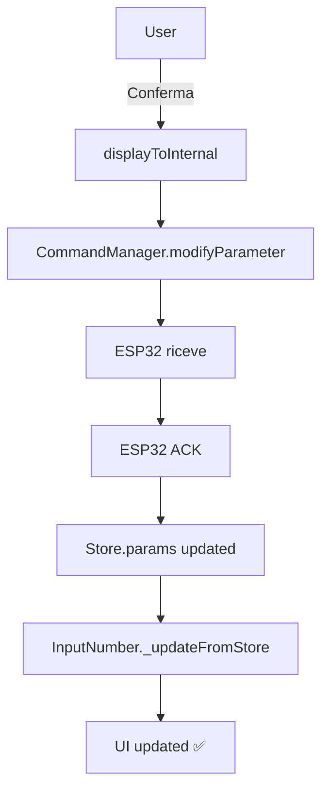

# Mermaid Diagrams and Markdown Normalization Implementation Plan

> **For Claude:** REQUIRED SUB-SKILL: Use superpowers:executing-plans to implement this plan task-by-task. (Adapted for direct manual + subagent execution in this session on current branch per user choice.)

**Goal:** Fix all 15 Mermaid diagrams across the repository to use valid, portable Mermaid syntax that renders in VS Code Markdown preview and common renderers (mmdc), normalize surrounding Markdown in affected files to standard portable form (ATX headings, callouts, links, lists, fences, spacing), while preserving all architecture, classes (AdvanceMap/PowerJetMap separate etc), relationships, and meaning. Exactly 0 changes to production C++ / JS source. Use smallest reasonable diffs.

**Architecture:** Targeted per-file edits using precise search/replace on the 5 Mermaid files + 3 additional files containing callouts or broken links (total ~8 files). Introduce diagram-local C++ type aliases only in Mermaid (e.g. BreakpointArray). Convert GitHub/Obsidian callouts to standard blockquotes. Convert all 70+ file:/// to relative links. Validate each diagram individually with mmdc before/after and at end. Follow verification-before-completion before any success claim. Frequent git commits for traceability.

**Tech Stack:** Markdown + Mermaid (classDiagram, graph/flowchart). Validation: Node + npx @mermaid-js/mermaid-cli (mmdc v11+). Edits via search_replace + manual verification. Git on branch "sim".

**Scope note (per user approval):** Direct edits on current "sim" branch (no worktree this time). Only documentation files. Approach 2 (comprehensive but minimal): all identified issues in files that contain them.

---

## Pre-Work (one-time)

**Step 0.1: Record baseline**
- Run: `git status --porcelain`
- Expected: clean (nothing to commit, working tree clean)
- Run: `git branch --show-current`
- Expected: sim

**Step 0.2: Confirm validator available**
- Run: `node --version; npm --version; npx --yes @mermaid-js/mermaid-cli --version`
- Expected: Node v22+, mmdc ~11.x (no permanent package.json change)

---

### Task 1: Create validation helper awareness + baseline Mermaid checks (prep)

**Files:**
- (no source change; use in terminal)

**Step 1.1: Document mmdc validation pattern to use for every diagram**
Use this pattern for each of the 15 (extract diagram source between fences to temp .mmd, render to .svg, assert exit 0 + svg non-empty + contains expected shapes):

```powershell
# Example for one diagram
$diagram = @'
classDiagram
direction TB
class Foo { +bar() }
'@
$diagram | Out-File $env:TEMP/d1.mmd -Encoding utf8
npx --yes @mermaid-js/mermaid-cli -i $env:TEMP/d1.mmd -o $env:TEMP/d1.svg --quiet 2>&1
$exit = $LASTEXITCODE
Write-Output "Exit: $exit"
Get-Item $env:TEMP/d1.svg | Select Length
# Then inspect: (Get-Content $env:TEMP/d1.svg -Raw) -match 'class|node|edge' etc.
Remove-Item $env:TEMP/d1.mmd, $env:TEMP/d1.svg -ErrorAction SilentlyContinue
```

**Step 1.2: Run baseline (pre-fix) validation on current diagrams (expect some to fail or be fragile)**
- Capture output for all 5 files' diagrams.
- Note which currently fail to render cleanly.

**Expected:** Record that some fail due to ~ , spaced stereotypes, unicode arrows, etc. (evidence before fixes).

---

### Task 2: Normalize docs/implementation_plan.md (callouts + links)

**Files:**
- Modify: `docs/implementation_plan.md`

**Step 2.1: Replace the 3 callouts + fix the 10+ file:/// links (and any others)**
Use multiple precise search_replace for unique blocks. Map:
- [!NOTE] -> **Note:**
- [!IMPORTANT] -> **Important:**
- [!WARNING] -> **Warning:**

Fix links e.g. [elaborato.md](elaborato.md) , [webui-conversion-plan.md](webui-conversion-plan.md) , for webui/Downloads refs turn into relative (../webui/...) or backtick + context since historical (smallest: replace full markdown link with repo-sensible relative from docs/).

Add blank lines around callouts if missing.

**Step 2.2: Run verification commands**
- `git diff --stat docs/implementation_plan.md`
- Grep for remaining [! and file:/// in the file (must be 0).
- Read sections around changes.

Commit: `git add docs/implementation_plan.md; git commit -m "docs: normalize callouts and links in implementation_plan.md (portable MD)"`

---

### Task 3: Normalize docs/elaborato.md (callouts + surrounding MD)

**Files:**
- Modify: `docs/elaborato.md`

**Step 3.1:** 4 callouts -> portable **Important:** / **Warning:** / **Note:**
Fix any file links if present (none major per scan). Ensure lists use -, code fences have lang where edited (the c and json blocks), blank lines.

**Step 3.2:** Verify no [! left, headings spacing, git diff.

Commit.

---

### Task 4: Normalize docs/sim/sim_implementation_plan.md (callout + links)

**Files:**
- Modify: `docs/sim/sim_implementation_plan.md`

**Step 4.1:** 1 callout + ~10 file:/// (pins.h, main.c etc in sim/ context) -> relative like [pins.h](pins.h) or appropriate from docs/sim/.

**Step 4.2:** Verify, commit.

---

### Task 5: Fix Mermaid diagrams + normalize in docs/sim/architecture.md (1 diagram + links)

**Files:**
- Modify: `docs/sim/architecture.md`

**Step 5.1: Fix the flowchart**
- Already mostly good (graph TD + 3 subgraphs closed, -->|labels|).
- Minor: ensure node labels with & / spaces are quoted if parser complains (current [MCU Core & State Machine] uses [] which is fine for labels).
- Fix the 3 file:/// links in "Important Subsystems" to relative: [mcu_core.md](mcu_core.md) etc (same dir).

**Step 5.2: Validate this diagram**
- Extract the exact mermaid block to temp, run mmdc, confirm exit 0 + svg contains "subgraph" or "node" elements + "Engine Kinematics" text.
- `git diff ...`

Commit.

---

### Task 6: Fix all 6 class diagrams + normalize in docs/architecture.md (older v1)

**Files:**
- Modify: `docs/architecture.md`

**Step 6.1: Per-diagram repairs (use unique strings)**
Diagram 1 (top EcuApplication etc at ~87): relationships use *-- and --> : labels. No complex types here mostly. Fix any file links at top.

Diagram 2 (Engine Core ~152): uses State enum, no ~ types. Fix members if $ for static.

Diagram 3 (Map & Lookup ~230): has 
- std::array~Breakpoint, MAX_BP~
- span~Breakpoint~
- std::array~MapSet, MAX_MAPS~
- span~SessionSample~
Introduce at start of this diagram (or file):
  classDiagram
  direction TB
  %% Aliases for display only (C++ normalization per spec)
  class BreakpointArray
  class BreakpointSpan
  class MapSetArray
  class SessionSampleSpan
Then rewrite members:
  -LookupTable1D has -std::array~Breakpoint, MAX_BP~ breakpoints -> -breakpoints : BreakpointArray
  +setBreakpoints(bp : span~Breakpoint~) -> +setBreakpoints(bp : BreakpointSpan)
  Similar for MapManager.
  <<POD / trivially copyable>> -> <<trivially_copyable>>
  SessionBuffer samples() span~SessionSample~ -> SessionSampleSpan

Diagram 4 (Telemetry ~275): similar, std::array~SessionSample, MAX_SAMPLES~ , span~SessionSample~ , span~SessionEvent~
Use aliases.

Diagram 5 (Comms ~329): fewer types.

Diagram 6 (HAL ~381): has ~GpioPin() for destructor, +~GpioPin() -> +~GpioPin() (destructor syntax ok-ish, but ensure parser safe; Mermaid supports ~name for dtor in some).

Also convert its 4x [!IMPORTANT] + 1 [!WARNING] (near end) to portable.

Fix top file:/// links (2-3).

**Step 6.2: Validate each of the 6 diagrams individually with mmdc + visual check (non-empty svg, contains class names like "EngineFsm", "LookupTable1D").**

**Step 6.3:** Run full file checks (no remaining ~ in mermaid blocks, no [! , no file:///). Small diff.

Commit.

---

### Task 7: Fix all 6 classDiagrams + 1 graph + normalize in docs/oop_architecture.md (primary file)

**Files:**
- Modify: `docs/oop_architecture.md` (largest number of issues)

**Step 7.1: Domain layer classDiagram (~121)**
- Stereotypes: <<enumeration>> ok, <<variant>> ok, <<value object>> x2 -> <<value_object>>
- Members:
  +evaluate(...) EngineEvent* -> +evaluate(...) OptionalEngineEvent
- Add alias comment block after classDiagram line:
  %% C++ type aliases for Mermaid rendering only (see task requirements)
  class BreakpointArray
  class CharArray16
  ...
  class OptionalEngineEvent
- Relationships at bottom use EngineStateMachine --> EngineState etc (preserve exactly).
- Convert the following > [!NOTE] (the one about AdvanceMap/PowerJetMap separate) to > **Note:**

**Step 7.2: Ports layer (~250)**
- <<interface>> ok.
- Many methods end with * e.g. lastPulseTimestampUs()* int64_t  -> lastPulseTimestampUs() int64_t   (the * was pseudo-abstract marker; <<interface>> + pure virtual in C++ is sufficient, remove to avoid punctuation issues).
- std::span~MapSet~ -> MapSetSpan (add alias)
- Fix any other.

**Step 7.3: Application layer (~339)**
- More std::array~...~ , std::span , RingBuffer~...~
- Aliases: MapSetArray, BreakpointSpan (reuse), RingBufferSessionSample etc.
- ICommandHandler etc.
- Relationships include ..|> for realization (preserve), *-- etc.
- No callout immediately here.

**Step 7.4: Infrastructure (~481)**
- More span~ , std::atomic~uint8_t~
- Add AtomicUint8 alias or use uint8_t (atomic is qualifier, simplify to activeIdx : uint8_t in display).
- Method suffixes $ and * : remove the $ and * (e.g. -isrHandler()$ void -> -isrHandler() void ; isr is private impl detail).
- DashboardWebSocketServer etc.
- Relationships at end: ..|> for impls (preserve direction and labels).

**Step 7.5: Runtime layer (~589)**
- <<singleton, static storage>> -> <<singleton>>
- note for ... syntax (Mermaid supports note for CLASS "text" or as block).
- Keep.

**Step 7.6: Full Dependency Graph (~639) flowchart**
- Already graph TB + multiple subgraphs with IDs + links like EcuApp --> C0 , PU -.->|implements| ICrnk
- -.-> with |label| is valid for dashed.
- style ... at end supported.
- Ensure all 5 subgraphs closed with `end` (they are).
- Node labels with / & ok inside ["..."].
- No types to alias here (it's boxes only).
- Good.

**Step 7.7: Later callouts in file (5 more [!IMPORTANT/!WARNING] around heap and open questions)**
Convert all to **Important:** / **Warning:** using exact text match (preserve inner bold and lists/tables).

**Step 7.8: Fix any remaining file:/// in this file (there are some in links to other docs).**

**Step 7.9: Validate all 7 diagrams in this file one-by-one with mmdc (class names visible: EngineStateMachine, SafetySupervisor, ICrankInput, MapCatalog, EspPickupInput, EcuApplication, and the layer boxes in graph). Confirm no parser errors on aliases or relationships.**

**Step 7.10:** Final lint on file: no ~ inside mermaid, no [! , links relative, lists consistent (-), blanks around --- and fences.

Commit with message referencing the oop architecture preservation.

---

### Task 8: Fix the 1 flowchart + normalize in webui/doc/useComponents/InputNumber/README.md

**Files:**
- Modify: `webui/doc/useComponents/InputNumber/README.md`

**Step 8.1: Repair the mermaid flow (lines ~221)**
Current is invalid (unicode → ↓ mixed with indent prose inside fence).
Rewrite to smallest valid equivalent preserving meaning (user confirmation flow to ESP32 ACK to store to UI):



(Use graph TD not sequence to stay closest to original "flow" style. Labels concise.)

**Step 8.2:** Check surrounding (the file is component doc, has other ```javascript -- ensure closed, add lang if missing on edited fence. Minor list normalization if * used.)

**Step 8.3:** Validate the fixed diagram (mmdc success + svg contains the 7+ nodes or "Conferma" / "UI updated").

Commit.

---

### Task 9: Fix the 1 phase graph + normalize in docs/webui-conversion-plan.md

**Files:**
- Modify: `docs/webui-conversion-plan.md`

**Step 9.1: The mermaid at ~1457**
Current:
graph TD
    A["Fase 0..."] --> B["Fase 2..."]
    ...
    style A fill:#10b981,color:#fff
    style K ...
This is valid-ish (node IDs A B, labels in [""] with Italian, style at end). Smallest: ensure no trailing spaces, labels properly quoted (they are), subgraph not needed here. Add direction if helps, but preserve.

**Step 9.2:** Convert its 4 [!IMPORTANT / !WARNING / !TIP] (one after mermaid) to portable **Important:** etc. The last [!TIP] mentions tempo stimato.

**Step 9.3:** Fix dozens of file:/// and Downloads/ links throughout (historical plan) to relative or plain text references. E.g. change long file:///.../adapter.js markdown links to [adapter.js](../webui/src/js/core/adapter.js) or just `adapter.js` (from docs/ location). Do not invent; use patterns that would resolve in repo tree. For ones under "Conteggio" etc keep intent.

**Step 9.4:** Validate the graph (mmdc, see styles or "Fase 0" text in svg).

**Step 9.5:** Ensure no [! or file:/// left in file.

Commit.

---

### Task 10: Global cross-check + other MD review (no or minimal changes)

**Files:**
- Inspect (read/grep): the other ~24 MD (webui/doc/prompt/* , useComponents/*/ *.md , docs/ECU.md , docs/sim/{io,mcu_core,web_ui}.md , webui/src/docs/WIFI... , CHANGELOG etc.)
- Only if a file has unbalanced fence, bad heading, or callout missed by prior grep: fix. Expect 0 or 1 trivial.
- Confirm no mermaid blocks outside the 5 files (grep already showed none).
- Fix any newly discovered absolute links or nonstandard in these if they would break portability (but smallest: only if obvious).

**Step 10.1:** Run repo-wide grep for remaining [! and file:/// after prior tasks (target 0 in edited, note any intentional in unedited).

**Step 10.2:** If any other file touched, commit separately.

---

### Task 11: Full validation of all 15 diagrams (post-fix)

**Files:** (all 5 source MD)

**Step 11.1:** For each of 15:
- Extract exact current (post-edit) mermaid source.
- Write to unique $env:TEMP/diagNN.mmd
- npx --yes @mermaid-js/mermaid-cli -i ... -o ...svg --quiet 2>&1 ; echo "EXIT=$LASTEXITCODE"
- Test -f svg && (Get-Item svg).Length -gt 2000  (rough visible)
- Grep svg content for key identifiers from that diagram (e.g. "SafetySupervisor", "AdvanceMap", "Fase 0", "UI updated", "Engine Kinematics", "GpioPin", layer names etc).
- rm temps.
- Record per-diagram: pass/fail + key evidence string.

**Step 11.2:** Additionally render one or two to text inspection if svg hard (or use --output-format png if supported, but svg fine).

**Expected:** All 15 EXIT=0 , visible non-trivial svgs, no parse errors on aliases/relationships/stereotypes/arrows.

---

### Task 12: Full document portability + acceptance spot checks

**Step 12.1:** For each edited file:
- Confirm ATX headings have exactly one space, blank before/after.
- Unordered lists use only - (not mixed *).
- All ``` closed, mermaid ones use mermaid lang.
- One blank between paragraphs/sections.
- Thematic --- have blanks.
- No trailing ws obvious.
- Inline code for filenames/classes where appropriate.

**Step 12.2:** Run `git diff --shortstat` overall. Count files changed (~8).

**Step 12.3:** Run full repo grep to prove 0 remaining [!XXX] and 0 file:/// in whole tree (or only in unedited if any, but we cleaned the ones found).

---

### Task 13: Final verification-before-completion + report prep

**Step 13.1:** Re-run baseline git status, confirm only the intended doc changes.
- `git status --porcelain`
- `git diff --name-only`

**Step 13.2:** (Optional but per skills) Dispatch review subagent on the local changes for the docs (use review skill) to catch any remaining issues.

**Step 13.3:** Before claiming done: 
- Re-execute key mmdc validations for 2-3 complex diagrams (fresh run).
- Confirm all 10 acceptance criteria (from user query) with line evidence or command output.
- Only then write the summary.

**Step 13.4:** Commit final if not already: "docs: fix all Mermaid (15 diagrams) + normalize to portable standard Markdown per spec"

**Step 13.5:** Produce the final response with:
- files changed (list)
- diagrams fixed (15)
- important syntax substitutions (table: before/after for ~ , stereotypes, callouts, arrows, links)
- validation command/method: npx --yes @mermaid-js/mermaid-cli -i $tmp.mmd -o $tmp.svg (powershell on win) + exit code + content checks. mmdc 11.15
- any that could not: none
- Evidence from verification commands.

---

## Post-Plan Notes for Execution
- Use todo_write to track each Task 1-13.
- Every edit: read_file first if needed for context (per tool rules), then search_replace (unique old_string), then verify snippet.
- Before any "complete" language: run the full verification commands and read their output.
- Prefer powershell commands for reproducibility on this Windows env.
- If a replace is not unique, enlarge the old_string with surrounding lines.
- Never touch main/, webui/src/, CMakeLists, package.json, or any .c/.js source.
- After plan written: begin Task 2 (or the first edit task) immediately, using fresh context.

This plan is self-contained for a skilled implementer. All exact strings for replaces will be derived from the read_file outputs captured during exploration + re-reads.

(End of plan)
