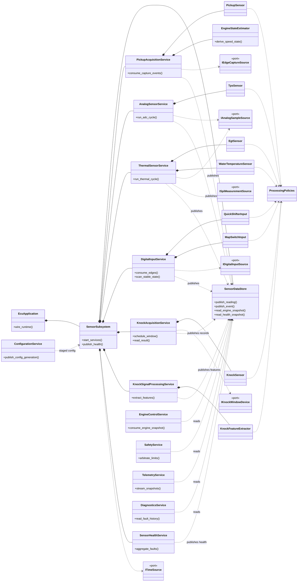
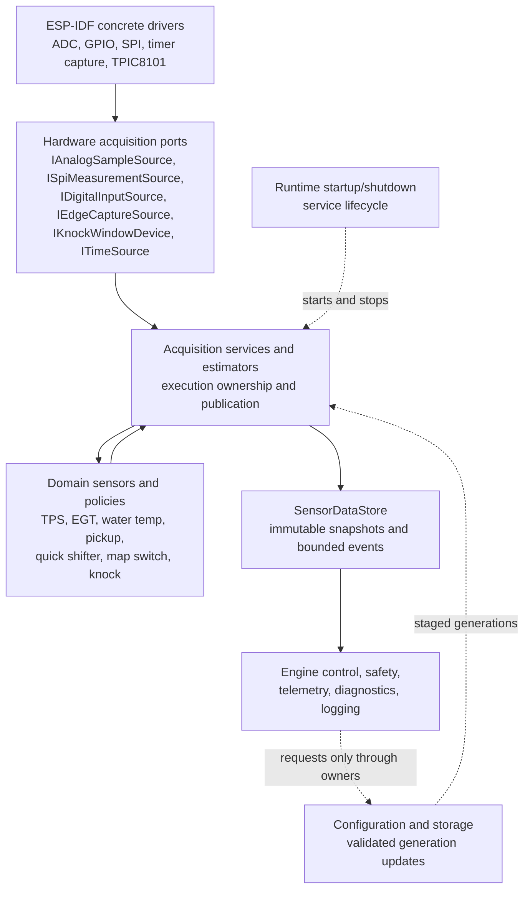

## Roadmap for the sensor-design phase

1. **Inventory the inputs** and classify each by signal type, timing requirements and safety importance.
2. **Define the data contract**: what a sensor produces beyond a number—timestamp, validity, units, quality and faults.
3. **Separate acquisition from interpretation**: hardware sampling, filtering/calibration and engine-domain meaning should be different responsibilities.
4. **Group sensors by execution model**, not one FreeRTOS task per sensor. Implemented in [sensor_oop.md](sensor_oop.md#phase-4---sensors-grouped-by-execution-model).
5. **Define the high-level OOP boundaries**: hardware interfaces, sensor objects, processing policies, acquisition services and published snapshots. Implemented in [sensor_oop.md](sensor_oop.md#phase-5---high-level-oop-boundaries).
6. **Define ownership and communication** between interrupts, tasks, engine control, safety and telemetry. Implemented in [sensor_ownership_faults.md](sensor_ownership_faults.md#phase-6---ownership-and-communication).
7. **Design failure behaviour and testability** before implementing drivers. Implemented in [sensor_ownership_faults.md](sensor_ownership_faults.md#phase-7---failure-behavior-and-testability).
8. **Create the final sensor architecture package** from the resolved decisions in [sensor_decision_queue.md](sensor_decision_queue.md). Implemented below in [Roadmap point 8 - final sensor architecture package](#roadmap-point-8---final-sensor-architecture-package).
9. Only after point 8 is reviewed, start implementation from the ordered backlog.

---

# 1. Start by redefining what “sensor” means

The inputs listed in your ECU specification are not all the same kind of sensor:

* Pickup
* TPS
* Knock sensor
* EGT
* Quick shifter
* Map switches and other digital inputs

They require fundamentally different acquisition models.

| Family                           | Inputs                    | Behaviour                                                        |
| -------------------------------- | ------------------------- | ---------------------------------------------------------------- |
| **Timing reference**             | Pickup                    | Asynchronous edge with precise timestamp                         |
| **Periodic analog measurements** | TPS, EGT, battery voltage | Sampled periodically, calibrated and filtered                    |
| **High-bandwidth signal**        | Knock sensor              | Continuous or windowed acquisition followed by signal processing |
| **Asynchronous digital event**   | Quick shifter, switches   | Edge or state change with debounce and validation                |
| **Derived engine values**        | RPM, acceleration, phase  | Calculated from other inputs rather than directly sampled        |

This classification should drive both your OOP design and your FreeRTOS design.

A single generic `Sensor` abstraction with a method conceptually equivalent to “read value” would be too weak. Reading TPS, receiving a pickup timestamp and processing a knock waveform are not the same operation.

---

# 2. First design questions

Before defining classes, I would ask these questions.

## Which sensors belong in the first working milestone?

My suggested order is:

1. **TPS**
2. **A slow analog sensor**, such as EGT or battery voltage
3. **Quick shifter or another digital input**
4. **Pickup capture and RPM calculation**
5. **Knock acquisition last**

This gives you progressively different acquisition models without starting with the most complex signal.

There is an argument for starting with the pickup because it is central to the ECU. However, pickup processing immediately introduces precise capture timing, interrupt affinity, RPM validation and engine synchronization. TPS is a simpler place to establish the sensor architecture itself.

A practical first sensor milestone could therefore be:

* One analog acquisition path.
* Calibration.
* Filtering.
* Validity detection.
* Timestamped publication.
* Consumption by a diagnostic or telemetry component.
* Simulated input for tests.

Once that structure works, apply the same architectural principles to the other sensor families.

---

## Does every sensor need every raw sample preserved?

Probably not.

For each sensor, decide whether consumers need:

* Only the latest valid value.
* Every acquired sample.
* An accumulated statistic.
* Only significant events.
* A block of samples.

Examples:

| Sensor          | Likely publication model                                                          |
| --------------- | --------------------------------------------------------------------------------- |
| TPS             | Latest filtered value                                                             |
| EGT             | Latest filtered value                                                             |
| Battery voltage | Latest filtered value plus minimum                                                |
| Pickup          | Every valid timing event, or latest period plus event notification                |
| Quick shifter   | Every validated activation event                                                  |
| Knock           | Blocks or computed knock metrics, not individual raw samples for normal consumers |

This decision affects whether you need snapshots, queues, notifications or stream buffers.

---

## Must acquisition be synchronized with the engine cycle?

The current project description says the pickup event should be followed by immediate RPM and TPS ADC acquisition.  I would question this design.

TPS normally does not need to be physically sampled at the exact pickup instant. A better default is:

* TPS is sampled continuously or periodically.
* The latest timestamped and validated TPS value is published.
* Engine control takes a consistent snapshot when processing a pickup event.

This avoids coupling analog acquisition latency to ignition timing.

Engine-synchronous sampling may still be useful for particular signals, but it should be a deliberate requirement rather than the default architecture.

---

## What does “valid TPS” mean?

A sensor design needs more than minimum and maximum voltage.

For TPS, for example:

* What voltage means closed throttle?
* What voltage means full throttle?
* What electrical range is physically plausible?
* How quickly can the value plausibly change?
* What happens if the signal becomes disconnected?
* What happens if the ADC saturates?
* Is calibration fixed at manufacturing time or user-adjustable?
* Is there a default calibration?
* What value does engine control use when TPS is invalid?
* How long can the last valid value remain usable?

These decisions belong in the sensor contract before implementation.

---

# 3. Define the data contract before the classes

A sensor should not publish only a primitive number such as `37.2`.

A domain-level sensor reading should conceptually contain:

| Field                            | Purpose                                                  |
| -------------------------------- | -------------------------------------------------------- |
| **Value**                        | Calibrated engineering value                             |
| **Unit or fixed representation** | Degrees, millivolts, permille, RPM, etc.                 |
| **Timestamp**                    | When the physical measurement was taken                  |
| **Validity**                     | Whether the value may be used for control                |
| **Quality**                      | Normal, degraded, stale, implausible, saturated          |
| **Source status**                | Hardware error, timeout, disconnected, calibration error |
| **Sequence or generation**       | Allows consumers to detect updates or missed data        |

This data structure becomes the contract between sensor processing and the rest of the ECU.

## Separate three representations

For each analog sensor, distinguish:

### Raw sample

What the hardware produced:

* ADC count.
* Capture timestamp.
* Digital level.
* DMA sample block.

### Physical measurement

The hardware value converted into physical meaning:

* Voltage.
* Resistance.
* Temperature.
* Throttle position.
* Pulse period.

### Control-domain value

The representation used by engine strategies:

* TPS from 0 to 1000 permille.
* Temperature with validity and derating state.
* RPM with confidence.
* Knock intensity for the current combustion window.

This separation avoids putting calibration details into engine-control logic.

---

# 4. Proposed high-level OOP layers

I would divide the sensor area into five layers.

## Layer 1 — Hardware acquisition interfaces

These interfaces describe what the hardware can do, not what the sensor means.

Possible conceptual interfaces:

* `IAnalogAcquisition`
* `IDigitalInput`
* `IEdgeCapture`
* `ISampleStream`
* `ITimeSource`

Their responsibility is limited to questions such as:

* Acquire a sample.
* Start or stop acquisition.
* Report a captured edge.
* Provide a sample block.
* Supply timestamps.
* Report hardware-level errors.

They should not know what TPS, EGT or knock means.

This layer is the boundary between ESP-IDF drivers and the rest of the application.

---

## Layer 2 — Sensor-domain objects

These classes represent real ECU inputs:

* `TpsSensor`
* `EgtSensor`
* `BatteryVoltageSensor`
* `PickupSensor`
* `QuickShifterInput`
* `KnockSensor`

Their responsibilities would be:

* Interpret hardware data.
* Apply calibration.
* Apply sensor-specific validation.
* Maintain sensor-specific health state.
* Produce a domain-level reading.

A `TpsSensor` knows what closed throttle, full throttle and plausible movement mean. The underlying ADC acquisition object does not.

A `PickupSensor` knows about pulse periods and plausibility. It should not know the ignition map or CDI output timing.

---

## Layer 3 — Processing policies

Filtering, calibration and validation should generally be composed into sensor objects rather than inherited from a large base sensor class.

Conceptual policies include:

* `CalibrationPolicy`
* `FilterPolicy`
* `RangeValidator`
* `RateOfChangeValidator`
* `TimeoutValidator`
* `DebouncePolicy`
* `FaultRecoveryPolicy`

This provides flexibility without creating an inheritance tree such as:

```text
Sensor
 └── AnalogSensor
      └── FilteredAnalogSensor
           └── CalibratedFilteredAnalogSensor
                └── TPS
```

That hierarchy would become difficult to evolve.

Composition is more appropriate:

```text
TPS sensor
 ├── analog acquisition dependency
 ├── TPS calibration
 ├── TPS filter
 └── TPS validation rules
```

---

## Layer 4 — Acquisition services

A service owns an execution context and coordinates one or more sensor objects.

Initial service candidates:

* `AnalogSensorService`
* `DigitalInputService`
* `PickupAcquisitionService`
* `KnockAcquisitionService`
* `SensorHealthService`

These are the classes most likely to own or be associated with FreeRTOS tasks.

The important distinction is:

> Sensors represent data and behaviour; services represent scheduled execution.

A `TpsSensor` does not require its own task. The analog service may acquire and process TPS, EGT and battery voltage together.

---

## Layer 5 — Sensor publication and access

Consumers should not directly call acquisition drivers or inspect mutable sensor internals.

Introduce a publication boundary such as:

* `SensorSnapshot`
* `EngineInputSnapshot`
* `SensorRepository`
* `SensorDataStore`

I would favour immutable snapshots for control consumers.

An engine-input snapshot might conceptually contain:

* TPS reading.
* RPM and timing state.
* EGT reading.
* Quick-shifter state.
* Knock metric.
* Battery voltage.
* Global timestamp.
* Per-input validity flags.
* Snapshot generation.

Consumers include:

* Engine-control logic.
* Safety logic.
* Actuator strategies.
* Telemetry.
* Diagnostics.
* Logging.

Telemetry should read published data. It should never ask the TPS hardware driver for a fresh sample.

---

# 5. Do not create one universal sensor interface

It is tempting to create:

```text
ISensor
- initialize
- read
- getValue
```

This works only for simple periodic sensors.

It does not naturally model:

* Pickup edge capture.
* Knock sample streams.
* Quick-shifter events.
* Sensors with multiple outputs.
* DMA acquisition.
* Derived values such as RPM.

A better approach is to define interfaces around **capabilities and boundaries**.

## Hardware capabilities

* Analog sampling.
* Digital state.
* Edge capture.
* Sample streaming.
* Time source.

## Domain-facing capabilities

* Latest measurement provider.
* Event source.
* Sample-block consumer.
* Health provider.
* Calibratable sensor.

A sensor can support the capabilities it genuinely needs.

For example:

| Class         | Relevant capabilities                         |
| ------------- | --------------------------------------------- |
| TPS           | Latest measurement, health, calibration       |
| EGT           | Latest measurement, health, calibration       |
| Pickup        | Timing-event source, RPM measurement, health  |
| Quick shifter | Event source, current state, health           |
| Knock         | Sample-block processing, knock metric, health |

This avoids forcing unrelated objects through the same abstraction.

---

# 6. FreeRTOS design: tasks by acquisition model

The sensor design should not initially produce one task per class.

A reasonable target is:

| Execution context                               | Sensors/work                                                                  |
| ----------------------------------------------- | ----------------------------------------------------------------------------- |
| **Hardware ISR/callback**                       | Capture timestamps, acknowledge hardware, store minimal raw data, notify task |
| **Analog sensor task**                          | TPS, EGT, battery and other low/medium-rate analog processing                 |
| **Digital input task or event handler**         | Quick shifter, switches and debounced digital inputs                          |
| **Pickup/engine task**                          | Consume capture events, validate timing and derive RPM                        |
| **Knock task**                                  | Process high-rate blocks and calculate knock metrics                          |
| **Sensor health task or periodic health phase** | Detect stale and failed inputs                                                |

You may initially combine analog, digital and health processing into one `SensorService` task. They can be split later when their rates or priorities justify it.

## Questions for task decomposition

For each possible task, ask:

1. Does it need a different priority?
2. Does it block on a different hardware event?
3. Does it have a significantly different frequency?
4. Could its workload delay a critical sensor?
5. Does it require a large stack?
6. Does it belong on a different core?
7. Would separating it make failure containment easier?

If most answers are no, it probably does not need a separate task.

---

# 7. Suggested initial FreeRTOS ownership model

## Core 1

Likely owners:

* Pickup capture and derived RPM.
* Engine-facing sensor snapshot.
* Fast analog processing needed by engine control.
* Quick-shifter event processing.

## Core 0

Likely consumers:

* Telemetry.
* Web UI.
* Display.
* Persistent calibration storage.
* Diagnostic logs.

Knock processing should be assigned only after its computational load and timing requirements are measured. It may justify a dedicated task, but it should not initially be allowed to delay pickup or ignition processing.

## Single-writer principle

Every mutable sensor state should have one owner.

For example:

* Analog service owns TPS internal state.
* Pickup service owns pulse history and RPM state.
* Knock service owns knock processing state.
* Sensor repository owns snapshot publication.

Other tasks should consume copies or immutable views.

This is much easier to reason about than several tasks locking and modifying the same sensor objects.

---

# 8. Interrupt responsibility

Interrupts and driver callbacks should belong to the acquisition layer, not directly to domain sensor classes or engine strategies.

Their responsibilities should be limited to:

* Capture raw event data.
* Timestamp it.
* Detect immediate hardware overflow where necessary.
* Place it in a preallocated transfer structure.
* Notify the owning service.

They should not perform:

* General calibration.
* Complex filtering.
* Logging.
* Web telemetry.
* Persistent storage.
* Configuration changes.
* High-level engine decisions.

For the pickup, a hardware callback could publish a timing event to the pickup or engine service.

For the quick shifter, it could publish a digital edge event.

For analog DMA, it could announce that a sample block is ready.

The same architectural rule applies even though the underlying peripherals are different.

---

# 9. Sensor health must be part of the original design

Do not add diagnostics after the normal value path has been completed.

Each sensor needs a state model such as:

```text
UNINITIALIZED
CALIBRATING
VALID
DEGRADED
STALE
FAILED
DISABLED
```

The exact states can be simplified, but the design needs to answer:

* When does a sensor become valid after startup?
* How many valid samples are required?
* How is an isolated bad sample handled?
* When does repeated invalid data become a fault?
* Can the sensor automatically recover?
* Is a fault latched?
* What fallback does engine control use?
* Is engine operation still allowed?

## Example fallback questions

### TPS failure

* Use a fixed conservative map?
* Use RPM-only ignition?
* Limit engine speed?
* Inhibit auxiliary actuators?
* Stop the engine?

### EGT failure

* Continue without temperature correction?
* Apply a conservative derating?
* Warn only?
* Stop after exceeding a timeout?

### Pickup failure

* Immediately inhibit ignition?
* How quickly?
* What constitutes a missing pulse while cranking versus while running?

### Knock failure

* Disable active knock correction?
* Apply a fixed conservative retard?
* Continue with the base map?

These are domain decisions, but they affect the sensor interface because validity and fault information must be available to consumers.

---

# 10. Calibration ownership

Calibration should not be mixed with raw hardware acquisition.

You need to decide whether calibration belongs to:

* The sensor-domain object.
* A separate calibration object used by the sensor.
* A central calibration repository.
* A combination of sensor-specific calibration and central persistence.

My preferred division is:

| Responsibility                      | Owner                                           |
| ----------------------------------- | ----------------------------------------------- |
| Calibration meaning and validation  | Sensor-domain object or sensor calibration type |
| Active calibration values in RAM    | Sensor service or configuration repository      |
| Loading and storing calibration     | Configuration/storage service                   |
| Applying calibration to raw samples | Sensor-domain object                            |
| Updating calibration while running  | Controlled configuration transaction            |

The ADC driver should not know that two voltage values represent closed and open throttle.

---

# 11. Filtering questions

Do not select filters before defining what problem you are solving.

For every sensor, ask:

* Is the noise random, periodic or caused by electrical interference?
* Must step changes be preserved?
* What delay is acceptable?
* What maximum rate of change is physically possible?
* Is the filter used for control, telemetry or both?
* Should control and telemetry use different filtered values?
* What happens when samples are missing?
* Should filtering reset after a fault?

## Likely differences

### TPS

Needs useful responsiveness with noise rejection. Excessive filtering would delay detection of rapid throttle movement.

### EGT

Can generally tolerate much slower filtering.

### Battery voltage

May need both a filtered normal value and rapid undervoltage detection.

### Pickup

Usually needs edge validation rather than conventional averaging.

### Quick shifter

Needs debounce and duration validation rather than an analog low-pass filter.

### Knock

Needs frequency-domain or band-limited processing and engine-position windowing. It is a separate signal-processing subsystem.

A generic `LowPassFilter` inside every sensor would therefore not be sufficient as the sensor architecture.

---

# 12. Time and synchronization model

All sensor data should use a common monotonic time source.

You need to decide:

* Timestamp at hardware acquisition or after task processing?
* Timestamp units?
* Timestamp resolution?
* Wraparound strategy?
* How consumers compare timestamps?
* How stale thresholds are represented?
* Whether pickup capture time and ADC sample time are directly comparable?

The acquisition timestamp is normally the important one.

A TPS sample processed 500 microseconds later should still carry the time at which it was acquired, not merely the time at which the FreeRTOS task processed it.

## Consistent snapshots

An engine-control cycle might require:

* Current pickup timestamp.
* Most recent TPS reading.
* Most recent EGT reading.
* Current quick-shifter state.
* Sensor validity.

Those values will not normally have identical timestamps. The snapshot should therefore preserve individual timestamps and validity information rather than pretending that all values were sampled simultaneously.

---

# 13. Derived sensors and estimators

RPM should not necessarily be modelled as a physical sensor.

The pickup hardware provides timestamped edges. An estimator derives:

* Pulse period.
* RPM.
* Acceleration or deceleration.
* Engine-running state.
* Confidence.
* Possibly phase information.

This suggests separating:

* `PickupSensor` or `PickupCapture`: interprets the electrical pulse.
* `EngineSpeedEstimator`: converts valid pulse timing into RPM and related state.

The same principle applies elsewhere:

* Throttle-rate is derived from TPS history.
* Thermal state may combine EGT and operating duration.
* Knock status is derived from signal blocks and engine position.

Derived values should not be hidden inside hardware drivers.

---

# 14. Recommended conceptual class map

A first high-level model could look like this:

```text
EcuApplication
│
├── SensorSubsystem
│   ├── AnalogSensorService
│   │   ├── TpsSensor
│   │   ├── EgtSensor
│   │   └── BatteryVoltageSensor
│   │
│   ├── DigitalInputService
│   │   ├── QuickShifterInput
│   │   └── MapSwitchInput
│   │
│   ├── PickupAcquisitionService
│   │   ├── PickupSensor
│   │   └── EngineSpeedEstimator
│   │
│   ├── KnockAcquisitionService
│   │   ├── KnockSensor
│   │   └── KnockFeatureExtractor
│   │
│   └── SensorDataStore
│       ├── EngineInputSnapshot
│       └── SensorHealthSnapshot
│
├── EngineControlService
├── SafetyService
├── TelemetryService
└── ConfigurationService
```

This is not intended as the final class diagram. It is a starting responsibility model.

The likely stable dependencies are:

```text
ESP-IDF hardware drivers
        ↓
Hardware acquisition interfaces
        ↓
Sensor-domain objects and estimators
        ↓
Acquisition services
        ↓
Immutable snapshots
        ↓
Engine control / safety / telemetry
```

Dependencies should not point back upward.

For example, `TpsSensor` should not know about the Web UI or ignition map.

---

# 15. Where interfaces are actually useful

Do not create an interface for every class merely because the design is OOP.

Interfaces are especially useful at these boundaries:

## Hardware replacement boundary

Allows the same sensor-domain object to receive data from:

* Real ESP32 hardware.
* A simulated source.
* A HITL source.
* A recorded sample stream.

## Time boundary

A time-source interface allows deterministic tests without real time.

## Storage/configuration boundary

Allows calibration to come from production storage, defaults or tests.

## Publication boundary

Allows engine control to consume sensor snapshots without knowing the acquisition details.

## Signal-processing strategy boundary

Useful when filters or validators may genuinely vary between configurations.

Concrete classes are sufficient when no meaningful substitution or test seam exists.

---

# 16. Testability should influence the interfaces

Your project includes JTAG, HITL and an external simulator.  The sensor architecture should explicitly support three data-source modes.

## Physical mode

Real hardware peripherals produce samples.

## Simulated mode

Software-provided samples exercise sensor logic on a development machine or embedded target.

## Replay mode

Previously recorded sensor data is reproduced with controlled timing.

This means the domain sensor and estimator classes should not depend directly on ESP-IDF types.

For example, the TPS interpretation logic should be testable with a sequence of abstract raw samples:

* Normal sweep.
* Disconnection.
* Short to ground.
* Short to supply.
* Noisy idle.
* Rapid opening.
* Calibration outside the expected range.

The ESP-IDF-specific acquisition component is then tested separately.

---

# 17. Design document to create for every sensor

Before classes are finalized, complete one row per sensor:

| Property              | Question                                      |
| --------------------- | --------------------------------------------- |
| Name                  | What is the physical input?                   |
| Purpose               | Which control or diagnostic functions use it? |
| Electrical type       | Analog, digital, frequency, waveform?         |
| Acquisition model     | Periodic, edge-driven, DMA stream?            |
| Sampling requirement  | How often or under which event?               |
| Timestamp requirement | What precision is needed?                     |
| Raw representation    | What does the hardware produce?               |
| Engineering unit      | What does the sensor publish?                 |
| Calibration           | Which parameters are required?                |
| Filtering             | What noise must be rejected?                  |
| Plausibility          | Which values and transitions are impossible?  |
| Stale timeout         | How old may the value become?                 |
| Startup behaviour     | When does it first become valid?              |
| Fault behaviour       | What happens when it fails?                   |
| Consumers             | Engine, safety, telemetry, actuator control?  |
| Publication model     | Latest value, event, sample block?            |
| Required task context | Which service owns it?                        |
| Test strategy         | Simulation, replay, injected faults?          |

This matrix is the main design input for the eventual class diagram.

---

# 18. Recommended scope of the first macro-area iteration

For the first complete sensor-area iteration, I would include:

## In scope

* One analog acquisition service.
* TPS as the first real domain sensor.
* A generic slow analog sensor, preferably battery voltage or EGT.
* Calibration and validation concepts.
* Timestamped readings.
* Sensor-health states.
* Immutable sensor snapshot.
* Telemetry consumption of the snapshot.
* Simulated acquisition source.
* Defined startup and failure behaviour.

## Explicitly postponed

* Full knock detection.
* Engine-synchronous ADC sampling.
* Adaptive filtering.
* Calibration persistence transactions.
* Cross-sensor plausibility.
* Complex engine-state estimation.
* Redundant sensors.
* Runtime reconfiguration while the engine is running.

This produces an end-to-end vertical slice without attempting every input simultaneously.

---

# 19. Decisions I would make now

Unless later requirements contradict them, I would establish these initial rules:

1. **No task per sensor.**
2. **No universal `ISensor::read()` abstraction.**
3. **Hardware acquisition and sensor meaning are separate layers.**
4. **Each mutable sensor state has one owner.**
5. **Engine control consumes snapshots, not hardware drivers.**
6. **Every published reading contains timestamp and validity.**
7. **Calibration, filtering and validation are separate responsibilities.**
8. **Interrupts only transfer minimal raw events into task context.**
9. **Knock is treated as a separate subsystem.**
10. **TPS sampling is initially independent from pickup timing.**
11. **Domain processing remains independent of ESP-IDF to support simulation and HITL.**
12. **Fault and fallback behaviour are designed before implementation.**

The next useful design step is to fill the sensor matrix for **TPS first**, then apply the resulting model to EGT, quick shifter, pickup and finally knock.

---

# Roadmap point 8 - final sensor architecture package

This section implements roadmap point 8 as documentation-only work. The
sensor macro-area decision queue is resolved in
[sensor_decision_queue.md](sensor_decision_queue.md), so the final architecture
can now be expressed as diagrams, ownership matrices and an implementation
backlog. Production firmware work should not start by inventing values that are
listed as open decisions here.

## Review of roadmap points 1 through 7

The review below checks the first seven roadmap points for contradictions,
missing ownership, ambiguous communication, unhandled failures and untestable
boundaries.

### Point 1 - Inventory the inputs

* Contradiction found: the original roadmap uses battery voltage as an example
  slow analogue sensor, while the current sensor specification covers water
  temperature instead. Battery voltage remains a future analogue input, not a
  required sensor macro-area v1 deliverable.
* Ownership gap closed: every current input is assigned to one service owner in
  the matrices below.
* Ambiguous communication closed: "map switches and other digital inputs" is
  split into physical map-switch state, UI-requested map and effective active
  map.
* Failure and testability gap closed: every current input has a failure,
  fallback and test row below.

### Point 2 - Define the data contract

* Contradiction found: `KnockEventRecord` is a sibling of `SensorReading<T>`,
  not a normal latest-value reading. This is acceptable only because it carries
  the same timing, validity, health, quality and fault vocabulary.
* Wording risk found: the older knock event wording includes "Knock decision".
  The final boundary is that sensor-side knock code may publish a
  sensor-threshold or feature flag, but ECU-level knock strategy owns final
  knock interpretation, ignition authority and protection decisions.
* Ownership gap closed: `SensorDataStore` owns snapshot generation and sequence
  counters; producers own their own event paths until handoff.
* Testability gap closed: the contract is testable through deterministic time,
  sequence counters, simulated sources and replayed event streams.

### Point 3 - Separate acquisition from interpretation

* Contradiction found: thermal sections describe protection responses, which
  can be misread as sensor objects commanding actuators. The final rule is that
  sensor services publish readings, health and protection requests; safety and
  engine-control services own final inhibit, limit and actuator effects.
* Ownership gap closed: acquisition adapters own raw peripheral facts; domain
  objects own interpretation; services own execution; `SensorDataStore` owns
  publication.
* Ambiguous communication closed: no consumer pulls fresh sensor values from
  ADC, SPI, GPIO, capture or TPIC8101 drivers.
* Failure gap closed: failed acquisition and failed interpretation produce
  explicit health and fault states instead of silent default values.

### Point 4 - Group sensors by execution model

* Contradiction found: EGT is not an analogue ADC input in the selected design;
  it is a MAX31856 SPI converter path. It may share a slow thermal task with
  water temperature, but it is not owned by the generic analogue ADC path.
* Ownership gap closed: tasks are grouped by activation source and timing
  class, not by sensor object count.
* Ambiguous communication closed: ISR/callback, task/phase and lower-priority
  consumer paths are separated in the FreeRTOS matrix.
* Untestable boundary closed: each execution group has a fake-source,
  deterministic-time or queue-overload test seam.

### Point 5 - Define high-level OOP boundaries

* Contradiction found: a universal `ISensor::read()` would contradict pickup
  events, quick-shifter events and crank-windowed knock records. The final
  model uses capability ports and typed domain objects instead.
* Ownership gap closed: `ConfigurationService` owns persisted and staged
  configuration; sensor services apply accepted generations at safe boundaries.
* Ambiguous communication closed: `QuickShifterInput` publishes requests and
  state; it never disables CDI output directly.
* Untestable boundary closed: domain objects depend on timestamped source data
  and policies, not ESP-IDF concrete driver types.

### Point 6 - Define ownership and communication

* Contradiction found: map switching is permitted while running, but the safe
  activation boundary and Web UI arbitration are outside the sensor macro-area.
  The final ownership matrix keeps physical switch qualification separate from
  effective map selection.
* Missing ownership closed: raw transfer slots, domain state, snapshots,
  configuration, fault events, diagnostics and shutdown requests each have one
  writer.
* Ambiguous communication closed: producer-consumer paths below define whether
  data is a latest snapshot, preserved event, crank-synchronous record,
  request/response transaction or best-effort telemetry stream.
* Failure gap closed: every bounded path has an overflow or backpressure rule.

### Point 7 - Design failure behavior and testability

* Contradiction found: sensor failures do not all imply engine shutdown. Pickup
  is mandatory for ignition scheduling; TPS has a 70 percent fallback for
  limited operation; EGT, water temperature, knock, quick shifter and map switch
  have different degraded behaviors.
* Missing ownership closed: sensors publish invalid, stale, degraded, failed
  or protection-request state; safety and engine control own final engine
  behavior.
* Ambiguous communication closed: stale, failed, disabled and degraded states
  remain visible in snapshots and fault events.
* Untestable boundary closed: timeout, debounce, stale, recovery and latching
  behavior must be testable with deterministic time and injected faults.

## Final class and responsibility diagram



| Component | Responsibility | Explicit non-responsibility |
| --- | --- | --- |
| Acquisition ports | Hide ESP-IDF ADC, GPIO, SPI, timer capture, TPIC8101 and time-source details behind testable capabilities | Sensor calibration, fallback strategy, telemetry serialization |
| Domain sensor objects | Convert timestamped raw facts into typed readings, events, health and faults | Own FreeRTOS tasks, direct actuator commands, storage, Web UI |
| Processing policies | Provide calibration, filtering, validation, debounce, timeout and recovery rules | Own hardware or final engine decisions |
| Acquisition services | Own execution context, call domain objects and publish outputs | Interpret telemetry, write persistent config, bypass `SensorDataStore` |
| `EngineStateEstimator` | Derive RPM, pulse period, acceleration and synchronization confidence from validated pickup captures | Read pickup hardware directly or schedule ignition output |
| `KnockFeatureExtractor` | Produce background, quality and normalized knock feature state | Decide final engine knock state or request ignition authority |
| `SensorDataStore` | Own immutable snapshots, event queues, generations and sequence counters | Pull fresh hardware values or apply calibration |
| `SensorHealthService` | Aggregate health and fault transitions into subsystem state | Mutate individual sensor internals |
| `ConfigurationService` | Validate, persist and publish configuration generations | Change sensor state outside owner service boundaries |
| Engine control and safety | Consume snapshots/events and decide final operating limits, inhibit and actuator requests | Read sensor hardware or mutate sensor state |
| Telemetry and diagnostics | Observe snapshots, events and diagnostic sessions | Backpressure engine-critical producers or request hidden fresh reads |

## FreeRTOS task and execution-context matrix

Exact FreeRTOS priorities, stack sizes, queue depths, timeouts and final core
pinning remain open integration decisions. The matrix fixes ownership and
communication boundaries without inventing those values.

| Execution context | Owner | Trigger | Timing class | Writes | Consumes | Backpressure and failure rule | Open integration values |
| --- | --- | --- | --- | --- | --- | --- | --- |
| Hardware ISR or driver callback | Acquisition adapter | Peripheral interrupt, capture, GPIO edge, ADC/DMA ready, TPIC ready | Hard real-time, minimal work | Preallocated raw event, buffer handoff or task notification | Hardware status and timestamp source | If transfer path is full, count overflow and let task publish fault; no allocation, logging, filtering or control | ISR affinity and peripheral-specific transfer depth |
| Pickup and engine-speed task or engine task phase | `PickupAcquisitionService`, `EngineStateEstimator` | Pickup capture event | Highest sensor priority | Valid capture events, RPM, synchronization state | ISR capture path, time source, pickup config | Overflow or impossible backlog makes crank reference untrusted until recovery | Priority, core, queue depth, missing-edge thresholds |
| Analogue sensor task | `AnalogSensorService` | Periodic ADC cycle or ADC-ready notification | Medium periodic | TPS reading and future medium-rate analogue readings | ADC sample source, TPS config | Overwrite latest readings; stale timeout drives invalid/fallback state | TPS sample rate, filter delay, timeout |
| Thermal sensor task or phase | `ThermalSensorService` | Periodic SPI converter read and NTC sample | Slow periodic | EGT and water-temperature readings, trends, thermal state | MAX31856 source, NTC analogue source, thermal config | Converter timeout or missing sample publishes stale/failed state; may share analogue task if nonblocking | Poll periods, thresholds, recovery durations |
| Digital input task or event handler | `DigitalInputService` | GPIO edge notification plus stable-state scan | Time-sensitive for quick shifter, low-rate for map switch | Stable state, quick-shifter request events, map-change requests | Digital source, debounce config, time source | Full request queue rejects new request and publishes overflow diagnostic; map changes may coalesce | Debounce, stuck duration, re-arm timeout |
| Knock window acquisition context | `KnockAcquisitionService` | Crank-synchronous window schedule | Deterministic crank-windowed | `KnockEventRecord` and TPIC health | Engine synchronization, TPIC device, knock config | Missing, mistimed, saturated or communication-failed record publishes degraded/failed knock state | TPIC timing, priority, queue depth |
| Knock signal-processing task | `KnockSignalProcessingService` | Knock event records | Lower than pickup acquisition | Feature record, background, quality and normalized index | Knock event queue, operating context snapshot | Under backlog, drop feature-processing records, count drops and publish degraded knock data | Workload split, stack size, optional enablement |
| Sensor health phase or task | `SensorHealthService` | Periodic tick and fault transitions | Low to medium | `SensorHealthSnapshot`, aggregate faults, degraded-operation requests | Health from all sensor services | Coalesce repeated identical faults; snapshot remains authoritative | Aggregation period and alert thresholds |
| Publication boundary | `SensorDataStore` | Producer publish calls | Bounded critical section, not a long task | Engine input snapshot, health snapshot, event queues | Producer-owned readings and events | Latest-value overwrite is allowed; sequence counters expose missed updates | Locking primitive and generation-copy implementation |
| Configuration, telemetry, diagnostics, Web UI and storage tasks | Their owning services | User request, network, storage, logging or diagnostic schedule | Non-engine-critical | Config generations, diagnostic records, telemetry streams | Snapshots/events only | Must drop, defer or reject work instead of blocking engine-critical paths | UI policy, persistence policy, log retention |

## Producer-consumer communication matrix

| Producer | Payload | Mechanism | Consumers | Overflow or stale behavior | Required tests |
| --- | --- | --- | --- | --- | --- |
| Pickup ISR/callback | Raw falling-edge timestamp and capture status | ISR-safe queue item or direct-to-task notification | `PickupAcquisitionService` | Overflow is a serious timing fault; crank reference becomes untrusted until plausible recovery | Queue-full injection, duplicate edge, missing edge, timer wraparound |
| Digital edge callback | Raw edge level, edge type and timestamp | ISR-safe queue item or notification | `DigitalInputService` | Collapse to latest edge/state if necessary, count overflow, publish diagnostic | Bounce storm, stuck input, startup-active state |
| ADC/DMA ready callback | Timestamped sample or buffer ownership token | Notification plus preallocated buffer handoff | `AnalogSensorService` | Mark sample gap or overrun; service evaluates stale/degraded state | Buffer overrun, stale timeout, noisy TPS sweep |
| Thermal service poll | MAX31856 result or NTC temperature sample | Service-owned request/response through port | `ThermalSensorService` | Timeout or diagnostic status publishes stale/failed thermal state | SPI timeout, open thermocouple, NTC open/short |
| Pickup service | Validated pickup capture | In-task call or bounded event queue | `EngineStateEstimator`, diagnostics | Out-of-order or impossible backlog causes sync-loss fault | RPM ramp, rapid acceleration, false-edge storm |
| Sensor services | Latest `SensorReading<T>` | `SensorDataStore` latest-value publish | Engine control, safety, telemetry, diagnostics | Overwrite latest value; sequence counter exposes missed updates | Missed sequence detection, stale snapshot rejection |
| Sensor services | Fault transition | Bounded event queue plus current health snapshot | `SensorHealthService`, safety, telemetry, diagnostics | Coalesce repeated identical transitions with count and first/last timestamp | Fault storm, queue-full, recovery transition |
| Knock acquisition | `KnockEventRecord` per enabled revolution | Bounded crank-synchronous record queue | Knock signal processing, diagnostics, telemetry | Drop lower-priority feature-processing work under backlog; preserve overflow count | Missing result, saturated result, processing backlog |
| `SensorDataStore` | Coherent engine input snapshot | Lock-free or short critical-section copy | Engine control and safety | Consumer rejects torn or stale copy by checking generation and per-input validity | Cross-core concurrent read/write, generation mismatch |
| `SensorDataStore` | Snapshot copy and drained events | Best-effort read/drain | Telemetry, diagnostics, logging | Drop, decimate or batch under load; never block producers | Telemetry backpressure and event drain overload |
| Configuration service | Validated config generation | Staged request/response and generation event | Owning sensor services | Rejected config leaves active generation unchanged | Invalid TPS calibration, runtime config during publication |
| Safety service | Final inhibit or limit request | Event plus snapshot to runtime and engine control | Runtime, engine control, telemetry | Safety decision does not mutate sensor internals | Sensor fault to inhibit/limit arbitration |

## State ownership matrix

| State | Single writer | Readers | Mutation boundary | Test obligation |
| --- | --- | --- | --- | --- |
| Raw pickup transfer slot or ISR queue item | Pickup ISR/acquisition adapter | `PickupAcquisitionService` | ISR writes preallocated raw fact only | ISR path cannot allocate, log or run domain logic |
| Pickup pulse history and edge plausibility | `PickupAcquisitionService` | `EngineStateEstimator`, diagnostics | Task context only | Duplicate, impossible interval and overflow tests |
| Engine speed and synchronization state | `EngineStateEstimator` | Engine control, safety, telemetry | Published snapshot/event only | RPM ramp, sync-loss and recovery tests |
| TPS calibration active in RAM | `ConfigurationService`, then applied by `AnalogSensorService` | TPS domain logic, diagnostics | Staged generation at safe service boundary | Valid, invalid and changed generation tests |
| TPS filtered value, fallback value and health | `AnalogSensorService` through `TpsSensor` | Engine control, safety, telemetry | Latest-value snapshot | 70 percent fallback, stale and recovery tests |
| EGT converter status, value, trend and health | `ThermalSensorService` through `EgtSensor` | Safety, telemetry, diagnostics | Latest-value snapshot and fault events | Open, converter fault, frozen value and recovery tests |
| Water-temperature value, trend, maximum and health | `ThermalSensorService` through `WaterTemperatureSensor` | Safety, engine-control limiters, telemetry | Latest-value snapshot and protection request | Open/short, rapid heating, sensor loss and hysteresis tests |
| Quick-shifter debounce, request and re-arm state | `DigitalInputService` through `QuickShifterInput` | Quick-shift eligibility, engine control, telemetry | Validated event plus stable-state snapshot | Bounce, long hold, startup-active and re-arm tests |
| Map-switch physical stable state | `DigitalInputService` through `MapSwitchInput` | Map selector, configuration, telemetry | Physical-state snapshot plus map-change request | Bounce, invalid map and runtime-change tests |
| UI-requested map override | Configuration or map-selection service | Map selector, telemetry | Request/response plus snapshot | Deferred until UI arbitration policy is defined |
| Effective active map | Map-selection or calibration service | Engine control, telemetry, diagnostics | Safe activation boundary | Deferred until activation boundary is defined |
| TPIC8101 configuration and acquisition state | `KnockAcquisitionService` | Knock signal processing, diagnostics | Crank-windowed event records | Communication fault, missing result, mistimed window |
| Knock background, quality and normalized features | `KnockSignalProcessingService` | ECU knock strategy, diagnostics, telemetry | Feature record and snapshot | Backlog, saturation, stuck value and background rebuild |
| Aggregate sensor health | `SensorHealthService` | Safety, telemetry, diagnostics | Health snapshot and fault events | Fault coalescing and subsystem degraded-state tests |
| Published snapshots and sequence counters | `SensorDataStore` | Engine control, safety, telemetry, logging | Immutable copy or generation-checked read | Torn-read rejection and missed-update detection |
| Persisted configuration | Storage/configuration service | Runtime and services through config snapshots | Boot load and validated transactions | Persistence failure and rejected config tests |
| Final inhibit, shutdown and degraded-mode state | Safety and engine-control services | Runtime, telemetry, diagnostics | Engine-control/safety boundary | Sensor fault cannot directly command actuator output |

## Dependency diagram



Dependency rules:

* Dependencies point from concrete hardware toward ports, domain logic,
  services, publication and consumers.
* Domain sensor objects do not depend on ESP-IDF concrete driver types.
* Engine control, safety, telemetry and diagnostics do not read acquisition
  drivers.
* Telemetry, diagnostics, Web UI, MQTT, OTA and storage are never dependencies
  of engine-critical sensor publication paths.
* Configuration crosses into sensor services only as validated staged
  generations applied by the owning service.

## Sensor-by-sensor failure and fallback matrix

| Sensor or input | Main failure modes | Published health/fault behavior | Fallback or safe posture | Recovery and latching | Tests |
| --- | --- | --- | --- | --- | --- |
| Pickup and engine-speed state | Missing expected edges, duplicate edges, impossible intervals, capture overflow, hardware diagnostic fault | `Stale`, `Failed` or unsynchronized; crank reference marked untrusted | Engine control does not schedule ignition from untrusted crank reference; safety may request inhibit | Normal loss of motion is not permanently latched; recovery requires plausible falling-edge sequence; hardware diagnostics may latch | RPM ramps to 25,000 RPM, false-edge storm, missing edges, timer wraparound, overflow |
| TPS | Electrical range fault, calibrated range fault, stale sample, stuck signal, excessive noise, implausible rate, invalid calibration | Invalid or stale TPS reading with health and fault bits; fallback value is explicit | Publish fixed 70 percent throttle fallback for limited operation; engine-control policy owns extra limits | Transient sample faults may auto-recover after stable plausible samples; invalid calibration latches until config changes | Full sweep, rapid closure, disconnect, short to ground/supply, noise, invalid calibration, stale timeout |
| EGT | Open thermocouple, MAX31856 fault, cold-junction fault, SPI timeout, frozen reading, implausible jump | Failed/stale EGT, converter fault detail and disabled EGT-dependent protection state | Disable EGT-dependent actions, request conservative limited operation, no immediate hard shutdown from sensor failure alone | Sensor faults reported; overtemperature latching depends on safety policy; recovery after stable valid measurements | Cold startup, controlled heating, threshold crossing, open circuit, converter loss, frozen value, recovery duration |
| Water temperature | NTC open/short, acquisition failure, stale sample, implausible temperature, impossible rate, frozen value | Failed/stale water-temperature reading and thermal-state invalid | Disable water-temperature adaptation; conservative limits only if configured mandatory, confirmed prior critical temperature or corroborating evidence exists | Ordinary sensor failure does not prove overheating; critical thermal faults may latch if configured; recovery needs hysteresis and duration | Cold startup, gradual heating, rapid heating, open/short, frozen value, sensor loss after critical state |
| Quick shifter | Startup-active input, bounce, implausibly short pulse, stuck active, excessive duration, stale stable-state scan | Invalid, degraded or failed input state; request event not published while invalid | Ignore quick-shifter request; no engine shutdown; input never directly cuts CDI | Startup-active/stuck remains active until normal inactive state observed; re-arm requires valid state change plus timeout | Normal shift, bounce, short pulse, long hold, startup-active, repeated requests, re-arm blocking |
| Map switch | Bounce, invalid electrical state, rapid repeated changes, unavailable selected map | Invalid/degraded physical switch state and map-change fault | Request hardcoded safe default map; effective active map is owned by map-selection service | Electrical faults may auto-recover; unavailable map/config faults remain until config changes | Both positions, bounce, disconnection, invalid map, startup positions, runtime changes |
| Knock | TPIC8101 communication/config fault, missing result, stuck result, saturation, mistimed window, invalid background | Invalid, stale, degraded or failed knock event/features; health/fault visible to ECU strategy | ECU-level knock strategy disables adaptive advance and learned positive correction; sensor side does not request final authority | TPIC/config faults may require reinitialization; transient missing records may recover after valid records and background rebuild | Injected result records, saturation, stuck value, missing records, window timing, TPIC communication fault, backlog |

## Explicit unresolved decisions

The diagrams and backlog do not resolve the decisions below. They assign the
owner or future phase that must close each decision before production code is
allowed to depend on it.

| Open decision | Owner or future phase | Blocks | What must not be assumed |
| --- | --- | --- | --- |
| Final TPS electrical diagnostic margins, sample rate, filter constants and stale timeout | Sensor calibration and hardware validation | Production TPS driver constants | Do not hardcode margins or delay values from the roadmap text |
| Whether engine control consumes TPS position only or also throttle rate | Engine-control design | Final `EngineInputSnapshot` fields used by maps | Do not make throttle-rate mandatory for all consumers |
| Additional TPS degraded-mode RPM, load or ignition limits beyond the 70 percent fallback | Safety and engine-control policy | Final fallback behavior | Do not put these limits inside `TpsSensor` |
| Pickup missing-edge thresholds, recovery edge count and signal-conditioner diagnostics | Engine timing and hardware validation | Pickup production driver and ignition inhibit timing | Do not treat one missing pulse as a universal failure rule |
| Supporting evidence for stopped engine versus pickup or conditioner failure | Runtime, starter-state and diagnostics design | Final fault classification | Do not claim software can always distinguish normal stop from sensor failure |
| Final EGT warning, derating, shutdown thresholds and overtemperature latching | Dyno validation and safety policy | Thermal protection authority | Do not tune engine protection from provisional values alone |
| Final water-temperature NTC model, analogue front end, installation, thresholds, hysteresis and limp limits | Hardware selection and thermal validation | Water-temperature production path | Do not implement fixed transfer or protection values before hardware is selected |
| Mandatory-by-configuration policy for optional sensors | Safety profile design | Startup gating and degraded-mode rules | Do not make optional sensors unconditional startup blockers |
| Quick-shifter debounce, stuck duration, re-arm timeout and acknowledgement policy | Vehicle calibration and rider-input validation | Quick-shifter production behavior | Do not let a held input generate repeated requests by timer alone |
| Runtime map-switch safe activation boundary | Engine-control and map-management design | Effective map switch implementation | Do not apply physical switch changes directly to active map data |
| Web UI map override persistence, cancellation, timeout and communication-loss behavior | Web UI and configuration policy | UI override implementation | Do not hide UI authority inside `MapSwitchInput` |
| Final knock frequency, gain, crank-angle window, background model, thresholds and authority level | Knock calibration and ECU strategy validation | Knock production authority | Do not let sensor-side code request final ignition retard or protection |
| Cross-sensor protection arbitration and final reduced RPM/load/ignition limits | Safety and engine-control design | Final degraded operating modes | Do not let individual sensors independently modify final actuator outputs |
| Which faults require automatic recovery, explicit acknowledgement, restart or service action | Safety and diagnostics policy | Fault manager and UI behavior | Do not use one latching rule for every sensor |
| FreeRTOS task priorities, stack sizes, queue depths, core pinning and exact timeout values | RTOS integration and measurement | Scheduler configuration | Do not infer numeric priorities from the matrix ordering |
| Telemetry, diagnostics and log retention overflow thresholds | Diagnostics and telemetry design | Noncritical observability behavior | Do not allow observability to block engine-critical producers |
| Existing wording cleanup for knock event "decision" fields | Documentation cleanup before implementation | Generated field names and tests | Do not interpret sensor-side knock fields as final ECU knock authority |

## Ordered implementation backlog

This backlog is ordered so each milestone produces a testable boundary. A
milestone that depends on an open decision may implement interfaces and tests,
but production constants or authority must wait until the named decision is
closed.

| ID | Milestone | Depends on | Work products | Acceptance criteria | Tests |
| --- | --- | --- | --- | --- | --- |
| B0 | Freeze point 8 documentation for implementation | Review of this section and linked sensor docs | Approved class boundaries, ownership matrices, failure matrix and backlog | No hidden unresolved decisions; all local links resolve | Markdown link check and review checklist |
| B1 | Common domain contracts and deterministic test harness | B0 | `TimestampUs`, sequence counter, `SensorHealthState`, `SensorQuality`, fault vocabulary, `SensorReading<T>`, `SensorEvent<T>`, `KnockEventRecord`, fake time source | All published values can carry timestamp, validity, health, quality, sequence and faults; domain tests run without ESP-IDF | Unit tests for sequence changes, stale timestamps, fault flags and deterministic time |
| B2 | Hardware port interfaces and fake sources | B1 | ADC sample port, SPI measurement port, digital input port, edge capture port, TPIC window port, replay source | Domain and service tests can inject samples, edges, converter results, TPIC records and time without hardware | Fake-source tests for normal, timeout, overflow and replayed streams |
| B3 | `SensorDataStore` and bounded event paths | B1, B2 | Engine input snapshot, health snapshot, latest-value publication, event queues, overflow counters, generation-copy read | Engine control and safety can read coherent snapshots; telemetry overload cannot block producers | Snapshot generation, torn-read retry, missed-update sequence, queue-full and coalescing tests |
| B4 | TPS vertical slice | B1-B3, TPS calibration values as configurable inputs | `TpsSensor`, TPS policies, `AnalogSensorService` phase, 70 percent fallback publication | Valid TPS publishes latest throttle reading; invalid/stale TPS publishes invalid status and explicit fallback; no engine consumer reads ADC directly | Full sweep, rapid closure, noise, disconnect, short to ground/supply, invalid calibration, stale timeout, recovery |
| B5 | Thermal domain slice for EGT and water temperature | B1-B3, selected thermal interfaces; production constants may remain config-only | `EgtSensor`, `WaterTemperatureSensor`, `ThermalSensorService`, thermal states, protection requests | Thermal readings publish value, trend, maximum, health and faults; sensor loss disables dependent adaptation without claiming unconfirmed overheating | Cold startup, controlled heating, MAX31856 fault, NTC open/short, frozen reading, rapid heating, recovery hysteresis |
| B6 | Digital input slice | B1-B3, quick-shifter debounce/re-arm values as configurable inputs | `QuickShifterInput`, `MapSwitchInput`, `DigitalInputService`, request queues | Quick-shifter requests are preserved only after validation and re-arm; map switch publishes physical state separate from effective active map | Bounce, short pulse, long hold, startup-active, repeated request rejection, map-switch bounce, invalid map |
| B7 | Pickup and engine-speed slice | B1-B3, pickup timing thresholds as configurable inputs | `PickupSensor`, `PickupAcquisitionService`, `EngineStateEstimator`, sync-loss publication | Valid captures produce RPM/sync state; untrusted crank reference prevents ignition scheduling from using pickup data | RPM ramps to 25,000 RPM, rapid acceleration/deceleration, missing edge, duplicate edge, timer wraparound, capture overflow |
| B8 | Sensor health aggregation | B3-B7 | `SensorHealthService`, fault transition coalescing, degraded subsystem state | Safety, telemetry and diagnostics can observe current health and fault history without mutating sensor internals | Fault storm, repeated fault coalescing, recovery transition, stale snapshot, health snapshot consistency |
| B9 | Safety and engine-control sensor consumption boundary | B3-B8 | Snapshot/event consumers, inhibit/limit request interfaces, no direct driver access | Engine control consumes only snapshots/events; sensors never command final actuator output | Static dependency check, pickup invalid inhibits scheduling path, TPS fallback consumed as invalid/fallback state, thermal fault routes through safety |
| B10 | Knock acquisition record path | B1-B3, B7, TPIC timing interface | `KnockSensor`, `KnockAcquisitionService`, TPIC record validation, crank-window event publication | One valid record per enabled revolution when configured; missing/stuck/saturated/mistimed records publish health and faults | Injected TPIC result, missing result, saturation, stuck count, invalid window timing, communication fault |
| B11 | Knock feature-processing boundary | B10 | `KnockFeatureExtractor`, background model interface, normalized feature record | Sensor-side knock processing publishes features and health only; ECU strategy owns final interpretation and authority | Background build, backlog drop counter, degraded feature state, static check that no ignition authority is published |
| B12 | Configuration transactions and persistence boundary | B4-B7, selected runtime policy | Staged config generations, safe-boundary application, rejection path, persisted calibration load | Invalid config cannot partially update active sensor state; accepted config applies only through owning service | Invalid TPS calibration, runtime generation change during publication, rejected map config, storage failure |
| B13 | Telemetry, diagnostics and replay observability | B3-B12 | Snapshot streaming, event drain, fault history, replay capture/readback | Observability reads snapshots/events only and drops or decimates under load | Telemetry backpressure, diagnostic command rejection, replay of recorded sensor session |
| B14 | ESP-IDF driver adapters and HITL integration | Stable domain/service tests plus closed hardware decisions for each sensor | Concrete ADC, GPIO, SPI, timer capture and TPIC adapters behind ports | Hardware adapters satisfy port contracts without leaking ESP-IDF types into domain objects | HITL TPS sweep, pickup simulator, EGT converter fault, NTC open/short, digital input bounce, TPIC communication fault |
| B15 | Scheduler, overload and cross-core validation | B3-B14 plus measured workload | Final task priorities, stack sizes, queue depths, core pinning and watchdog policy | Engine-critical sensor paths remain bounded under telemetry, diagnostics and fault load | Cross-core snapshot read/write, queue overload, telemetry saturation, ISR work-budget measurement, watchdog recovery |

Milestone dependencies:

* B1 through B3 are architecture foundations and should precede all real sensor
  behavior.
* B4 through B7 can be implemented as vertical slices, but B7 must complete
  before any ignition scheduling path can trust engine speed.
* B10 and B11 depend on B7 because knock is crank-windowed.
* B14 must not start for a sensor until that sensor's hardware-selection and
  calibration blockers are closed or represented as configurable values.
* B15 is the point where exact FreeRTOS priorities, stacks, queue depths and
  core affinity become measured implementation choices.
