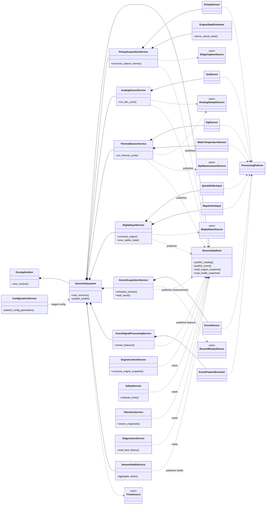
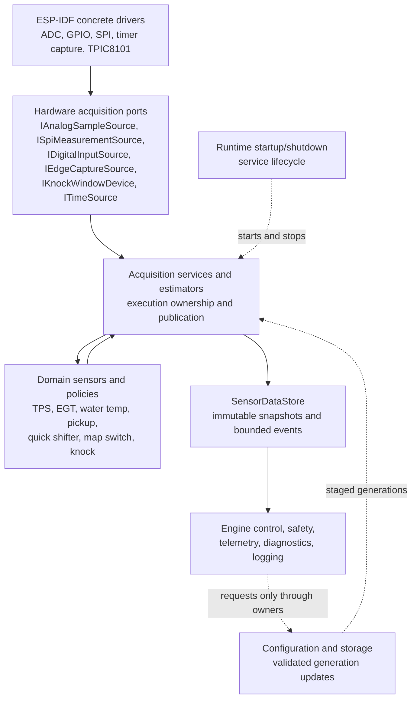

# Sensor Architecture, Ownership, Failure Behavior, and Testability

This document is the maintained architecture contract for the ECU sensor
subsystem. It consolidates the previous execution-model, OOP-boundary,
decision-queue, ownership, communication, failure and testability documents.

Per-sensor requirements live in [sensors.md](sensors.md). This document defines
how those requirements are implemented at the architecture boundary.

Battery voltage is not part of the current sensor macro-area. It remains a
future analogue-input extension.

---

# 1. Resolved architecture decisions

## 1.1 Common timebase

All published sensor-domain data uses a monotonic unsigned 64-bit microsecond
timestamp represented as `TimestampUs`.

The timestamp is acquired at the hardware event or physical sample time.
Published snapshots preserve per-input timestamps. Pickup handling may keep raw
hardware ticks internally when useful, but published domain data uses
`TimestampUs`.

## 1.2 Publication contracts

Latest-value inputs use `SensorReading<T>`.

Each `SensorReading<T>` carries:

* Typed value, such as `ThrottlePositionPermille`,
  `TemperatureCelsius` or `EngineSpeedState`
* `TimestampUs acquired_at`
* `uint32_t sequence`
* `bool valid_for_control`
* `SensorHealthState`
* `SensorQuality`
* Fault bitset or fault code

Event-based inputs use a sibling `SensorEvent<T>` with the same timing,
validity, health, quality and fault vocabulary.

Knock does not use `SensorReading<T>`. Knock publishes a crank-synchronous
`KnockWindowMeasurement` sibling contract. Its primary identity is
`revolution_id`.

## 1.3 Health-state model

The common health vocabulary is:

* `Uninitialized`
* `Stabilizing`
* `Valid`
* `Degraded`
* `Stale`
* `Failed`
* `Disabled`

Each sensor family defines its own transition guards:

* Startup evidence
* Stale trigger
* Failure trigger
* Recovery evidence
* Latching category

Faults are categorized as:

* Transient auto-recoverable
* Persistent recoverable after stable samples
* Configuration-latched
* Safety-latched

## 1.4 Mandatory-status and operating profiles

Only the crank reference is strictly mandatory for ignition scheduling.

Mandatory behavior is profile-dependent. The architecture supports at least
these operating profiles:

| Profile | Purpose | Sensor policy intent |
| --- | --- | --- |
| Development | Bring-up and bench testing | Keep optional sensors nonblocking; publish faults visibly |
| Dyno | Calibration and validation | Allow stricter thermal and knock requirements when configured |
| Race | Limited operation with known configuration | Permit selected degraded modes with explicit limits |
| Production safety | Conservative deployed behavior | Allow profiles to make selected sensors mandatory |

Baseline mandatory-status rules:

| Input | Baseline policy |
| --- | --- |
| Pickup and trusted engine-speed state | Mandatory for ignition scheduling |
| TPS | Mandatory for normal mapped operation; invalid TPS uses the fixed 70 percent fallback for limited operation |
| EGT | Not mandatory for basic operation; failure disables EGT-dependent protection and requests conservative limited operation |
| Water temperature | Not mandatory until a profile makes it mandatory; failure disables dependent adaptation and may request conservative limits |
| Knock | Not mandatory; failure disables adaptive knock correction and learned positive advance in ECU strategy |
| Quick shifter | Optional; failure ignores quick-shift requests |
| Map switch | Optional; failure requests the hardcoded safe default map through map selection |

Final inhibit, derating, RPM/load limits and actuator effects are owned by
safety and engine-control policies, not by sensor-domain objects.

## 1.5 Buffering and overflow policy

Use policy classes by data criticality:

| Data path | Buffering policy | Overflow or backlog behavior |
| --- | --- | --- |
| Pickup capture | Bounded timestamp-ordered event path | Serious timing fault; crank reference becomes untrusted until recovery |
| Latest-value readings | Overwrite latest snapshot and increment sequence | Consumers detect missed updates through sequence |
| Quick-shifter requests | Preserve validated request events | Reject new request and publish overflow diagnostic |
| Map-switch changes | Coalesce repeated changes and keep latest stable physical state | Publish invalid/degraded physical input if stability is lost |
| Knock measurements | Bounded per-revolution stream | Drop lower-priority feature-processing work, count drops and publish degraded knock data |
| Fault transitions | Coalesce repeated identical transitions | Preserve count and first/last timestamp |
| Telemetry and diagnostics | Best effort | Drop, decimate or batch without blocking engine-critical producers |

---

# 2. Final class and responsibility diagram

---

# 3. Boundary rules

## 3.1 No universal sensor read abstraction

There is no mandatory `ISensor::read()` abstraction. Pickup captures,
quick-shifter events, map-switch state changes, latest TPS readings and
crank-windowed knock measurements do not share the same behavior.

Interfaces are defined around capabilities and boundaries.

## 3.2 Layer responsibilities

| Layer | Responsibility | Examples |
| --- | --- | --- |
| Hardware acquisition ports | Describe hardware capabilities without ECU meaning | `IAnalogSampleSource`, `ISpiMeasurementSource`, `IDigitalInputSource`, `IEdgeCaptureSource`, `IKnockWindowDevice`, `ITimeSource` |
| Sensor-domain objects | Convert raw hardware facts into domain readings, events and health | `TpsSensor`, `EgtSensor`, `WaterTemperatureSensor`, `PickupSensor`, `QuickShifterInput`, `MapSwitchInput`, `KnockSensor` |
| Processing policies | Reusable calibration, filtering, validation, debounce, timeout and recovery behavior | `TpsCalibration`, `ThermalTransferCurve`, `LowPassFilter`, `RangeValidator`, `RateOfChangeValidator`, `DebouncePolicy` |
| Estimators and strategies | Derived values and non-physical-sensor decisions | `EngineStateEstimator`, `ThrottleRateEstimator`, `ThermalStateClassifier`, `KnockFeatureExtractor`, `QuickShiftEligibilityPolicy` |
| Acquisition services | Own execution context and coordinate domain objects | `AnalogSensorService`, `ThermalSensorService`, `DigitalInputService`, `PickupAcquisitionService`, `KnockAcquisitionService` |
| Publication boundary | Provide stable data contracts to consumers | `SensorDataStore`, `EngineInputSnapshot`, `SensorHealthSnapshot`, event queues |

## 3.3 Hardware acquisition ports

| Port | Produces | Must not contain |
| --- | --- | --- |
| `IAnalogSampleSource` | ADC code or millivolt sample with acquisition timestamp and hardware status | TPS calibration, throttle percent, thermal state |
| `ISpiMeasurementSource` | Digital converter result, timestamp and communication status | EGT transfer interpretation, thermal protection state |
| `IDigitalInputSource` | Digital level, edge type and timestamp | Quick-shift eligibility, map arbitration |
| `IEdgeCaptureSource` | Edge timestamp, polarity and capture status | RPM, synchronization, ignition scheduling |
| `IKnockWindowDevice` | TPIC8101 configuration status, window control and integrated result | Knock strategy, ignition correction |
| `ITimeSource` | Common monotonic timestamp | Sensor-specific stale decisions |

ESP-IDF drivers live behind these ports. Domain logic must remain testable with
simulated and replayed sources.

## 3.4 Domain objects

| Object | Input dependency | Policy dependencies | Output |
| --- | --- | --- | --- |
| `TpsSensor` | Timestamped analog sample | TPS calibration, low-latency filter, range/rate/stuck validators, timeout validator | `SensorReading<ThrottlePosition>` and optional throttle-rate estimate |
| `EgtSensor` | Timestamped MAX31856 result | EGT transfer, slow filter, range/rate/frozen validators, converter diagnostics | `SensorReading<TemperatureCelsius>` and EGT thermal state |
| `WaterTemperatureSensor` | Timestamped analog NTC sample | NTC transfer, thermal thresholds, hysteresis, range/rate/frozen validators | `SensorReading<TemperatureCelsius>` and water thermal state |
| `PickupSensor` | Timestamped edge capture | Polarity, minimum interval, pulse plausibility and timeout rules | Validated pickup capture event |
| `EngineStateEstimator` | Validated pickup capture events | RPM range and acceleration plausibility rules | `EngineSpeedState` |
| `QuickShifterInput` | Timestamped digital level/edge | Polarity, debounce, duration and stuck-input validators | Stable state and `QuickShiftRequestEvent` |
| `MapSwitchInput` | Timestamped digital level | Polarity and debounce policy | Stable physical map request and physical-switch event |
| `KnockSensor` | TPIC8101 window result and scheduled revolution context | TPIC configuration, missing/stuck/saturation/window validators | `KnockWindowMeasurement` |
| `KnockFeatureExtractor` | Knock measurements and operating context | Background model, signal-quality checks and normalization rules | Knock feature record and signal health |

Domain objects shall not trigger CDI output, command actuators, write
persistent storage, communicate with the Web UI or own FreeRTOS tasks.

## 3.5 Service responsibilities

| Service | Owns | Writes to | May notify |
| --- | --- | --- | --- |
| `PickupAcquisitionService` | Pickup capture validation and capture history | Pickup event queue and engine-speed state | Engine control, safety, telemetry |
| `EngineStateEstimator` | Derived RPM, acceleration, revolution counter and synchronization confidence | Engine-speed reading inside `EngineInputSnapshot`; scheduled revolution context for knock | Engine control and safety |
| `AnalogSensorService` | TPS state and future non-thermal medium-rate ADC inputs | Latest analog readings in `SensorDataStore` | Sensor health and telemetry |
| `ThermalSensorService` | EGT and water-temperature state | Latest thermal readings and thermal protection requests | Safety, telemetry and diagnostics |
| `DigitalInputService` | Quick-shifter state and physical map-switch state | Digital state snapshot and validated events | Quick-shift strategy, map selector and telemetry |
| `KnockAcquisitionService` | TPIC8101 window scheduling and result acquisition | `KnockWindowMeasurement` records | Knock signal processing and telemetry |
| `KnockSignalProcessingService` | Background model, signal quality and normalized feature extraction | Knock feature record and signal health | ECU knock strategy, diagnostics and telemetry |
| `SensorHealthService` | Aggregated stale/fault/degraded state | `SensorHealthSnapshot` and fault events | Safety, telemetry and diagnostics |
| `SensorDataStore` | Published latest values and snapshot generation | Immutable snapshots and event queues | Engine control, safety, telemetry and logging |

This service set does not imply one FreeRTOS task per service.

---

# 4. Execution model and FreeRTOS matrix

Sensors are grouped by execution model, not by class count.

| Execution context | Owner | Trigger | Timing class | Writes | Consumes | Backpressure and failure rule | Open integration values |
| --- | --- | --- | --- | --- | --- | --- | --- |
| Hardware ISR or driver callback | Acquisition adapter | Peripheral interrupt, capture, GPIO edge, ADC/DMA ready, TPIC ready | Hard real-time, minimal work | Preallocated raw event, buffer handoff or task notification | Hardware status and timestamp source | If transfer path is full, count overflow and let task publish fault; no allocation, logging, filtering or control | ISR affinity and peripheral-specific transfer depth |
| Pickup and engine-speed task or engine task phase | `PickupAcquisitionService`, `EngineStateEstimator` | Pickup capture event | Highest sensor priority | Valid capture events, RPM, revolution counter, synchronization state | ISR capture path, time source, pickup config | Overflow or impossible backlog makes crank reference untrusted until recovery | Priority, core, queue depth, missing-edge thresholds |
| Analogue sensor task | `AnalogSensorService` | Periodic ADC cycle or ADC-ready notification | Medium periodic | TPS reading and future non-thermal ADC readings | ADC sample source, TPS config | Overwrite latest readings; stale timeout drives invalid/fallback state | TPS sample rate, filter delay, timeout |
| Thermal sensor task or phase | `ThermalSensorService` | Periodic SPI converter read and NTC sample | Slow periodic | EGT and water-temperature readings, trends, thermal state | MAX31856 source, NTC analogue source, thermal config | Converter timeout or missing sample publishes stale/failed state; may share analogue task if nonblocking | Poll periods, thresholds, recovery durations |
| Digital input task or event handler | `DigitalInputService` | GPIO edge notification plus stable-state scan | Time-sensitive for quick shifter, low-rate for map switch | Stable state, quick-shifter request events, physical map-switch events | Digital source, debounce config, time source | Full request queue rejects new request and publishes overflow diagnostic; map changes may coalesce | Debounce, stuck duration, re-arm timeout |
| Knock window acquisition context | `KnockAcquisitionService` | Crank-synchronous window schedule | Deterministic crank-windowed | `KnockWindowMeasurement` and TPIC health | Engine synchronization, scheduled revolution context, TPIC device, knock config | Missing, mistimed, saturated or communication-failed record publishes degraded/failed knock state | TPIC timing, priority, queue depth |
| Knock signal-processing task | `KnockSignalProcessingService` | Knock measurements | Lower than pickup acquisition | Feature record, background, quality and normalized index | Knock queue, operating context snapshot | Under backlog, drop feature-processing records, count drops and publish degraded knock data | Workload split, stack size, optional enablement |
| Sensor health phase or task | `SensorHealthService` | Periodic tick and fault transitions | Low to medium | `SensorHealthSnapshot`, aggregate faults, degraded-operation requests | Health from all sensor services | Coalesce repeated identical faults; snapshot remains authoritative | Aggregation period and alert thresholds |
| Publication boundary | `SensorDataStore` | Producer publish calls | Bounded critical section, not a long task | Engine input snapshot, health snapshot, event queues | Producer-owned readings and events | Latest-value overwrite is allowed; sequence counters expose missed updates | Locking primitive and generation-copy implementation |
| Configuration, telemetry, diagnostics, Web UI and storage tasks | Their owning services | User request, network, storage, logging or diagnostic schedule | Non-engine-critical | Config generations, diagnostic records, telemetry streams | Snapshots/events only | Must drop, defer or reject work instead of blocking engine-critical paths | UI policy, persistence policy, log retention |

---

# 5. Producer-consumer communication matrix

| Producer | Payload | Mechanism | Consumers | Overflow or stale behavior | Required tests |
| --- | --- | --- | --- | --- | --- |
| Pickup ISR/callback | Raw falling-edge timestamp and capture status | ISR-safe queue item or direct-to-task notification | `PickupAcquisitionService` | Overflow is a serious timing fault; crank reference becomes untrusted until plausible recovery | Queue-full injection, duplicate edge, missing edge, timer wraparound |
| Digital edge callback | Raw edge level, edge type and timestamp | ISR-safe queue item or notification | `DigitalInputService` | Collapse to latest edge/state if necessary, count overflow, publish diagnostic | Bounce storm, stuck input, startup-active state |
| ADC/DMA ready callback | Timestamped sample or buffer ownership token | Notification plus preallocated buffer handoff | `AnalogSensorService` | Mark sample gap or overrun; service evaluates stale/degraded state | Buffer overrun, stale timeout, noisy TPS sweep |
| Thermal service poll | MAX31856 result or NTC temperature sample | Service-owned request/response through port | `ThermalSensorService` | Timeout or diagnostic status publishes stale/failed thermal state | SPI timeout, open thermocouple, NTC open/short |
| Pickup service | Validated pickup capture and scheduled revolution context | In-task call or bounded event queue | `EngineStateEstimator`, `KnockAcquisitionService`, diagnostics | Out-of-order or impossible backlog causes sync-loss fault | RPM ramp, rapid acceleration, false-edge storm |
| Sensor services | Latest `SensorReading<T>` | `SensorDataStore` latest-value publish | Engine control, safety, telemetry, diagnostics | Overwrite latest value; sequence counter exposes missed updates | Missed sequence detection, stale snapshot rejection |
| Sensor services | Fault transition | Bounded event queue plus current health snapshot | `SensorHealthService`, safety, telemetry, diagnostics | Coalesce repeated identical transitions with count and first/last timestamp | Fault storm, queue-full, recovery transition |
| Knock acquisition | `KnockWindowMeasurement` per enabled revolution | Bounded crank-synchronous record queue | Knock signal processing, diagnostics, telemetry | Drop lower-priority feature-processing work under backlog; preserve overflow count | Missing result, saturated result, processing backlog |
| `SensorDataStore` | Coherent engine input snapshot | Lock-free or short critical-section copy | Engine control and safety | Consumer rejects torn or stale copy by checking generation and per-input validity | Cross-core concurrent read/write, generation mismatch |
| `SensorDataStore` | Snapshot copy and drained events | Best-effort read/drain | Telemetry, diagnostics, logging | Drop, decimate or batch under load; never block producers | Telemetry backpressure and event drain overload |
| Configuration service | Validated config generation | Staged request/response and generation event | Owning sensor services | Rejected config leaves active generation unchanged | Invalid TPS calibration, runtime config during publication |
| Safety service | Final inhibit or limit request | Event plus snapshot to runtime and engine control | Runtime, engine control, telemetry | Safety decision does not mutate sensor internals | Sensor fault to inhibit/limit arbitration |

---

# 6. State ownership matrix

| State | Single writer | Readers | Mutation boundary | Test obligation |
| --- | --- | --- | --- | --- |
| Raw pickup transfer slot or ISR queue item | Pickup ISR/acquisition adapter | `PickupAcquisitionService` | ISR writes preallocated raw fact only | ISR path cannot allocate, log or run domain logic |
| Pickup pulse history and edge plausibility | `PickupAcquisitionService` | `EngineStateEstimator`, diagnostics | Task context only | Duplicate, impossible interval and overflow tests |
| Engine speed, revolution counter and synchronization state | `EngineStateEstimator` | Engine control, safety, knock acquisition, telemetry | Published snapshot/event and scheduled context only | RPM ramp, sync-loss and recovery tests |
| TPS calibration active in RAM | `ConfigurationService`, then applied by `AnalogSensorService` | TPS domain logic, diagnostics | Staged generation at safe service boundary | Valid, invalid and changed generation tests |
| TPS filtered value, fallback value and health | `AnalogSensorService` through `TpsSensor` | Engine control, safety, telemetry | Latest-value snapshot | 70 percent fallback, stale and recovery tests |
| EGT converter status, value, trend and health | `ThermalSensorService` through `EgtSensor` | Safety, telemetry, diagnostics | Latest-value snapshot and fault events | Open, converter fault, frozen value and recovery tests |
| Water-temperature value, trend, maximum and health | `ThermalSensorService` through `WaterTemperatureSensor` | Safety, engine-control limiters, telemetry | Latest-value snapshot and protection request | Open/short, rapid heating, sensor loss and hysteresis tests |
| Quick-shifter debounce, request and re-arm state | `DigitalInputService` through `QuickShifterInput` | Quick-shift eligibility, engine control, telemetry | Validated event plus stable-state snapshot | Bounce, long hold, startup-active and re-arm tests |
| Map-switch physical stable state | `DigitalInputService` through `MapSwitchInput` | Map selector, telemetry | Physical-state snapshot plus physical-switch event | Bounce, invalid state and runtime-change tests |
| UI-requested map override | Configuration or map-selection service | Map selector, telemetry | Request/response plus snapshot | Deferred until UI arbitration policy is defined |
| Effective active map | Map-selection or calibration service | Engine control, telemetry, diagnostics | Safe activation boundary | Deferred until activation boundary is defined |
| TPIC8101 configuration and acquisition state | `KnockAcquisitionService` | Knock signal processing, diagnostics | Crank-windowed measurement records | Communication fault, missing result, mistimed window |
| Knock background, quality and normalized features | `KnockSignalProcessingService` | ECU knock strategy, diagnostics, telemetry | Feature record and snapshot | Backlog, saturation, stuck value and background rebuild |
| Aggregate sensor health | `SensorHealthService` | Safety, telemetry, diagnostics | Health snapshot and fault events | Fault coalescing and subsystem degraded-state tests |
| Published snapshots and sequence counters | `SensorDataStore` | Engine control, safety, telemetry, logging | Immutable copy or generation-checked read | Torn-read rejection and missed-update detection |
| Persisted configuration | Storage/configuration service | Runtime and services through config snapshots | Boot load and validated transactions | Persistence failure and rejected config tests |
| Final inhibit, shutdown and degraded-mode state | Safety and engine-control services | Runtime, telemetry, diagnostics | Engine-control/safety boundary | Sensor fault cannot directly command actuator output |

---

# 7. Dependency diagram

Dependency rules:

* Dependencies point from concrete hardware toward ports, domain logic,
  services, publication and consumers.
* Domain sensor objects do not depend on ESP-IDF concrete driver types.
* Engine control, safety, telemetry and diagnostics do not read acquisition
  drivers.
* Telemetry, diagnostics, Web UI, MQTT, OTA and storage are never dependencies
  of engine-critical sensor publication paths.
* Configuration crosses into sensor services only as validated staged
  generations applied by the owning service.

---

# 8. Runtime ownership rules

## 8.1 ISR and callback boundary

ISRs and callbacks may:

* Timestamp raw events
* Capture status bits
* Write a preallocated transfer item
* Notify the owning task or service phase

They must not perform calibration, filtering, logging, storage, Web UI work,
map changes or actuator commands.

## 8.2 Cross-core rules

* Cross-core sensor data is transferred as immutable snapshots or bounded event
  records.
* Shared mutable sensor objects are prohibited.
* Snapshot publication uses a generation counter. Consumers reject torn reads by
  copying again when the generation changes during read.
* Engine-critical producers never block on telemetry, Web UI, storage, MQTT,
  OTA or diagnostics work.
* Locks held by telemetry, diagnostics or configuration code are not taken in
  pickup, ignition or other engine-critical paths.
* Configuration updates crossing cores are staged and applied by the owning
  service at a safe boundary.

## 8.3 Startup ownership

Runtime owns startup sequencing:

1. Configuration and storage services load persisted calibration and defaults.
2. Hardware acquisition adapters initialize peripherals.
3. Sensor services start in `Uninitialized` or `Stabilizing`.
4. `SensorDataStore` publishes invalid snapshots with timestamps and health.
5. Engine control remains in a state that does not trust unavailable inputs.
6. Each sensor service transitions to `Valid` only after its startup rules are
   satisfied.
7. Safety receives health snapshots before engine operation is allowed.

Startup-active quick-shifter input is diagnostic and ignored until the input
returns to a valid normal state. Startup pickup state is unsynchronized until
sufficient consistent events establish a credible period.

## 8.4 Shutdown ownership

Sensor objects do not shut down the engine. They publish invalid, failed,
critical or protection-request states. Safety and engine control own final
inhibit or degraded-operation decisions.

## 8.5 Runtime reconfiguration ownership

Configuration service owns runtime reconfiguration transactions:

* Requests come from Web UI, diagnostics, stored profiles or calibration tools.
* The configuration service validates each request against the current mode.
* Accepted changes receive a new generation number.
* Owning sensor services apply the generation at a safe service boundary.
* Rejected changes leave the active generation unchanged and return an error.
* Configuration persistence is not performed by sensor-domain objects.

## 8.6 Prohibited dependencies and direct calls

The following are prohibited:

* Engine control directly reading ADC, SPI, GPIO or TPIC8101 drivers.
* Telemetry or diagnostics asking a hardware driver for fresh sensor data.
* Sensor-domain objects calling Web UI, MQTT, OTA, storage or actuator output.
* ISRs performing calibration, filtering, JSON serialization, logging or config
  changes.
* Configuration service mutating sensor internals outside the owning service.
* Safety directly editing sensor state to force a desired reading.
* Sensor-side knock processing publishing final knock interpretation,
  protection requests or ignition authority.
* Quick-shifter input directly disabling CDI output.
* Map-switch input directly selecting the effective active map.

---

# 9. Failure and fallback matrix

| Sensor or input | Main failure modes | Published health/fault behavior | Fallback or safe posture | Recovery and latching | Tests |
| --- | --- | --- | --- | --- | --- |
| Pickup and engine-speed state | Missing expected edges, duplicate edges, impossible intervals, capture overflow, hardware diagnostic fault | `Stale`, `Failed` or unsynchronized; crank reference marked untrusted | Engine control does not schedule ignition from untrusted crank reference; safety may request inhibit | Normal loss of motion is not permanently latched; recovery requires plausible falling-edge sequence; hardware diagnostics may latch | RPM ramps to 25,000 RPM, false-edge storm, missing edges, timer wraparound, overflow |
| TPS | Electrical range fault, calibrated range fault, stale sample, stuck signal, excessive noise, implausible rate, invalid calibration | Invalid or stale TPS reading with health and fault bits; fallback value is explicit | Publish fixed 70 percent throttle fallback for limited operation; engine-control policy owns extra limits | Transient sample faults may auto-recover after stable plausible samples; invalid calibration latches until config changes | Full sweep, rapid closure, disconnect, short to ground/supply, noise, invalid calibration, stale timeout |
| EGT | Open thermocouple, MAX31856 fault, cold-junction fault, SPI timeout, frozen reading, implausible jump | Failed/stale EGT, converter fault detail and disabled EGT-dependent protection state | Disable EGT-dependent actions and publish conservative-operation request; no immediate hard shutdown from sensor failure alone | Sensor faults reported; overtemperature latching depends on safety policy; recovery after stable valid measurements | Cold startup, controlled heating, threshold crossing, open circuit, converter loss, frozen value, recovery duration |
| Water temperature | NTC open/short, acquisition failure, stale sample, implausible temperature, impossible rate, frozen value | Failed/stale water-temperature reading and thermal-state invalid | Disable water-temperature adaptation; conservative limits only if profile mandates, confirmed prior critical temperature or corroborating evidence exists | Ordinary sensor failure does not prove overheating; critical thermal faults may latch if configured; recovery needs hysteresis and duration | Cold startup, gradual heating, rapid heating, open/short, frozen value, sensor loss after critical state |
| Quick shifter | Startup-active input, bounce, implausibly short pulse, stuck active, excessive duration, stale stable-state scan | Invalid, degraded or failed input state; request event not published while invalid | Ignore quick-shifter request; no engine shutdown; input never directly cuts CDI | Startup-active/stuck remains active until normal inactive state observed; re-arm requires valid state change plus timeout | Normal shift, bounce, short pulse, long hold, startup-active, repeated requests, re-arm blocking |
| Map switch | Bounce, invalid electrical state, rapid repeated changes | Invalid/degraded physical switch state and physical-switch fault | Request hardcoded safe default through map-selection service; effective active map is owned by map-selection service | Electrical faults may auto-recover; unavailable map/config faults belong to map selection | Both positions, bounce, disconnection, startup positions, runtime changes |
| Knock | TPIC8101 communication/config fault, missing result, stuck result, saturation, mistimed window, invalid background | Invalid, stale, degraded or failed measurement/features; health/fault visible to ECU strategy | ECU-level knock strategy disables adaptive advance and learned positive correction; sensor side does not request final authority | TPIC/config faults may require reinitialization; transient missing records may recover after valid records and background rebuild | Injected result records, saturation, stuck value, missing records, window timing, TPIC communication fault, backlog |

---

# 10. Test strategy

## 10.1 Test seams

| Seam | Purpose | Required capability |
| --- | --- | --- |
| Hardware source ports | Replace ESP-IDF peripherals in tests | Inject analog samples, SPI converter results, digital edges, pickup captures and TPIC results |
| Deterministic time source | Test timeout, stale and debounce behavior | Advance monotonic time without real delays |
| Replay source | Reproduce recorded sessions and failures | Feed timestamped events/samples at controlled speed |
| Fault injector | Exercise health transitions | Inject open/short, timeout, stuck value, bounce, overflow, saturation, SPI failure, TPIC fault and missing pickup |
| Configuration source | Test calibration and runtime updates | Provide valid, invalid and generation-changing config snapshots |
| Publication reader | Verify snapshots and events | Inspect sequence counters, timestamps, health, quality and fault payloads |
| Queue/backpressure harness | Test overload behavior | Fill event queues and verify overflow counters, drops and degraded states |

## 10.2 Test categories

Unit tests:

* TPS calibration, range validation, rate validation, fallback publication and
  recovery period.
* Pickup edge plausibility, duplicate rejection, RPM estimation and sync loss.
* EGT and water-temperature transfer, stale detection, thermal state and
  recovery hysteresis.
* Quick-shifter debounce, startup-active behavior, stuck input and re-arm.
* Map-switch debounce and physical-state publication.
* Knock measurement validation, missing/stuck/saturation detection and
  background state transitions.
* `SensorDataStore` snapshot generation, sequence counters and stale reads.

Integration tests:

* End-to-end analog service publication to engine snapshot and telemetry.
* Pickup event to RPM/sync snapshot and engine-control inhibit when stale.
* Digital input edge to validated quick-shifter event without direct CDI call.
* Map-switch physical event to map-selection request and safe default request.
* Thermal fault to safety protection request without direct actuator command.
* Knock measurement to normalized feature publication without sensor-side
  protection request or direct ignition output.
* Configuration transaction staging, rejection and safe-boundary application.

HITL tests:

* Simulator-generated pickup ramps up to the specified maximum operating range.
* TPS sweep, rapid closure, disconnect, short to ground and short to supply.
* EGT converter fault, open thermocouple and controlled heating profile.
* Water-temperature cold startup, gradual heating, rapid heating and sensor
  loss.
* Quick-shifter normal activation, bounce, long hold and startup-active state.
* Map-switch startup positions, bounce and runtime changes.
* TPIC8101 communication fault, missing knock result and window timing checks
  when hardware is available.

Concurrency and overload tests:

* Engine-critical snapshot reads while telemetry drains snapshots on another
  core.
* Configuration update request while sensor services publish current data.
* Fault transition queue overflow while current health snapshot remains
  correct.
* Telemetry backpressure while sensor publication continues.
* Diagnostics requests rejected or deferred when they would violate ownership.
* Pickup event burst or false-edge storm creates overflow diagnostics and
  sync-loss behavior rather than blocking.
* Knock signal-processing backlog publishes degraded knock data and counts
  dropped records.

## 10.3 Acceptance criteria

1. Every mutable sensor-related state has exactly one documented writer.
2. No sensor-domain object depends on Web UI, MQTT, OTA, storage or actuator
   output modules.
3. Engine control obtains sensor inputs only through snapshots or subscribed
   events.
4. ISRs and callbacks perform no calibration, filtering, logging, allocation,
   storage or actuator commands.
5. Every published measurement includes timestamp, validity, health, quality
   and sequence, generation or revolution identity as appropriate.
6. Every event path has documented bounded buffering and overflow behavior.
7. Telemetry and diagnostics overload cannot block pickup, engine-speed or
   sensor publication paths.
8. Configuration updates are staged, validated and applied by the owning
   service at a safe boundary.
9. Pickup invalid or stale state prevents ignition scheduling from an untrusted
   crank reference.
10. TPS invalid or stale state publishes invalid status and uses the 70 percent
    fallback unless a later engine-control policy adds restrictions.
11. EGT and water-temperature sensor failures disable dependent adaptation and
    publish conservative-operation requests without claiming unconfirmed
    overheating.
12. Quick-shifter faults cause requests to be ignored until recovery or re-arm.
13. Map-switch faults publish invalid physical state and request safe default
    behavior through map selection.
14. Knock faults are published so ECU strategy can disable adaptive correction
    and learned positive advance.
15. Deterministic-time tests can trigger startup, stale, timeout, recovery and
    latching transitions without real waiting.
16. Replay tests can feed timestamped sensor data without ESP-IDF dependencies.
17. Fault-injection tests cover open/short, timeout, stuck, noise/bounce,
    overflow, saturation and communication-failure paths.
18. Cross-core snapshot reads are coherent and expose missed updates through
    sequence or generation counters.
19. All unresolved numeric thresholds and calibration decisions remain
    configurable or explicitly blocked before production driver implementation.

---

# 11. Explicit open decisions

These decisions are not hidden inside diagrams or backlog items. They remain
outside the current sensor architecture contract until the named owner closes
them.

| Open decision | Owner or future phase | Blocks | What must not be assumed |
| --- | --- | --- | --- |
| Final TPS electrical diagnostic margins, sample rate, filter constants and stale timeout | Sensor calibration and hardware validation | Production TPS driver constants | Do not hardcode margins or delay values from early design text |
| Whether engine control consumes TPS position only or also throttle rate | Engine-control design | Final `EngineInputSnapshot` fields used by maps | Do not make throttle-rate mandatory for all consumers |
| Additional TPS degraded-mode RPM, load or ignition limits beyond the 70 percent fallback | Safety and engine-control policy | Final fallback behavior | Do not put these limits inside `TpsSensor` |
| Pickup missing-edge thresholds, recovery edge count and signal-conditioner diagnostics | Engine timing and hardware validation | Pickup production driver and ignition inhibit timing | Do not treat one missing pulse as a universal failure rule |
| Supporting evidence for stopped engine versus pickup or conditioner failure | Runtime, starter-state and diagnostics design | Final fault classification | Do not claim software can always distinguish normal stop from sensor failure |
| Final EGT warning, derating, shutdown thresholds and overtemperature latching | Dyno validation and safety policy | Thermal protection authority | Do not tune engine protection from provisional values alone |
| Final water-temperature NTC model, analogue front end, installation, thresholds, hysteresis and limp limits | Hardware selection and thermal validation | Water-temperature production path | Do not implement fixed transfer or protection values before hardware is selected |
| Mandatory-by-profile policy for optional sensors | Safety profile design | Startup gating and degraded-mode rules | Do not make optional sensors unconditional startup blockers |
| Quick-shifter debounce, stuck duration, re-arm timeout and acknowledgement policy | Vehicle calibration and rider-input validation | Quick-shifter production behavior | Do not let a held input generate repeated requests by timer alone |
| Runtime map-switch safe activation boundary | Engine-control and map-management design | Effective map switch implementation | Do not apply physical switch changes directly to active map data |
| Web UI map override persistence, cancellation, timeout and communication-loss behavior | Web UI and configuration policy | UI override implementation | Do not hide UI authority inside `MapSwitchInput` |
| Final knock frequency, gain, crank-angle window, background model, thresholds and authority level | Knock calibration and ECU strategy validation | Knock production authority | Do not let sensor-side code request final ignition retard or protection |
| Cross-sensor protection arbitration and final reduced RPM/load/ignition limits | Safety and engine-control design | Final degraded operating modes | Do not let individual sensors independently modify final actuator outputs |
| Which faults require automatic recovery, explicit acknowledgement, restart or service action | Safety and diagnostics policy | Fault manager and UI behavior | Do not use one latching rule for every sensor |
| FreeRTOS task priorities, stack sizes, queue depths, core pinning and exact timeout values | RTOS integration and measurement | Scheduler configuration | Do not infer numeric priorities from the matrix ordering |
| Telemetry, diagnostics and log retention overflow thresholds | Diagnostics and telemetry design | Noncritical observability behavior | Do not allow observability to block engine-critical producers |

---

# 12. Ordered implementation backlog

| ID | Milestone | Depends on | Work products | Acceptance criteria | Tests |
| --- | --- | --- | --- | --- | --- |
| B0 | Freeze sensor documentation for implementation | Review of `sensors.md` and this document | Approved requirements, class boundaries, ownership matrices, failure matrix and backlog | No hidden unresolved decisions; all local links resolve | Markdown link check and review checklist |
| B1 | Common domain contracts and deterministic test harness | B0 | `TimestampUs`, sequence counter, `SensorHealthState`, `SensorQuality`, fault vocabulary, `SensorReading<T>`, `SensorEvent<T>`, `KnockWindowMeasurement`, fake time source | All published values can carry timestamp, validity, health, quality, sequence or revolution identity and faults; domain tests run without ESP-IDF | Unit tests for sequence changes, stale timestamps, revolution identity, fault flags and deterministic time |
| B2 | Hardware port interfaces and fake sources | B1 | ADC sample port, SPI measurement port, digital input port, edge capture port, TPIC window port, replay source | Domain and service tests can inject samples, edges, converter results, TPIC records and time without hardware | Fake-source tests for normal, timeout, overflow and replayed streams |
| B3 | `SensorDataStore` and bounded event paths | B1, B2 | Engine input snapshot, health snapshot, latest-value publication, event queues, overflow counters, generation-copy read | Engine control and safety can read coherent snapshots; telemetry overload cannot block producers | Snapshot generation, torn-read retry, missed-update sequence, queue-full and coalescing tests |
| B4 | TPS vertical slice | B1-B3, TPS calibration values as configurable inputs | `TpsSensor`, TPS policies, `AnalogSensorService` phase, 70 percent fallback publication | Valid TPS publishes latest throttle reading; invalid/stale TPS publishes invalid status and explicit fallback; no engine consumer reads ADC directly | Full sweep, rapid closure, noise, disconnect, short to ground/supply, invalid calibration, stale timeout, recovery |
| B5 | Thermal domain slice for EGT and water temperature | B1-B3, selected thermal interfaces; production constants may remain config-only | `EgtSensor`, `WaterTemperatureSensor`, `ThermalSensorService`, thermal states, protection requests | Thermal readings publish value, trend, maximum, health and faults; sensor loss disables dependent adaptation without claiming unconfirmed overheating | Cold startup, controlled heating, MAX31856 fault, NTC open/short, frozen reading, rapid heating, recovery hysteresis |
| B6 | Digital input slice | B1-B3, quick-shifter debounce/re-arm values as configurable inputs | `QuickShifterInput`, `MapSwitchInput`, `DigitalInputService`, request queues | Quick-shifter requests are preserved only after validation and re-arm; map switch publishes physical state separate from effective active map | Bounce, short pulse, long hold, startup-active, repeated request rejection, map-switch bounce |
| B7 | Pickup and engine-speed slice | B1-B3, pickup timing thresholds as configurable inputs | `PickupSensor`, `PickupAcquisitionService`, `EngineStateEstimator`, sync-loss publication, `revolution_id` generation | Valid captures produce RPM/sync state and revolution context; untrusted crank reference prevents ignition scheduling from using pickup data | RPM ramps to 25,000 RPM, rapid acceleration/deceleration, missing edge, duplicate edge, timer wraparound, capture overflow |
| B8 | Sensor health aggregation | B3-B7 | `SensorHealthService`, fault transition coalescing, degraded subsystem state | Safety, telemetry and diagnostics can observe current health and fault history without mutating sensor internals | Fault storm, repeated fault coalescing, recovery transition, stale snapshot, health snapshot consistency |
| B9 | Safety and engine-control sensor consumption boundary | B3-B8 | Snapshot/event consumers, inhibit/limit request interfaces, operating-profile hooks, no direct driver access | Engine control consumes only snapshots/events; sensors never command final actuator output | Static dependency check, pickup invalid inhibits scheduling path, TPS fallback consumed as invalid/fallback state, thermal fault routes through safety |
| B10 | Knock acquisition measurement path | B1-B3, B7, TPIC timing interface | `KnockSensor`, `KnockAcquisitionService`, TPIC measurement validation, crank-window publication | One valid `KnockWindowMeasurement` per enabled revolution when configured; missing/stuck/saturated/mistimed records publish health and faults | Injected TPIC result, missing result, saturation, stuck count, invalid window timing, communication fault |
| B11 | Knock feature-processing boundary | B10 | `KnockFeatureExtractor`, background model interface, normalized feature record | Sensor-side knock processing publishes features and health only; ECU strategy owns final interpretation and authority | Background build, backlog drop counter, degraded feature state, static check that no ignition authority is published |
| B12 | Configuration transactions and persistence boundary | B4-B7, selected runtime policy | Staged config generations, safe-boundary application, rejection path, persisted calibration load | Invalid config cannot partially update active sensor state; accepted config applies only through owning service | Invalid TPS calibration, runtime generation change during publication, rejected map config, storage failure |
| B13 | Telemetry, diagnostics and replay observability | B3-B12 | Snapshot streaming, event drain, fault history, replay capture/readback | Observability reads snapshots/events only and drops or decimates under load | Telemetry backpressure, diagnostic command rejection, replay of recorded sensor session |
| B14 | ESP-IDF driver adapters and HITL integration | Stable domain/service tests plus closed hardware decisions for each sensor | Concrete ADC, GPIO, SPI, timer capture and TPIC adapters behind ports | Hardware adapters satisfy port contracts without leaking ESP-IDF types into domain objects | HITL TPS sweep, pickup simulator, EGT converter fault, NTC open/short, digital input bounce, TPIC communication fault |
| B15 | Scheduler, overload and cross-core validation | B3-B14 plus measured workload | Final task priorities, stack sizes, queue depths, core pinning and watchdog policy | Engine-critical sensor paths remain bounded under telemetry, diagnostics and fault load | Cross-core snapshot read/write, queue overload, telemetry saturation, ISR work-budget measurement, watchdog recovery |

Milestone dependencies:

* B1 through B3 are architecture foundations and should precede all real sensor
  behavior.
* B4 through B7 can be implemented as vertical slices, but B7 must complete
  before any ignition scheduling path can trust engine speed.
* B10 and B11 depend on B7 because knock is crank-windowed.
* B14 must not start for a sensor until that sensor's hardware-selection and
  calibration blockers are closed or represented as configurable values.
* B15 is where exact FreeRTOS priorities, stacks, queue depths and core
  affinity become measured implementation choices.
