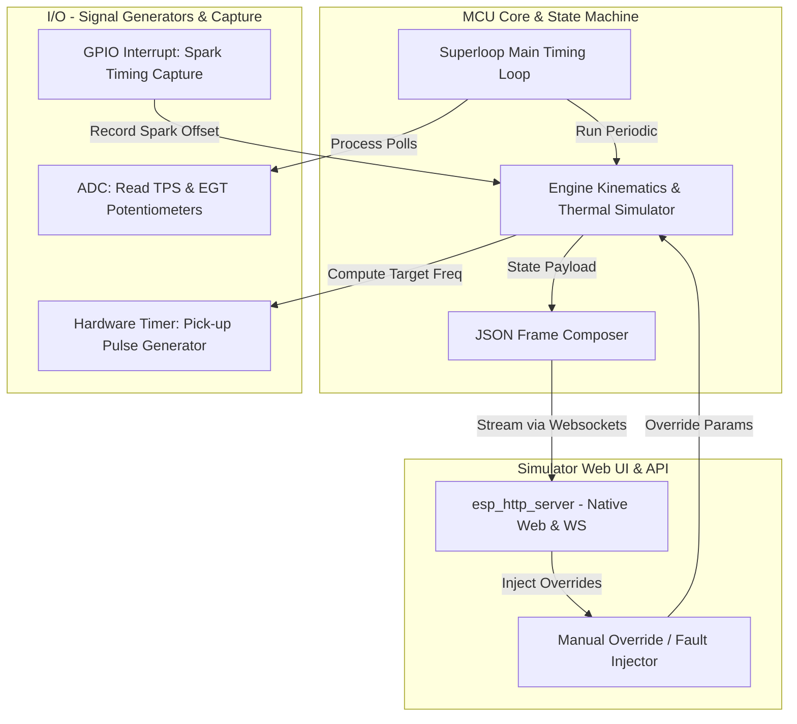

# Simulator Node High-Level Architecture Prototyping

This document outlines the high-level architecture of the **ECU Simulator Node**. The simulator runs on a secondary ESP32 development board (e.g., standard ESP32 or ESP32-S2), serving as a hardware-in-the-loop (HIL) test-bench. It physicalizes mechanical and thermal signals (Pick-up coil sensor, Throttle Position Sensor, Exhaust Gas Temperature) and measures the resulting ECU CDI (Capacitor Discharge Ignition) trigger output to calculate spark advance.

## Design Philosophy: Centralized Configuration & Native ESP-IDF

To ensure sub-microsecond pulse timing accuracy, zero task-switching overhead, and maximal determinism in the kinematics calculations, **the core Simulator logic operates in a single-threaded superloop** paired with hardware interrupts and low-overhead timers. 

### Key Principles:
- **Centralized Pin Mappings**: All simulator inputs and outputs are defined as macros in a centralized `pins.h` header file, allowing easy hardware portability across ESP32 and ESP32-S2 development boards.
- **ESP-IDF Native Components**: Web interfaces and API endpoints are powered by ESP-IDF's native `esp_http_server` module, avoiding third-party Arduino dependencies and maintaining compliance with standard ESP-IDF workflows.
- **Dual Hardware DACs**: Both TPS and EGT simulated analog voltages are generated via the ESP32/ESP32-S2's dual on-board Digital-to-Analog Converters (DACs). This provides highly accurate 8-bit DC voltage outputs without requiring high-frequency PWM or external RC smoothing filters.
- **Open-Loop Signal Generation**: The pick-up coil pulse generator operates independently of the ECU's spark output, dynamically translating the selected RPM (from Web UI or potentiometer) to a corresponding frequency in Hz.
- **Passive Monitoring**: The spark advance capture system acts as a passive observer, measuring the phase relationship of the ECU's output relative to the generated pickup signal without feeding back into the signal generation logic.

---

## High-Level Architecture Overview

The simulator consists of three key architectural blocks cooperating in a single-threaded loop:

---

## Important Subsystems

To keep the codebase modular and organized, the architecture is split into three main technical specifications:

### 1. [MCU Core (Engine Simulator)](mcu_core.md)
Responsible for engine rotation kinematics, thermal rise/decay equations, virtual overrides, and telemetry compilation. It coordinates the overall logic of the simulation without spawning concurrent tasks.

### 2. [I/O Interface (Hardware Layer)](io.md)
Responsible for physical interaction, using pin assignments defined in `pins.h`:
- **Generation**: Creating the pick-up sensor square wave based on the selected RPM using hardware LEDC.
- **Measurement**: Capturing the ECU's CDI spark output with a high-precision input capture GPIO interrupt.
- **Sampling**: Reading physical potentiometers using the ADC to simulate TPS and EGT sensors.

### 3. [Simulator Web UI (Interactive Panel)](web_ui.md)
A lightweight web interface hosted directly on the simulator's flash filesystem. It allows developers to:
- Actively override analog sensor values (TPS, EGT) via virtual sliders.
- Artificially inject faults (e.g., EGT overheating) to test the ECU's `ALARM` state.
- Monitor physical spark timing metrics calculated by the capture system.

---

## HIL Hardware Connections

All pins listed below are configurable via `pins.h` to support various development boards (ESP32 / ESP32-S2):

| Simulator Pin Macro | Signal Type | ECU Pin (ESP32-S3) | Signal Description |
|---------------------|-------------|---------------------|--------------------|
| `SIM_PIN_PICKUP`    | Output → Input | **GPIO 4**          | Pick-up Coil Pulse (0-300 Hz square wave) |
| `SIM_PIN_TPS_OUT`   | Output → Input | **GPIO 5**          | TPS Analog Voltage (0-3.3V via hardware DAC Channel 2) |
| `SIM_PIN_EGT_OUT`   | Output → Input | **GPIO 6**          | EGT Analog Voltage (0-3.3V via hardware DAC Channel 1) |
| `SIM_PIN_SPARK`     | Input ← Output | **GPIO 7**          | CDI Ignition Spark Trigger |
| `SIM_PIN_QS_OUT`    | Output → Input | **GPIO 8**          | Quick-Shifter (QS) Switch Trigger (Active-Low pulse) |
| **GND**             | Ground Share| **GND**             | Common Ground Reference |

