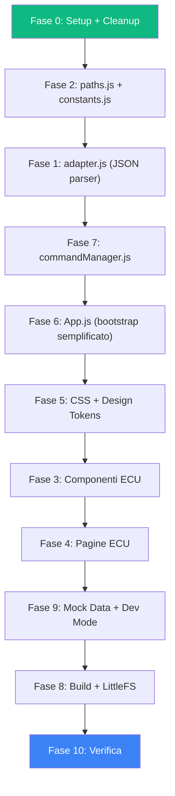

# Piano di Conversione: fogextra-webui → ECU Dashboard

> Conversione della SPA Vite dal dominio "sistema di nebulizzazione industriale" al dominio "ECU telemetria e accensione motociclo monocilindrico".

---

## Sommario

Il progetto `fogextra-webui` è una Single Page Application vanilla JS con Vite, già collaudata su ESP32 con WebSocket, gzip build, e deploy su LittleFS. Il piano copre la conversione completa verso la dashboard ECU definita nella sezione §5 di [elaborato.md](file:///Users/puddu/Documents/GitHub/ecu-dev-board/idf/docs/elaborato.md).

> [!IMPORTANT]
> La conversione **non è un refactor**: è una riscrittura chirurgica del layer dominio (adapter, store paths, componenti, pagine) mantenendo intatta l'infrastruttura core (Store, Component, Page, Socket, Vite pipeline).

---

## Indice

1. [Inventario Codebase Sorgente](#1-inventario-codebase-sorgente)
2. [Mappa Keep / Modify / Delete](#2-mappa-keep--modify--delete)
3. [Fase 0 — Setup Progetto](#3-fase-0--setup-progetto)
4. [Fase 1 — Protocollo e Adapter (JSON)](#4-fase-1--protocollo-e-adapter-json)
5. [Fase 2 — Store Paths e Costanti](#5-fase-2--store-paths-e-costanti)
6. [Fase 3 — Componenti UI ECU](#6-fase-3--componenti-ui-ecu)
7. [Fase 4 — Pagine](#7-fase-4--pagine)
8. [Fase 5 — CSS e Theme](#8-fase-5--css-e-theme)
9. [Fase 6 — App.js Bootstrap](#9-fase-6--appjs-bootstrap)
10. [Fase 7 — Utilities e Managers](#10-fase-7--utilities-e-managers)
11. [Fase 8 — Build Pipeline e Integrazione ESP32](#11-fase-8--build-pipeline-e-integrazione-esp32)
12. [Fase 9 — Mock Data e Dev Mode](#12-fase-9--mock-data-e-dev-mode)
13. [Fase 10 — Verifica e Collaudo](#13-fase-10--verifica-e-collaudo)
14. [File-by-File Reference](#14-file-by-file-reference)

---

## 1. Inventario Codebase Sorgente

### Struttura Directory

```
webui/
├── src/
│   ├── index.html                    # Entry point HTML
│   ├── css/
│   │   ├── styles.css                # 42KB — CSS globale + design tokens
│   │   ├── components/               # 18 file CSS componente
│   │   └── pages/
│   │       └── WifiPage.css
│   ├── js/
│   │   ├── main.js                   # Bootstrap entry
│   │   ├── commands.js               # Command string templates
│   │   ├── core/
│   │   │   ├── App.js                # 32KB — Orchestratore bootstrap (911 righe)
│   │   │   ├── Component.js          # 28KB — Classe base componenti (lifecycle)
│   │   │   ├── Page.js               # 13KB — Classe base pagine
│   │   │   ├── store.js              # 14KB — Store reattivo path-based
│   │   │   ├── socket.js             # 17KB — WebSocket client (backoff, heartbeat, visibility)
│   │   │   ├── adapter.js            # 23KB — Parser messaggi pipe-delimited
│   │   │   ├── AssetCatalog.js       # 5KB  — Catalogo asset statici
│   │   │   ├── authGuard.js          # 9KB  — PIN lock system
│   │   │   └── localizationEffect.js # 5KB  — Observer i18n
│   │   ├── managers/
│   │   │   ├── navigatorManager.js   # 13KB — Router SPA
│   │   │   ├── commandManager.js     # 22KB — Command queue + ACK/NACK
│   │   │   ├── modalManager.js       # 10KB — Modal lifecycle
│   │   │   ├── sidebarManager.js     # 5KB  — Sidebar toggle
│   │   │   ├── BootstrapRequestPipeline.js # 5KB — Bootstrap sequencing
│   │   │   └── ImageManager.js       # 11KB — Image cache
│   │   ├── components/               # 26 component directories
│   │   ├── pages/                    # 8 page files
│   │   └── utils/                    # 14 utility files
│   ├── assets/
│   │   ├── icons/                    # SVG icons
│   │   └── img/                      # Immagini domain-specific
│   └── docs/
├── dist/                             # Build output
│   ├── app.js.gz                     # ~87KB (JS bundle compresso)
│   ├── style.css.gz                  # ~16KB (CSS compresso)
│   └── index.html                    # 4KB
├── data/                             # Copia per LittleFS
├── vite.config.js                    # Build config con gzip + copy
└── package.json                      # Dipendenze: vite, fs-extra, vite-plugin-static-copy
```

### Metriche Chiave

| Metrica | Valore |
|---|---|
| File JS totali | ~55 |
| Righe JS totali | ~6.500 |
| File CSS totali | ~20 |
| Build gzip totale | ~107KB (JS+CSS+HTML) |
| Dipendenze runtime | **0** (vanilla JS) |
| Dipendenze dev | 3 (vite, fs-extra, vite-plugin-static-copy) |

---

## 2. Mappa Keep / Modify / Delete

### ✅ KEEP (infrastruttura riutilizzabile as-is)

| File | Ruolo | Note |
|---|---|---|
| [store.js](file:///Users/puddu/Downloads/webui/src/js/core/store.js) | Store reattivo path-based | 100% generico — `Store.set()`, `Store.get()`, `Store.subscribe()` |
| [Component.js](file:///Users/puddu/Downloads/webui/src/js/core/Component.js) | Classe base componenti | Lifecycle: `CREATED→MOUNTED→BOUND→ACTIVE→DEACTIVATED`. 100% generico |
| [Page.js](file:///Users/puddu/Downloads/webui/src/js/core/Page.js) | Classe base pagine | Extends Component, aggiunge `createSkeleton()`. 100% generico |
| [socket.js](file:///Users/puddu/Downloads/webui/src/js/core/socket.js) | WebSocket client | Backoff esponenziale, heartbeat, visibility API, replaced overlay. **Produzione-ready** |
| [navigatorManager.js](file:///Users/puddu/Downloads/webui/src/js/managers/navigatorManager.js) | Router SPA | `registerPage()`, `navigateTo()`, history stack. 100% generico |
| [modalManager.js](file:///Users/puddu/Downloads/webui/src/js/managers/modalManager.js) | Modal lifecycle | `open()`, `close()`, backdrop. 100% generico |
| [sidebarManager.js](file:///Users/puddu/Downloads/webui/src/js/managers/sidebarManager.js) | Sidebar toggle | `open()`, `close()`, navigation links. 100% generico |
| [logger.js](file:///Users/puddu/Downloads/webui/src/js/utils/logger.js) | Logger con debug mode | `log.info()`, `log.debug()`, `log.error()`. 100% generico |
| [theme.js](file:///Users/puddu/Downloads/webui/src/js/utils/theme.js) | Dark/Light mode toggle | `data-theme` attribute, localStorage persistence |
| [animations.js](file:///Users/puddu/Downloads/webui/src/js/utils/animations.js) | Animazioni UI temporanee | Utility generiche |
| [socketLogger.js](file:///Users/puddu/Downloads/webui/src/js/utils/socketLogger.js) | Debug WS messages | Log e statistiche messaggi ricevuti |
| `vite.config.js` | Build pipeline | Gzip, copy-to-data, version injection. **Riutilizzare tal quale** |
| `package.json` | Dipendenze | Aggiornare solo `name`, `description`, `version` |

### 🔧 MODIFY (adattare al dominio ECU)

| File | Cosa cambia | Effort |
|---|---|---|
| [adapter.js](file:///Users/puddu/Downloads/webui/src/js/core/adapter.js) | **Riscrittura totale**: da parser pipe-delimited a parser JSON ECU | Alto |
| [App.js](file:///Users/puddu/Downloads/webui/src/js/core/App.js) | Bootstrap: rimuovere LANG/MENU/PIN, nuova sequenza (connect → config → telemetry) | Alto |
| [commandManager.js](file:///Users/puddu/Downloads/webui/src/js/managers/commandManager.js) | Nuovi comandi ECU JSON: `qs_trigger`, `edit_map`, `set_active_map`, `ota_check`, `get_config` | Alto |
| [BootstrapRequestPipeline.js](file:///Users/puddu/Downloads/webui/src/js/managers/BootstrapRequestPipeline.js) | Semplificare: unica richiesta `get_config` invece di 5 step | Medio |
| [constants.js](file:///Users/puddu/Downloads/webui/src/js/utils/constants.js) | **Riscrittura totale**: nuovi `MsgType`, `CmdToEcu`, `FsmState`, `SocketState` (keep) | Alto |
| [paths.js](file:///Users/puddu/Downloads/webui/src/js/utils/paths.js) | **Riscrittura totale**: nuovi path ECU (telemetry, maps, fsm, ota) | Alto |
| [main.js](file:///Users/puddu/Downloads/webui/src/js/main.js) | Minimo: cambiare nomi, rimuovere import non usati | Basso |
| [index.html](file:///Users/puddu/Downloads/webui/src/index.html) | Rimuovere CSS fog, aggiungere CSS ECU, cambiare `<title>`, rimuovere 18 link CSS componenti | Medio |
| `styles.css` | Mantenere design tokens e layout, sostituire componenti fog con ECU | Alto |
| [socket.js](file:///Users/puddu/Downloads/webui/src/js/core/socket.js) | **Minimo**: cambiare formato heartbeat da `"PING|heartbeat"` a JSON `{"cmd":"ping"}` se necessario | Basso |

### ❌ DELETE (domain-specific fog)

| File/Directory | Motivo |
|---|---|
| `components/AddTimeSlotButton/` | Scheduler nebulizzazione |
| `components/GanttChart/` | Visualizzazione orari nebulizzazione |
| `components/InputTimer/` | Input ore/minuti nebulizzazione |
| `components/ModeSelector/` | Selezione modalità fog (temp/hum/timer/cal) |
| `components/ModeStateButton/` | Toggle ON/OFF modalità fog |
| `components/ParameterItem/` | Editor parametro generico fog (con divisor/shift) |
| `components/PowerButton/` | ON/OFF pompa |
| `components/RelayStatusForm/` | Stato relè ausiliario |
| `components/SensorCard/` | Card sensore temp/umidità |
| `components/Sensors/` | Container sensori fog |
| `components/TimeSlot/` | Singola fascia oraria |
| `components/TimeSlotGauge/` | Gauge fascia oraria |
| `components/TimeSlotRender/` | Rendering lista fasce |
| `components/TimerForm/` | Form editor timer |
| `components/WiFiCardInput/` | Input credenziali WiFi |
| `components/WifiConnectionCard/` | Card connessione WiFi |
| `components/LanguageDropdown/` | Selector lingua (ECU non serve i18n multi-lingua) |
| `pages/HomePage.js` | Home fog con sensori, modalità, pompa |
| `pages/MenuSettingsPage.js` | Menu parametri fog |
| `pages/TimeSlotsPage.js` | Lista fasce orarie |
| `pages/TimeSlotEditorPage.js` | Editor fascia oraria |
| `pages/TimerEditorPage.js` | Editor timer |
| `pages/ParameterEditorPage.js` | Editor singolo parametro |
| `pages/WifiPage.js` | Pagina WiFi (ECU usa STA, no config WiFi da dashboard) |
| `pages/PinPage.js` | Pagina PIN lock |
| `core/authGuard.js` | Sistema PIN (non richiesto per ECU) |
| `core/localizationEffect.js` | Observer i18n (ECU → solo italiano/inglese hardcoded) |
| `core/AssetCatalog.js` | Catalogo immagini fog |
| `managers/ImageManager.js` | Cache immagini fog |
| `utils/i18n.js` | Sistema internazionalizzazione (37KB — non serve) |
| `utils/enumMappings.js` | Mapping enum fog |
| `utils/iconMapping.js` | Mapping icone fog |
| `utils/menuMapping.js` | Mapping menu fog |
| `utils/paramHelpers.js` | Helper parametri fog |
| `utils/mockData.js` | Mock data fog (va ricreato per ECU) |
| `utils/testHelpers.js` | Test helpers fog |
| `utils/clock.js` | RTC sync (ECU non ha RTC lato web) |
| `commands.js` | Template comandi pipe-delimited fog |
| Tutti i CSS in `css/components/` | Stili componenti fog |
| `css/pages/WifiPage.css` | Stile pagina WiFi |
| `assets/icons/` | Icone fog-specific |
| `assets/img/` | Immagini fog-specific |

---

## 3. Fase 0 — Setup Progetto

### 3.1 Copiare il progetto

```bash
# Dalla root del progetto ECU
cp -r /Users/puddu/Downloads/webui ./webui
cd webui
```

### 3.2 Pulire i file da eliminare

```bash
# Componenti fog
rm -rf src/js/components/AddTimeSlotButton
rm -rf src/js/components/GanttChart
rm -rf src/js/components/InputTimer
rm -rf src/js/components/ModeSelector
rm -rf src/js/components/ModeStateButton
rm -rf src/js/components/ParameterItem
rm -rf src/js/components/PowerButton
rm -rf src/js/components/RelayStatusForm
rm -rf src/js/components/SensorCard
rm -rf src/js/components/Sensors
rm -rf src/js/components/TimeSlot
rm -rf src/js/components/TimeSlotGauge
rm -rf src/js/components/TimeSlotRender
rm -rf src/js/components/TimerForm
rm -rf src/js/components/WiFiCardInput
rm -rf src/js/components/WifiConnectionCard
rm -rf src/js/components/LanguageDropdown

# Pagine fog
rm src/js/pages/HomePage.js
rm src/js/pages/MenuSettingsPage.js
rm src/js/pages/TimeSlotsPage.js
rm src/js/pages/TimeSlotEditorPage.js
rm src/js/pages/TimerEditorPage.js
rm src/js/pages/ParameterEditorPage.js
rm src/js/pages/WifiPage.js
rm src/js/pages/PinPage.js

# Core fog-specific
rm src/js/core/authGuard.js
rm src/js/core/localizationEffect.js
rm src/js/core/AssetCatalog.js
rm src/js/managers/ImageManager.js

# Utils fog-specific
rm src/js/utils/i18n.js
rm src/js/utils/enumMappings.js
rm src/js/utils/iconMapping.js
rm src/js/utils/menuMapping.js
rm src/js/utils/paramHelpers.js
rm src/js/utils/mockData.js
rm src/js/utils/testHelpers.js
rm src/js/utils/clock.js
rm src/js/commands.js

# CSS fog-specific (ricreeremo per ECU)
rm -rf src/css/components/
rm -rf src/css/pages/

# Asset fog-specific
rm -rf src/assets/icons/
rm -rf src/assets/img/

# Dist e data (rebuild)
rm -rf dist/
rm -rf data/
```

### 3.3 Aggiornare package.json

```json
{
  "name": "ecu-dashboard",
  "version": "0.1.0",
  "private": true,
  "type": "module",
  "description": "Dashboard telemetria e controllo ECU per ESP32-S3",
  "scripts": {
    "dev": "vite",
    "build": "vite build",
    "preview": "vite preview"
  },
  "devDependencies": {
    "fs-extra": "^11.3.2",
    "vite": "^7.1.10",
    "vite-plugin-static-copy": "^3.1.4"
  }
}
```

### 3.4 Struttura target dopo cleanup

```
webui/
├── src/
│   ├── index.html
│   ├── css/
│   │   ├── styles.css                 # Riscritto per ECU
│   │   ├── components/                # Nuovi stili componenti ECU
│   │   └── pages/                     # Nuovi stili pagine ECU
│   ├── js/
│   │   ├── main.js                    # Entry (modificato)
│   │   ├── core/
│   │   │   ├── App.js                 # Bootstrap (modificato)
│   │   │   ├── Component.js           # KEEP as-is
│   │   │   ├── Page.js                # KEEP as-is
│   │   │   ├── store.js               # KEEP as-is
│   │   │   ├── socket.js              # KEEP (minime modifiche)
│   │   │   └── adapter.js             # RISCRITTO per JSON ECU
│   │   ├── managers/
│   │   │   ├── navigatorManager.js    # KEEP as-is
│   │   │   ├── commandManager.js      # RISCRITTO per comandi ECU
│   │   │   ├── modalManager.js        # KEEP as-is
│   │   │   ├── sidebarManager.js      # KEEP as-is
│   │   │   └── BootstrapRequestPipeline.js # Semplificato
│   │   ├── components/                # NUOVI componenti ECU
│   │   │   ├── _superClass/           # KEEP (classe base foglia)
│   │   │   ├── Badge/                 # KEEP (generico)
│   │   │   ├── Banner/                # KEEP (generico)
│   │   │   ├── LoadingSpinner/        # KEEP (generico)
│   │   │   ├── Modal/                 # KEEP (generico)
│   │   │   ├── PageTopBar/            # KEEP (generico)
│   │   │   ├── Sidebar/               # KEEP (modificare link)
│   │   │   ├── topBar/                # KEEP (modificare contenuto)
│   │   │   ├── RpmGauge/              # NUOVO
│   │   │   ├── TpsBar/                # NUOVO
│   │   │   ├── EgtIndicator/          # NUOVO
│   │   │   ├── FsmBadge/              # NUOVO
│   │   │   ├── TelemetryValue/        # NUOVO
│   │   │   ├── MapEditor/             # NUOVO
│   │   │   ├── MapCurve/              # NUOVO
│   │   │   ├── MapSelector/           # NUOVO
│   │   │   ├── QsButton/              # NUOVO
│   │   │   ├── OtaStatus/             # NUOVO
│   │   │   └── ConnectionBadge/       # NUOVO (reusa SocketState)
│   │   ├── pages/                     # NUOVE pagine ECU
│   │   │   ├── DashboardPage.js       # NUOVO — pagina principale telemetria
│   │   │   ├── MapsPage.js            # NUOVO — editor mappe
│   │   │   └── SettingsPage.js        # NUOVO — OTA + info firmware
│   │   └── utils/
│   │       ├── constants.js           # RISCRITTO per ECU
│   │       ├── paths.js               # RISCRITTO per ECU
│   │       ├── logger.js              # KEEP as-is
│   │       ├── theme.js               # KEEP as-is
│   │       ├── animations.js          # KEEP as-is
│   │       ├── socketLogger.js        # KEEP as-is
│   │       └── mockData.js            # NUOVO — mock telemetry ECU
│   └── assets/
│       └── icons/                     # Nuove icone ECU (minimal)
├── vite.config.js                     # KEEP (aggiornare copy dest)
└── package.json
```

---

## 4. Fase 1 — Protocollo e Adapter (JSON)

### Differenza fondamentale di protocollo

| Aspetto | fogextra (attuale) | ECU (target) |
|---|---|---|
| **Formato** | Pipe-delimited: `TYPE\|field☺field☻field` | **JSON puro** |
| **Direzione ECU→Dashboard** | `UPDATE\|T,1,1,...` (posizionale) | `{"type":"telemetry","data":{...}}` |
| **Direzione Dashboard→ECU** | `MODIFY_PARAM\|id☺value` (pipe) | `{"cmd":"qs_trigger"}` (JSON) |
| **Separatori** | `☺☻♥♦♣` (codifica CP437) | Nessuno (JSON nativo) |
| **Bootstrap** | 5 messaggi sequenziali (HELLO→PARAM→MENU→TIME_SLOT→UPDATE) | 1 richiesta `get_config` → 1 risposta `config` |

### 4.1 Nuovo [adapter.js](file:///Users/puddu/Downloads/webui/src/js/core/adapter.js)

Riscrivere completamente. Il nuovo adapter gestirà 4 tipi di messaggio in ingresso:

```javascript
// adapter.js — ECU version
import { Store } from "./store.js";
import { Paths } from "../utils/paths.js";

/**
 * Dispatch JSON messages from ECU WebSocket
 * @param {string} raw — raw WebSocket message (JSON string)
 */
export function dispatchMessage(raw) {
  let msg;
  try {
    msg = JSON.parse(raw);
  } catch (e) {
    // Ignore non-JSON messages (PONG, etc.)
    return;
  }

  switch (msg.type) {
    case "telemetry":  return parseTelemetry(msg.data);
    case "config":     return parseConfig(msg.data);
    case "ack":        return parseAck(msg);
    case "ota_status": return parseOtaStatus(msg);
    default:
      console.warn("Unknown message type:", msg.type);
  }
}
```

#### 4.1.1 `parseTelemetry(data)`

Ricevuto a 10–20 Hz. Aggiorna lo Store con i dati real-time:

```javascript
function parseTelemetry(data) {
  Store.set(Paths.TELEMETRY.RPM,         data.rpm);
  Store.set(Paths.TELEMETRY.TPS,         data.tps);
  Store.set(Paths.TELEMETRY.EGT,         data.egt);
  Store.set(Paths.TELEMETRY.FSM_STATE,   data.fsm);
  Store.set(Paths.TELEMETRY.ADVANCE_DEG, data.advance_deg);
  Store.set(Paths.TELEMETRY.PJ_DUTY,     data.pj_duty);
  Store.set(Paths.TELEMETRY.ACTIVE_MAP,  data.active_map);
  Store.set(Paths.TELEMETRY.TIMESTAMP,   data.ts);
}
```

> [!WARNING]
> **Performance critica**: A 20 Hz (50ms tra messaggi), ogni `Store.set()` triggera i subscriber. Valutare se usare `Store.batch()` (da implementare) per aggregare gli update e notificare una sola volta per frame telemetria. Alternativa: usare un singolo path `Paths.TELEMETRY.SNAPSHOT` e fare `Store.set(Paths.TELEMETRY.SNAPSHOT, data)` — i componenti estraggono i campi dal singolo oggetto.

**Raccomandazione**: Approccio **snapshot singolo**. Un solo `Store.set()` per frame telemetria. I componenti subscribono a `telemetry.snapshot` e leggono i campi che servono. Questo è 7x più efficiente a 20 Hz.

```javascript
function parseTelemetry(data) {
  Store.set(Paths.TELEMETRY.SNAPSHOT, data);
}
```

#### 4.1.2 `parseConfig(data)`

Ricevuto una volta al bootstrap (risposta a `get_config`):

```javascript
function parseConfig(data) {
  Store.set(Paths.CONFIG.FIRMWARE_VERSION, data.firmware_version);
  Store.set(Paths.CONFIG.MAPS.IGNITION,    data.maps.ignition);
  Store.set(Paths.CONFIG.MAPS.POWER_JET,   data.maps.power_jet);
  Store.set(Paths.CONFIG.ACTIVE_MAP_ID,    data.active_map_id);
  Store.set(Paths.CONFIG.SYNC_PULSES,      data.sync_pulses_required);
  Store.set(Paths.CONFIG.EGT_ALARM,        data.egt_alarm_threshold);
}
```

#### 4.1.3 `parseAck(msg)`

Conferma ricezione comandi:

```javascript
function parseAck(msg) {
  Store.set(Paths.COMMAND.LAST_ACK, {
    cmd:    msg.cmd,
    status: msg.status,
    ts:     Date.now()
  });
}
```

#### 4.1.4 `parseOtaStatus(msg)`

```javascript
function parseOtaStatus(msg) {
  Store.set(Paths.OTA.AVAILABLE,       msg.available);
  Store.set(Paths.OTA.REMOTE_VERSION,  msg.remote_version);
  Store.set(Paths.OTA.CURRENT_VERSION, msg.current_version);
}
```

### 4.2 Formato messaggi Dashboard → ECU

Il fogextra usa `CommandManager` con messaggi pipe-delimited e un sistema ACK/NACK testuale. L'ECU usa JSON.

**Comandi ECU (tutti JSON `Socket.send(JSON.stringify(cmd))`)**:

| Comando | JSON | Note |
|---|---|---|
| Quick Shift | `{"cmd":"qs_trigger"}` | Immediato, no params |
| Set mappa attiva | `{"cmd":"set_active_map","map_id":1}` | Cambia mappa runtime |
| Edit mappa | `{"cmd":"edit_map","map_type":"ignition","map_id":1,"breakpoints":[...]}` | Payload completo breakpoints |
| Check OTA | `{"cmd":"ota_check"}` | Trigger polling server |
| Get config | `{"cmd":"get_config"}` | Bootstrap: ECU risponde con `{type:"config",...}` |

---

## 5. Fase 2 — Store Paths e Costanti

### 5.1 Nuovo [paths.js](file:///Users/puddu/Downloads/webui/src/js/utils/paths.js)

```javascript
export const Paths = {
  // ── Telemetria real-time (aggiornata a 10-20 Hz) ──
  TELEMETRY: {
    SNAPSHOT: "telemetry.snapshot",  // Oggetto completo {rpm, tps, egt, fsm, ...}
    // Campi individuali (opzionale, per subscribe granulare)
    RPM:         "telemetry.rpm",
    TPS:         "telemetry.tps",
    EGT:         "telemetry.egt",
    FSM_STATE:   "telemetry.fsm",
    ADVANCE_DEG: "telemetry.advance_deg",
    PJ_DUTY:     "telemetry.pj_duty",
    ACTIVE_MAP:  "telemetry.active_map",
    TIMESTAMP:   "telemetry.ts"
  },

  // ── Configurazione (ricevuta al bootstrap, aggiornata su edit_map) ──
  CONFIG: {
    FIRMWARE_VERSION: "config.firmwareVersion",
    MAPS: {
      IGNITION:  "config.maps.ignition",   // Array di {id, name, breakpoints}
      POWER_JET: "config.maps.powerJet"    // Array di {id, name, breakpoints}
    },
    ACTIVE_MAP_ID:     "config.activeMapId",
    SYNC_PULSES:       "config.syncPulses",
    EGT_ALARM:         "config.egtAlarm"
  },

  // ── OTA ──
  OTA: {
    AVAILABLE:       "ota.available",
    REMOTE_VERSION:  "ota.remoteVersion",
    CURRENT_VERSION: "ota.currentVersion"
  },

  // ── Command feedback ──
  COMMAND: {
    LAST_ACK: "command.lastAck"    // {cmd, status, ts}
  },

  // ── Socket state ──
  SOCKET: {
    STATE: "socket.state"
  },

  // ── App state ──
  APP: {
    LOADING:     "app.loading",
    INITIALIZED: "app.initialized",
    ERROR:       "app.error"
  }
};
```

### 5.2 Nuovo [constants.js](file:///Users/puddu/Downloads/webui/src/js/utils/constants.js)

```javascript
// ── Tipi messaggi ECU → Dashboard ──
export const MsgType = {
  TELEMETRY:  "telemetry",
  CONFIG:     "config",
  ACK:        "ack",
  OTA_STATUS: "ota_status"
};

// ── Comandi Dashboard → ECU ──
export const CmdType = {
  QS_TRIGGER:     "qs_trigger",
  SET_ACTIVE_MAP: "set_active_map",
  EDIT_MAP:       "edit_map",
  OTA_CHECK:      "ota_check",
  GET_CONFIG:     "get_config"
};

// ── FSM States ──
export const FsmState = {
  INIT:    "INIT",
  SYNCING: "SYNCING",
  RUNNING: "RUNNING",
  IDLE:    "IDLE",
  IGNCUT:  "IGNCUT",
  ALARM:   "ALARM"
};

// ── FSM State display config ──
export const FsmStateConfig = {
  INIT:    { label: "INIT",    color: "#6b7280", icon: "⏸" },  // grigio
  SYNCING: { label: "SYNCING", color: "#f59e0b", icon: "🔄" }, // giallo
  RUNNING: { label: "RUNNING", color: "#10b981", icon: "▶" },  // verde
  IDLE:    { label: "IDLE",    color: "#3b82f6", icon: "💤" },  // blu
  IGNCUT:  { label: "IGNCUT",  color: "#8b5cf6", icon: "⚡" }, // viola
  ALARM:   { label: "ALARM",   color: "#ef4444", icon: "🚨" }  // rosso
};

// ── Map types ──
export const MapType = {
  IGNITION:  "ignition",
  POWER_JET: "power_jet"
};

// ── Socket states (KEEP da fogextra) ──
export const SocketState = {
  CONNECTING:   "connecting",
  CONNECTED:    "connected",
  DISCONNECTED: "disconnected",
  RECONNECTING: "reconnecting"
};

// ── EGT thresholds per colori ──
export const EgtThresholds = {
  SAFE:    600,   // verde < 600°C
  WARNING: 750,   // giallo 600-750°C
  DANGER:  800    // rosso > 750°C (alarm > 800°C)
};

// ── RPM range ──
export const RpmRange = {
  MIN: 0,
  MAX: 18000,
  IDLE_THRESHOLD: 1500,
  REDLINE: 14000
};
```

---

## 6. Fase 3 — Componenti UI ECU

### 6.1 Componenti da creare

Ogni componente segue il pattern di `Component.js`:

```javascript
class MyComponent extends Component {
  constructor(options) { super(options); }
  createDOM()    { /* return HTMLElement */ }
  bindEvents()   { /* addEventListener */ }
  onActivate()   { /* subscribe Store, start update */ }
  onDeactivate() { /* unsubscribe, stop update */ }
  update(data)   { /* DOM manipulation */ }
}
```

---

#### 6.1.1 `RpmGauge` — Indicatore RPM (componente principale)

**File**: `src/js/components/RpmGauge/RpmGauge.js` + `src/css/components/RpmGauge.css`

**Funzione**: Visualizzazione RPM grande e prominente, con arco SVG o barra lineare. Deve essere il focus visivo della dashboard.

**Store subscription**: `Paths.TELEMETRY.SNAPSHOT` → estrai `data.rpm`

**Specifiche UI**:
- Display numerico grande al centro (es. `8500`)
- Unità "RPM" sotto il numero
- Barra/arco progressivo da 0 a `RpmRange.MAX` (18000)
- Colorazione: verde (0–10000), giallo (10000–14000), rosso (14000+)
- Animazione smooth con `requestAnimationFrame` per transizioni fluide

**Implementazione suggerita**: Arco SVG con `stroke-dashoffset` animato. L'arco occupa 270° (da 135° a 405°). Il valore RPM determina la percentuale dell'arco riempito.

```javascript
// Pseudo-struttura DOM
// <div class="rpm-gauge">
//   <svg viewBox="0 0 200 200">
//     <circle class="rpm-gauge__track" />      <!-- arco grigio sfondo -->
//     <circle class="rpm-gauge__fill" />        <!-- arco colorato -->
//   </svg>
//   <div class="rpm-gauge__value">8500</div>
//   <div class="rpm-gauge__label">RPM</div>
// </div>
```

---

#### 6.1.2 `TpsBar` — Barra posizione gas

**File**: `src/js/components/TpsBar/TpsBar.js` + `src/css/components/TpsBar.css`

**Store subscription**: `Paths.TELEMETRY.SNAPSHOT` → `data.tps`

**Specifiche UI**:
- Barra orizzontale o verticale (0–100%)
- Valore numerico: `72.3%`
- Gradiente colore: grigio → verde → giallo
- Label: "TPS" (Throttle Position Sensor)

---

#### 6.1.3 `EgtIndicator` — Indicatore temperatura scarico

**File**: `src/js/components/EgtIndicator/EgtIndicator.js` + `src/css/components/EgtIndicator.css`

**Store subscription**: `Paths.TELEMETRY.SNAPSHOT` → `data.egt`

**Specifiche UI**:
- Valore numerico grande: `620°C`
- Colorazione soglia (da `EgtThresholds`):
  - **Verde** (< 600°C): sicuro
  - **Giallo** (600–750°C): attenzione
  - **Rosso** (> 750°C): pericolo
- Icona che pulsa in rosso sopra soglia alarm (`EgtThresholds.DANGER`)
- Linea soglia visibile

---

#### 6.1.4 `FsmBadge` — Badge stato motore

**File**: `src/js/components/FsmBadge/FsmBadge.js` + `src/css/components/FsmBadge.css`

**Store subscription**: `Paths.TELEMETRY.SNAPSHOT` → `data.fsm`

**Specifiche UI**:
- Badge rettangolare con sfondo colorato (da `FsmStateConfig`)
- Testo: nome stato (INIT, SYNCING, RUNNING, IDLE, IGNCUT, ALARM)
- Icona emoji prima del testo
- Animazione pulse quando cambia stato
- Dimensione compatta (inline nella top area)

Può estendere il componente [Badge](file:///Users/puddu/Downloads/webui/src/js/components/Badge/) esistente (già generico).

---

#### 6.1.5 `TelemetryValue` — Valore telemetria generico

**File**: `src/js/components/TelemetryValue/TelemetryValue.js` + `src/css/components/TelemetryValue.css`

**Uso**: Componente riutilizzabile per mostrare un singolo valore con label e unità. Usato per:
- Angolo anticipo: `28.5°`
- Duty PJ: `45.0%`
- Mappa attiva: `Mappa A`

**Props (constructor options)**:
- `label`: string — "Anticipo" / "PJ Duty" / "Mappa"
- `unit`: string — "°" / "%" / ""
- `field`: string — chiave nel telemetry snapshot (`advance_deg`, `pj_duty`, `active_map`)
- `formatter`: function — formattazione custom (es. `v => mapNames[v]`)

---

#### 6.1.6 `MapEditor` — Editor breakpoints mappa

**File**: `src/js/components/MapEditor/MapEditor.js` + `src/css/components/MapEditor.css`

**Questo è il componente più complesso.** Editor interattivo per le lookup table 1D.

**Store subscription**: `Paths.CONFIG.MAPS.IGNITION` / `Paths.CONFIG.MAPS.POWER_JET`

**Specifiche UI**:
- **Tabella breakpoints**: colonne RPM | Valore, righe editabili
- **Pulsanti**: "Aggiungi breakpoint" / "Rimuovi breakpoint"
- **Input validazione**: RPM intero (step 500), Valore intero/float
- **Pulsante "Salva"**: invia `edit_map` via CommandManager
- **Feedback ACK**: mostra ✅/❌ dopo risposta ECU

**Interazione**:
1. Utente modifica un valore nella tabella
2. Click "Salva" → `CommandManager.sendEditMap(mapType, mapId, breakpoints)`
3. ECU risponde `{type:"ack", cmd:"edit_map", status:"ok"}`
4. UI aggiorna stato → badge verde "Salvato"

---

#### 6.1.7 `MapCurve` — Visualizzazione curva mappa

**File**: `src/js/components/MapCurve/MapCurve.js` + `src/css/components/MapCurve.css`

**Specifiche UI**:
- Canvas o SVG
- Asse X: RPM (0–18000)
- Asse Y: gradi anticipo (0–60°) o duty PJ (0–100%)
- Punti breakpoints come cerchi cliccabili
- Linea interpolata tra i breakpoints
- Marker verticale per RPM corrente (dal telemetry snapshot)
- Griglia di riferimento leggera

---

#### 6.1.8 `MapSelector` — Selettore mappa attiva

**File**: `src/js/components/MapSelector/MapSelector.js` + `src/css/components/MapSelector.css`

**Store subscription**: `Paths.CONFIG.MAPS.IGNITION`, `Paths.TELEMETRY.SNAPSHOT` → `active_map`

**Specifiche UI**:
- Dropdown o radio button group
- Mostra nome mappa + badge "attiva" sulla mappa corrente
- Click → `CommandManager.sendSetActiveMap(mapId)`
- Feedback ACK

---

#### 6.1.9 `QsButton` — Pulsante Quick Shift

**File**: `src/js/components/QsButton/QsButton.js` + `src/css/components/QsButton.css`

**Specifiche UI**:
- Pulsante grande e prominente (il pilota lo usa con guanti)
- Testo: "QS" o "⚡ QUICK SHIFT"
- Colore: viola/blu elettrico
- Click → `CommandManager.sendQsTrigger()`
- Stato FSM → IGNCUT: pulsante lampeggia durante il taglio
- Feedback visivo: animazione "press" con ritorno elastico
- **Disabilitato** quando FSM ≠ RUNNING (non ha senso fare QS se non in marcia)

---

#### 6.1.10 `OtaStatus` — Stato aggiornamento firmware

**File**: `src/js/components/OtaStatus/OtaStatus.js` + `src/css/components/OtaStatus.css`

**Store subscription**: `Paths.OTA.*`, `Paths.CONFIG.FIRMWARE_VERSION`

**Specifiche UI**:
- Versione corrente: `v1.2.0`
- Pulsante "Verifica aggiornamenti"
- Se disponibile: badge "Aggiornamento disponibile: v1.3.0" con pulsante "Aggiorna"
- Nota: l'aggiornamento è gestito dall'ESP32 (`ota_task`), la dashboard mostra solo lo stato

---

#### 6.1.11 `ConnectionBadge` — Badge connessione WS

**File**: `src/js/components/ConnectionBadge/ConnectionBadge.js` + `src/css/components/ConnectionBadge.css`

**Store subscription**: `Paths.SOCKET.STATE`

**Specifiche UI**:
- Cerchio colorato (verde/giallo/rosso/grigio) + testo stato
- Posizionato nella TopBar
- Verde = connected, giallo = connecting/reconnecting, rosso = disconnected

---

### 6.2 Componenti esistenti da mantenere

| Componente | Path | Modifiche |
|---|---|---|
| [Badge](file:///Users/puddu/Downloads/webui/src/js/components/Badge/) | `components/Badge/` | Nessuna — generico |
| [Banner](file:///Users/puddu/Downloads/webui/src/js/components/Banner/) | `components/Banner/` | Nessuna — generico |
| [LoadingSpinner](file:///Users/puddu/Downloads/webui/src/js/components/LoadingSpinner/) | `components/LoadingSpinner/` | Nessuna — generico |
| [Modal](file:///Users/puddu/Downloads/webui/src/js/components/Modal/) | `components/Modal/` | Nessuna — per conferme |
| [PageTopBar](file:///Users/puddu/Downloads/webui/src/js/components/PageTopBar/) | `components/PageTopBar/` | Cambiare titoli pagina |
| [Sidebar](file:///Users/puddu/Downloads/webui/src/js/components/Sidebar/) | `components/Sidebar/` | Cambiare link navigazione: Dashboard, Mappe, Settings |
| [topBar](file:///Users/puddu/Downloads/webui/src/js/components/topBar/) | `components/topBar/` | Aggiungere `ConnectionBadge`, rimuovere LanguageDropdown |
| [InputNumber](file:///Users/puddu/Downloads/webui/src/js/components/InputNumber/) | `components/InputNumber/` | Utile per editor breakpoints |
| [_superClass](file:///Users/puddu/Downloads/webui/src/js/components/_superClass/) | `components/_superClass/` | Nessuna — classe base |

---

## 7. Fase 4 — Pagine

### 7.1 `DashboardPage` — Pagina principale telemetria

**File**: `src/js/pages/DashboardPage.js`

**Questa è la pagina principale**. Mostra tutti i dati real-time in un layout compatto e leggibile su telefono/tablet.

**Layout (mobile-first, portrait)**:

```
┌─────────────────────────────────┐
│ TopBar [🔗 ConnectionBadge]     │
├─────────────────────────────────┤
│                                 │
│       ┌───────────────┐         │
│       │   RPM GAUGE   │         │
│       │    8500        │         │
│       │    ◠◠◠◠◠       │         │
│       └───────────────┘         │
│                                 │
│  [FSM: ▶ RUNNING]              │
│                                 │
│  ┌──────────┐ ┌──────────┐     │
│  │ TPS      │ │ EGT      │     │
│  │ ███░░ 72%│ │ 620°C 🟢 │     │
│  └──────────┘ └──────────┘     │
│                                 │
│  ┌──────────┐ ┌──────────┐     │
│  │ Anticipo │ │ PJ Duty  │     │
│  │ 28.5°    │ │ 45.0%    │     │
│  └──────────┘ └──────────┘     │
│                                 │
│  ┌──────────┐ ┌──────────┐     │
│  │ Mappa    │ │          │     │
│  │ Stock A  │ │ ⚡ QS    │     │
│  └──────────┘ └──────────┘     │
│                                 │
└─────────────────────────────────┘
```

**Lifecycle**:
- `createSkeleton()`: crea container con grid layout
- `onActivate()`: subscriba a `Paths.TELEMETRY.SNAPSHOT`, avvia update loop
- `onDeactivate()`: unsubscribe
- `update(snapshot)`: aggiorna tutti i componenti figli

**Componenti figli**: `RpmGauge`, `FsmBadge`, `TpsBar`, `EgtIndicator`, `TelemetryValue` ×3, `QsButton`

---

### 7.2 `MapsPage` — Editor mappe

**File**: `src/js/pages/MapsPage.js`

**Layout**:

```
┌─────────────────────────────────┐
│ PageTopBar [← Dashboard] [Maps] │
├─────────────────────────────────┤
│                                 │
│  Tipo mappa: [Ignition ▼]      │
│                                 │
│  ┌─────────────────────────┐   │
│  │     CURVA MAPPA (SVG)   │   │
│  │  °/% ▲                  │   │
│  │      │    ·----·         │   │
│  │      │  ·/     \·       │   │
│  │      │·/         \      │   │
│  │      └─────────────► RPM│   │
│  │      [RPM corrente: |]  │   │
│  └─────────────────────────┘   │
│                                 │
│  Mappa: [Stock A ▼] [Map B]    │
│         ^^^^^^^^ attiva         │
│                                 │
│  ┌─────────────────────────┐   │
│  │ RPM    │ Valore │       │   │
│  │ 1000   │ 5°     │ [×]   │   │
│  │ 3000   │ 15°    │ [×]   │   │
│  │ 6000   │ 25°    │ [×]   │   │
│  │ 9000   │ 30°    │ [×]   │   │
│  │ 12000  │ 28°    │ [×]   │   │
│  │          [+ Breakpoint]  │   │
│  └─────────────────────────┘   │
│                                 │
│  [💾 Salva Mappa]               │
│                                 │
└─────────────────────────────────┘
```

**Componenti figli**: `MapCurve`, `MapSelector`, `MapEditor`

---

### 7.3 `SettingsPage` — Impostazioni e OTA

**File**: `src/js/pages/SettingsPage.js`

**Layout**:

```
┌─────────────────────────────────┐
│ PageTopBar [← Dashboard] [⚙]   │
├─────────────────────────────────┤
│                                 │
│  Firmware                       │
│  ┌─────────────────────────┐   │
│  │ Versione: v1.2.0        │   │
│  │ [🔄 Verifica OTA]       │   │
│  │                          │   │
│  │ ⬆ Disponibile: v1.3.0   │   │
│  └─────────────────────────┘   │
│                                 │
│  Configurazione ECU             │
│  ┌─────────────────────────┐   │
│  │ Impulsi sync: 5         │   │
│  │ Soglia EGT alarm: 800°C │   │
│  │ Soglia RPM idle: 1500   │   │
│  └─────────────────────────┘   │
│                                 │
│  Connessione                    │
│  ┌─────────────────────────┐   │
│  │ WebSocket: ● Connesso   │   │
│  │ IP ECU: 192.168.1.x     │   │
│  └─────────────────────────┘   │
│                                 │
└─────────────────────────────────┘
```

**Componenti figli**: `OtaStatus`, `ConnectionBadge`

---

## 8. Fase 5 — CSS e Theme

### 8.1 Design Tokens da mantenere (dal fogextra)

Il fogextra `styles.css` definisce un sistema di design tokens completo che è largamente riutilizzabile:

```css
:root {
  /* Colori base - DA RIFARE per tema ECU */
  --color-primary: ...;
  --color-surface: ...;
  --color-text: ...;
  
  /* Spacing - KEEP */
  --spacing-xs: 4px;
  --spacing-sm: 8px;
  --spacing-md: 16px;
  --spacing-lg: 24px;
  --spacing-xl: 32px;
  
  /* Border radius - KEEP */
  --radius-sm: 4px;
  --radius-md: 8px;
  --radius-lg: 16px;
  
  /* Shadows - KEEP */
  --shadow-sm: ...;
  --shadow-md: ...;
  
  /* Transitions - KEEP */
  --transition-fast: 150ms ease;
  --transition-normal: 300ms ease;
}

[data-theme="dark"] {
  /* Dark mode overrides - DA RIFARE */
}
```

### 8.2 Palette colori ECU

Il tema ECU deve evocare **motorsport, telemetria, cockpit**:

```css
:root {
  /* ── ECU Color Palette ── */
  --ecu-bg:           #0a0e17;        /* Sfondo scuro (quasi nero) */
  --ecu-surface:      #111827;        /* Card surface */
  --ecu-surface-alt:  #1f2937;        /* Surface alternativa */
  --ecu-border:       #374151;        /* Bordi */
  
  --ecu-text:         #f3f4f6;        /* Testo primario */
  --ecu-text-muted:   #9ca3af;        /* Testo secondario */
  
  --ecu-accent:       #3b82f6;        /* Accent blu elettrico */
  --ecu-accent-glow:  rgba(59, 130, 246, 0.3);
  
  --ecu-green:        #10b981;        /* Stato OK / sicuro */
  --ecu-yellow:       #f59e0b;        /* Warning */
  --ecu-red:          #ef4444;        /* Danger / alarm */
  --ecu-purple:       #8b5cf6;        /* Quick shift / IGNCUT */
  
  /* ── RPM Gauge gradient ── */
  --rpm-low:          #10b981;        /* 0-10000 RPM */
  --rpm-mid:          #f59e0b;        /* 10000-14000 RPM */
  --rpm-high:         #ef4444;        /* 14000+ RPM (redline) */
  
  /* ── EGT gradient ── */
  --egt-safe:         #10b981;
  --egt-warn:         #f59e0b;
  --egt-danger:       #ef4444;
}
```

> [!TIP]
> Il tema ECU è **dark-first**. La modalità light è opzionale (e probabilmente inutile — un pilota in pista guarda il display sotto il sole, ma il dark mode ha meno riflessi). Tuttavia il sistema tema del fogextra (`data-theme`) è già pronto se servisse.

### 8.3 Responsività

La dashboard deve funzionare su **telefono (portrait)** come caso principale:
- **320px–430px**: Layout singola colonna, RPM gauge grande
- **430px–768px**: Grid 2 colonne per i valori secondari
- **768px+**: Layout più spazioso (tablet in landscape)

### 8.4 File CSS da creare

| File | Contenuto |
|---|---|
| `css/styles.css` | Design tokens, reset, layout globale, grid, typography |
| `css/components/RpmGauge.css` | Arco SVG, animazioni, colori RPM |
| `css/components/TpsBar.css` | Barra percentuale |
| `css/components/EgtIndicator.css` | Valore con colori soglia |
| `css/components/FsmBadge.css` | Badge stato con colori per stato |
| `css/components/TelemetryValue.css` | Card valore generico |
| `css/components/MapEditor.css` | Tabella breakpoints editabile |
| `css/components/MapCurve.css` | Canvas/SVG curva |
| `css/components/MapSelector.css` | Dropdown/radio mappa |
| `css/components/QsButton.css` | Pulsante grande, animazione press |
| `css/components/OtaStatus.css` | Card OTA |
| `css/components/ConnectionBadge.css` | Cerchio stato + testo |
| `css/pages/DashboardPage.css` | Layout grid dashboard |
| `css/pages/MapsPage.css` | Layout editor mappe |
| `css/pages/SettingsPage.css` | Layout settings |

---

## 9. Fase 6 — App.js Bootstrap

### Differenze rispetto al fogextra

| Aspetto | fogextra | ECU |
|---|---|---|
| Bootstrap messages | 5 (HELLO, PARAM, MENU, TIME_SLOT, UPDATE) | 1 (get_config → config response) |
| Auth guard | PIN lock system | Nessuno |
| Localization | 5 lingue, 37KB di i18n | Nessuna (testo hardcoded IT o EN) |
| Pages | 8 pagine | 3 pagine |
| Loading gate | Attende LANG + PARAMS + MENU + LANG_INDEX | Attende solo `config` response |
| First page | `homePage` o `pinPage` | `dashboardPage` |

### Nuova sequenza bootstrap

```
1. initSocket()               — connette WS
2. waitForConfig()             — invia get_config, attende config response
3. renderSkeleton()            — crea DOM pagine
4. initManagers()              — navigator, modal, sidebar, command
5. registerPages()             — registra pagine + bind events
6. initUI()                    — TopBar con ConnectionBadge
7. navigateTo('dashboardPage') — mostra dashboard
```

### Modifiche a [App.js](file:///Users/puddu/Downloads/webui/src/js/core/App.js)

**Rimuovere**:
- Import e uso di `authGuard.js`, `localizationEffect.js`, `i18n.js`
- Import di tutte le pagine fog (HomePage, MenuSettingsPage, ecc.)
- Tutto il sistema `bootstrapSnapshot` con 5 messaggi
- `BootstrapRequestPipeline` (semplificarlo o eliminarlo)
- `_setupAutoClockUpdate()` (RTC sync non serve)
- Mock data loader fog
- Debug helpers fog (`FogExtra` global)

**Aggiungere**:
- Import delle 3 pagine ECU (DashboardPage, MapsPage, SettingsPage)
- `waitForConfig()` semplificato: invia `get_config`, attende `config` response su Store
- Debug helpers ECU (`ECU` global con Store, Socket)

**Semplificazione drastica**: da 911 righe a ~300 righe stimate.

---

## 10. Fase 7 — Utilities e Managers

### 10.1 [commandManager.js](file:///Users/puddu/Downloads/webui/src/js/managers/commandManager.js) — Riscrittura

Il fogextra CommandManager ha un sistema complesso di ACK/NACK con retry e timeout basato su messaggi pipe-delimited. Per l'ECU, semplificare drasticamente:

```javascript
// commandManager.js — ECU version
import { Socket } from "../core/socket.js";

export const CommandManager = (() => {
  function send(cmd) {
    Socket.send(JSON.stringify(cmd));
  }

  return {
    init() {},

    sendGetConfig() {
      send({ cmd: "get_config" });
    },

    sendQsTrigger() {
      send({ cmd: "qs_trigger" });
    },

    sendSetActiveMap(mapId) {
      send({ cmd: "set_active_map", map_id: mapId });
    },

    sendEditMap(mapType, mapId, breakpoints) {
      send({
        cmd: "edit_map",
        map_type: mapType,
        map_id: mapId,
        breakpoints: breakpoints
      });
    },

    sendOtaCheck() {
      send({ cmd: "ota_check" });
    }
  };
})();
```

### 10.2 [BootstrapRequestPipeline.js](file:///Users/puddu/Downloads/webui/src/js/managers/BootstrapRequestPipeline.js)

**Opzione A**: Eliminare completamente. Il bootstrap diventa:
1. `Socket.onOpen()` → `CommandManager.sendGetConfig()`
2. `Store.subscribe(Paths.CONFIG.FIRMWARE_VERSION)` → quando arriva → bootstrap complete

**Opzione B**: Mantenere semplificato per gestire retry se `get_config` non riceve risposta entro timeout.

> [!TIP]
> **Raccomandazione**: Opzione A (eliminare). Se la connessione WS è aperta, il messaggio arriva. Se si disconnette, il socket handler ricollega e re-invia. Il pipeline fog era necessario perché l'ESP mandava 5 messaggi diversi e poteva perderne uno.

### 10.3 File utils da mantenere senza modifiche

| File | Righe | Ruolo |
|---|---|---|
| [logger.js](file:///Users/puddu/Downloads/webui/src/js/utils/logger.js) | 100 | Logger con debug mode |
| [theme.js](file:///Users/puddu/Downloads/webui/src/js/utils/theme.js) | 90 | Dark/light toggle |
| [animations.js](file:///Users/puddu/Downloads/webui/src/js/utils/animations.js) | 80 | Utility animazioni |
| [socketLogger.js](file:///Users/puddu/Downloads/webui/src/js/utils/socketLogger.js) | 170 | Debug WS messages |

### 10.4 Nuovo `mockData.js`

Per lo sviluppo senza ESP32, creare mock data che simula la telemetria:

```javascript
// mockData.js — ECU version
export function loadMockData(Store, Paths) {
  // Config
  Store.set(Paths.CONFIG.FIRMWARE_VERSION, "1.2.0-mock");
  Store.set(Paths.CONFIG.ACTIVE_MAP_ID, 0);
  Store.set(Paths.CONFIG.SYNC_PULSES, 5);
  Store.set(Paths.CONFIG.EGT_ALARM, 800);
  Store.set(Paths.CONFIG.MAPS.IGNITION, [
    {
      id: 0, name: "Stock",
      breakpoints: [
        { rpm: 1000, value: 5 },
        { rpm: 3000, value: 15 },
        { rpm: 6000, value: 25 },
        { rpm: 9000, value: 30 },
        { rpm: 12000, value: 28 }
      ]
    },
    {
      id: 1, name: "Race",
      breakpoints: [
        { rpm: 1000, value: 8 },
        { rpm: 3000, value: 20 },
        { rpm: 6000, value: 32 },
        { rpm: 9000, value: 35 },
        { rpm: 12000, value: 30 }
      ]
    }
  ]);
  Store.set(Paths.CONFIG.MAPS.POWER_JET, [
    {
      id: 0, name: "Stock",
      breakpoints: [
        { rpm: 1000, value: 0 },
        { rpm: 4000, value: 10 },
        { rpm: 8000, value: 40 },
        { rpm: 12000, value: 60 }
      ]
    }
  ]);
}

/**
 * Simula telemetria a frequenza configurabile.
 * Genera dati realistici di un motore monocilindrico.
 */
export function startMockTelemetry(Store, Paths, hz = 10) {
  let rpm = 0;
  let tps = 0;
  let egt = 180;
  let fsm = "INIT";
  let t = 0;

  return setInterval(() => {
    // Simula accelerazione/decelerazione
    t += 1 / hz;
    const cycle = Math.sin(t * 0.3) * 0.5 + 0.5; // 0..1 sinusoide lenta
    
    rpm = Math.round(1200 + cycle * 10800);         // 1200–12000
    tps = Math.round(cycle * 100 * 10) / 10;        // 0.0–100.0
    egt = Math.round(180 + cycle * 540);             // 180–720
    fsm = rpm > 1500 ? "RUNNING" : rpm > 0 ? "IDLE" : "INIT";

    Store.set(Paths.TELEMETRY.SNAPSHOT, {
      rpm,
      tps,
      egt,
      fsm,
      advance_deg: Math.round((5 + cycle * 25) * 10) / 10,
      pj_duty: Math.round(cycle * 60 * 10) / 10,
      active_map: 0,
      ts: Date.now()
    });
  }, 1000 / hz);
}
```

---

## 11. Fase 8 — Build Pipeline e Integrazione ESP32

### 11.1 Vite Config

[vite.config.js](file:///Users/puddu/Downloads/webui/vite.config.js) è già configurato correttamente:

- ✅ `root: './src'` — sorgente in src/
- ✅ `base: './'` — percorsi relativi (essenziale per LittleFS)
- ✅ `build.target: 'es2018'` — compatibile con browser mobile recenti
- ✅ `inlineDynamicImports: true` — singolo file `app.js`
- ✅ `entryFileNames: 'app.js'`, `assetFileNames: 'style.css'` — nomi fissi
- ✅ Gzip con `deleteOriginFile: true` — solo `.gz` in output
- ✅ Plugin `copy-build-to-data` — copia automatica in `../data`

**Unica modifica**: aggiornare il path di destinazione in `copy-build-to-data`:

```javascript
// Cambiare da:
const dest = path.resolve(__dirname, '../data');
// A (se webui è dentro il progetto ECU):
const dest = path.resolve(__dirname, '../data');
// Oppure, se webui è nella root del progetto ESP-IDF:
// const dest = path.resolve(__dirname, '../main/littlefs_data');
```

> [!IMPORTANT]
> Il path `../data` deve corrispondere alla cartella che viene flashata nella partizione LittleFS dell'ESP32-S3. Verificare con il `CMakeLists.txt` del progetto ESP-IDF quale cartella viene usata per `spiffs_create_partition_image` o `littlefs_create_partition_image`.

### 11.2 Dimensione bundle stimata

| Componente | fogextra (attuale) | ECU (stimato) |
|---|---|---|
| `app.js.gz` | 87KB | **35–50KB** (meno componenti, no i18n 37KB, no auth) |
| `style.css.gz` | 16KB | **8–12KB** (meno componenti CSS) |
| `index.html` | 4KB | **2KB** (meno link CSS) |
| **Totale** | **107KB** | **45–64KB** |

La riduzione del ~50% è significativa per LittleFS su ESP32 (tipicamente 1–2MB di partizione).

### 11.3 Integrazione con ESP-IDF

Lato firmware ESP32-S3 (in `EspAsyncWebServer`):

```c
// Serve gzipped files from LittleFS
server.on("/", HTTP_GET, [](AsyncWebServerRequest *req) {
    AsyncWebServerResponse *res = req->beginResponse(LittleFS, "/index.html", "text/html");
    req->send(res);
});

server.on("/app.js", HTTP_GET, [](AsyncWebServerRequest *req) {
    AsyncWebServerResponse *res = req->beginResponse(LittleFS, "/app.js.gz", "application/javascript");
    res->addHeader("Content-Encoding", "gzip");
    req->send(res);
});

server.on("/style.css", HTTP_GET, [](AsyncWebServerRequest *req) {
    AsyncWebServerResponse *res = req->beginResponse(LittleFS, "/style.css.gz", "text/css");
    res->addHeader("Content-Encoding", "gzip");
    req->send(res);
});
```

---

## 12. Fase 9 — Mock Data e Dev Mode

### 12.1 Dev mode senza ESP32

Il fogextra ha già un sistema `useMockData` + `autoConnectSocket`. Mantenerlo:

```javascript
// main.js
const isDev = true; // false in produzione

window.APP_CONFIG = isDev
  ? { socketUrl: "192.168.1.65/ws", useMockData: true, autoConnectSocket: false }
  : { socketUrl: window.location.host + "/ws" };
```

Con `useMockData: true`:
1. `loadMockData()` popola lo Store con config statica
2. `startMockTelemetry()` avvia simulazione a 10 Hz
3. La dashboard si anima con dati realistici
4. I comandi (QS, edit_map) vengono loggati in console

### 12.2 Proxy WebSocket per dev

Per testare con ESP32 reale da `vite dev`, aggiungere proxy in `vite.config.js`:

```javascript
server: {
  open: true,
  proxy: {
    '/ws': {
      target: 'ws://192.168.1.65',
      ws: true
    }
  }
}
```

---

## 13. Fase 10 — Verifica e Collaudo

### 13.1 Checklist funzionale

| # | Test | Criterio |
|---|---|---|
| 1 | **Build** | `npm run build` produce `dist/` con `app.js.gz`, `style.css.gz`, `index.html` |
| 2 | **Bundle size** | `app.js.gz` < 60KB, `style.css.gz` < 15KB |
| 3 | **Dev mode mock** | `npm run dev` → dashboard si anima con dati finti |
| 4 | **WebSocket connect** | Dashboard connette a ESP32-S3, riceve telemetria |
| 5 | **Telemetria 10-20Hz** | RPM, TPS, EGT, FSM si aggiornano fluidi senza lag |
| 6 | **QS trigger** | Click pulsante → ESP riceve `{"cmd":"qs_trigger"}` → FSM → IGNCUT |
| 7 | **Map editor** | Modifica breakpoints → salva → ESP riceve → ACK |
| 8 | **Map switch** | Cambio mappa attiva → ESP conferma |
| 9 | **OTA check** | Click verifica → ESP risponde con versione disponibile |
| 10 | **Reconnect** | Scollegare WiFi → ricollegare → dashboard recupera senza refresh |
| 11 | **LittleFS** | Flash su ESP32 → browser accede → dashboard funziona |
| 12 | **Mobile** | Testare su Chrome Android (telefono reale) in portrait |
| 13 | **Dark mode** | Tema scuro coerente, leggibile sotto il sole |
| 14 | **Navigation** | Sidebar: Dashboard ↔ Mappe ↔ Settings |

### 13.2 Performance benchmark

| Metrica | Target |
|---|---|
| First Contentful Paint | < 500ms (da LittleFS locale) |
| Telemetry render latency | < 16ms (60fps) |
| Memory usage (Chrome) | < 30MB |
| WebSocket message roundtrip | < 50ms |

---

## 14. File-by-File Reference

Tabella completa di ogni file nel progetto sorgente con la decisione finale:

| File | Azione | Righe | Note |
|---|---|---|---|
| `src/index.html` | 🔧 MODIFY | 129 | Nuovo `<title>`, nuovi CSS links, rimuovi fog scripts |
| `src/css/styles.css` | 🔧 MODIFY | ~1100 | Keep tokens/layout, riscrivere colori per ECU dark theme |
| `src/css/components/*.css` (18 files) | ❌ DELETE | ~2000 | Tutti fog-specific, ricreare per ECU |
| `src/css/pages/WifiPage.css` | ❌ DELETE | ~150 | Non serve |
| `src/js/main.js` | 🔧 MODIFY | 82 | Cambiare nomi, rimuovere import |
| `src/js/commands.js` | ❌ DELETE | 40 | Comandi pipe-delimited |
| `src/js/core/App.js` | 🔧 MODIFY | 911 | Semplificare drasticamente a ~300 righe |
| `src/js/core/Component.js` | ✅ KEEP | ~700 | 100% generico |
| `src/js/core/Page.js` | ✅ KEEP | ~300 | 100% generico |
| `src/js/core/store.js` | ✅ KEEP | ~350 | 100% generico |
| `src/js/core/socket.js` | ✅ KEEP | 461 | Eventualmente cambiare heartbeat format |
| `src/js/core/adapter.js` | 🔧 MODIFY | 697 | **Riscrittura totale** → ~80 righe JSON parser |
| `src/js/core/AssetCatalog.js` | ❌ DELETE | ~120 | Fog-specific |
| `src/js/core/authGuard.js` | ❌ DELETE | ~200 | Non serve |
| `src/js/core/localizationEffect.js` | ❌ DELETE | ~130 | Non serve |
| `src/js/managers/navigatorManager.js` | ✅ KEEP | ~350 | 100% generico |
| `src/js/managers/commandManager.js` | 🔧 MODIFY | ~550 | **Riscrittura** → ~50 righe JSON commands |
| `src/js/managers/modalManager.js` | ✅ KEEP | ~250 | 100% generico |
| `src/js/managers/sidebarManager.js` | ✅ KEEP | ~130 | Cambiare link navigazione |
| `src/js/managers/BootstrapRequestPipeline.js` | ❌ DELETE | ~130 | Non serve (bootstrap semplificato) |
| `src/js/managers/ImageManager.js` | ❌ DELETE | ~280 | Non serve |
| `src/js/components/Badge/` | ✅ KEEP | ~80 | Generico, usato per FsmBadge |
| `src/js/components/Banner/` | ✅ KEEP | ~100 | Generico |
| `src/js/components/LoadingSpinner/` | ✅ KEEP | ~60 | Generico |
| `src/js/components/Modal/` | ✅ KEEP | ~150 | Generico |
| `src/js/components/PageTopBar/` | ✅ KEEP | ~80 | Generico |
| `src/js/components/Sidebar/` | 🔧 MODIFY | ~120 | Cambiare link |
| `src/js/components/topBar/` | 🔧 MODIFY | ~100 | Aggiungere ConnectionBadge |
| `src/js/components/InputNumber/` | ✅ KEEP | ~120 | Utile per MapEditor |
| `src/js/components/_superClass/` | ✅ KEEP | ~50 | Classe base |
| 18 componenti fog | ❌ DELETE | ~2500 | Tutti domain-specific |
| 8 pagine fog | ❌ DELETE | ~1200 | Tutti domain-specific |
| `src/js/utils/constants.js` | 🔧 MODIFY | 294 | **Riscrittura** per ECU |
| `src/js/utils/paths.js` | 🔧 MODIFY | 101 | **Riscrittura** per ECU |
| `src/js/utils/logger.js` | ✅ KEEP | ~100 | 100% generico |
| `src/js/utils/theme.js` | ✅ KEEP | ~90 | 100% generico |
| `src/js/utils/animations.js` | ✅ KEEP | ~80 | 100% generico |
| `src/js/utils/socketLogger.js` | ✅ KEEP | ~170 | 100% generico |
| 8 utils fog | ❌ DELETE | ~1200 | Tutti domain-specific |
| `vite.config.js` | 🔧 MODIFY | 135 | Minimo: aggiornare dest copy |
| `package.json` | 🔧 MODIFY | 22 | Nome, descrizione, versione |

### Conteggio finale

| Azione | File | Righe stimate |
|---|---|---|
| ✅ KEEP (as-is) | 14 | ~2.800 |
| 🔧 MODIFY | 12 | ~3.500 → ~1.500 (dopo semplificazione) |
| ❌ DELETE | 49 | ~8.000 |
| 🆕 NEW (da creare) | ~20 | ~2.000 |
| **Totale risultante** | ~46 | **~6.300** (vs ~14.300 originali) |

---

## Ordine di esecuzione raccomandato



> [!TIP]
> **Tempo stimato**: 3–5 giorni di lavoro per uno sviluppatore che conosce il codebase fogextra. La complessità principale è nel MapEditor (componente interattivo) e nell'RPM Gauge (SVG animato a 20Hz).
