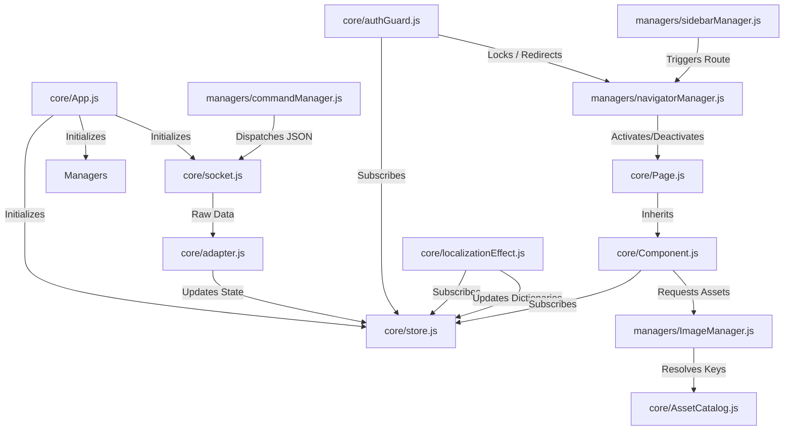

# ECU Simulator WebUI - JS Architecture Documentation

This document describes the JavaScript architecture of the ECU Simulator WebUI, specifically the files in `webui/src/js/core` and `webui/src/js/managers`. It is designed to help an LLM or developer quickly understand the layout, responsibilities, APIs, and inter-dependencies of these modules.

---

## Architecture Overview

The WebUI uses a clean, decoupled Single Page Application (SPA) architecture written in Vanilla ES6 JavaScript:
1. **Centralized Reactive State (`core/store.js`)**: All application state resides in a single, path-addressable Store. Components react to state changes by subscribing to specific paths (e.g., `telemetry.rpm`).
2. **WebSocket Core (`core/socket.js` & `core/adapter.js`)**: Manages the connection, watchdog, background/foreground state, and serializes/deserializes communication with the ESP32.
3. **Component Lifecycle (`core/Component.js` & `core/Page.js`)**: Standardizes rendering, event binding, reactive subscriptions, sub-components, and deferred asset loading.
4. **Dedicated Managers (`managers/`)**: Decouple logic for routing (`NavigatorManager`), overlays (`ModalManager`), side drawer (`SidebarManager`), hardware actions (`CommandManager`), image loading (`ImageManager`), and startup sequence (`BootstrapRequestPipeline`).

---

## 1. Core Modules (`webui/src/js/core/`)

### [App.js](file:///c:/Users/puddu/Documents/Github/ecu-dev-board/idf/webui/src/js/core/App.js)
* **Purpose**: The main bootstrapper and orchestrator of the application.
* **Responsibilities**:
  * Initializes the logging level.
  * Connects and monitors the WebSocket (`Socket`).
  * Injects mock telemetry generators in local/development mode.
  * Dynamically instantiates and mounts page skeletons.
  * Initializes managers and establishes links between them (e.g., binds the sidebar events to the navigator).
  * Triggers initial navigation to the dashboard page.
* **Bootstrap Sequence**:
  1. `initSocket()`: Configures and initiates WebSocket status/message hooks.
  2. Runs mock emulator if `config.useMockData` is enabled.
  3. `renderSkeleton()`: Appends page elements into `.pages-container`.
  4. `initManagers()`: Sets up Navigator, Modal, Sidebar, and Command managers.
  5. `registerPages()`: Binds routing records and event listeners.
  6. `initUI()`: Mounts the static `TopBar`.
  7. Navigates to `dashboardPage`.
* **Important APIs**:
  * `bootstrap()`: Begins the startup process.
  * `initSocket()`: Standardizes socket callbacks and connects.

---

### [AssetCatalog.js](file:///c:/Users/puddu/Documents/Github/ecu-dev-board/idf/webui/src/js/core/AssetCatalog.js)
* **Purpose**: Static catalog defining asset IDs, URLs, priorities, and alt text descriptors.
* **Key Design Decisions**:
  * **Decoupled Identity**: Does not handle fetching or caching (which is delegated to `ImageManager.js`); it only defines identity.
  * **Canonical URL Normalization**: Resolves paths to absolute URLs (via `new URL(url, window.location.origin)`) so that different relative paths (e.g. `./assets/...` and `/assets/...`) map to the exact same cache entry in `ImageManager`.
  * **Priority Levels**: Maps assets to priority weights (HIGH = 10, NORMAL = 5, LOW = 1) to determine download queue sequencing.
  * **Global Fallback**: Exports a lightweight Base64 SVG placeholder (`SHARED_FALLBACK`) to avoid empty image frames or network failures during load.
* **Important APIs**:
  * `getAssetDescriptor(key)`: Returns normalized metadata `{ key, urlOriginal, urlCanonico, priority, fallback, alt }`.

---

### [Component.js](file:///c:/Users/puddu/Documents/Github/ecu-dev-board/idf/webui/src/js/core/Component.js)
* **Purpose**: The base class for all UI elements in the application.
* **Responsibilities**:
  * Provides lifecycle hook callbacks (`onCreate`, `onMount`, `onActivate`, `onDeactivate`, `onDestroy`).
  * Manages reactive key binding: automatically updates local state and calls `update()` when bound Store paths modify.
  * Tracks and cleans up DOM listeners (`addEventListener`) and sub-components (`addChild`, `removeChild`) to prevent memory leaks.
  * Handles localization notifications automatically (`enableI18n`).
  * Integrates with `ImageManager` using a scanning utility (`bindDeferredImages`) that discovers elements with a `data-asset-key` attribute and subscribes them to async loading.
* **Lifecycle Flow**:
  1. `constructor` -> Calls `onCreate()`
  2. `mount(container)` -> Creates DOM via `render()`, triggers `onMount()`, sets up i18n
  3. `bindEvents()` -> Calls `onBindEvents()` to set up DOM listeners, recurses into children
  4. `activate()` -> Subscribes to Store bindings, runs `update()`, calls `onActivate()`, binds deferred images
  5. `deactivate()` -> Unsubscribes from Store, unbinds deferred images, calls `onDeactivate()`
  6. `destroy()` -> Cleans up store subscriptions, i18n hooks, DOM listeners, removes from DOM, and recurses `destroy()` on children
* **Deferred Image Constraints**:
  * Scans only the component's own subtree, explicitly ignoring child component scopes to avoid double-processing.
  * Currently supports only `` elements to maintain clear boundaries.

---

### [Page.js](file:///c:/Users/puddu/Documents/Github/ecu-dev-board/idf/webui/src/js/core/Page.js)
* **Purpose**: An extension of `Component` specifically tailored to represent full-screen views managed by the navigator.
* **Responsibilities**:
  * Provides page structure templates including sub-headers and back buttons.
  * Organizes sub-components by target areas (`header`, `content`, `footer`).
  * Exposes loading overlays (`showLoading`, `hideLoading`) and error callouts (`showError`, `hideError`).
  * Integrates navigation-specific hooks:
    * `handleBack()`: intercept back actions.
    * `canLeave()`: prevent navigation (e.g. check for unsaved form values).
    * `canEnter()`: pre-requisite check (e.g. authentication status).

---

### [adapter.js](file:///c:/Users/puddu/Documents/Github/ecu-dev-board/idf/webui/src/js/core/adapter.js)
* **Purpose**: Maps incoming WebSocket network payloads to the reactive Store.
* **Responsibilities**:
  * Receives raw JSON strings from the socket connection.
  * Parses telemetry types (`sim_telemetry`) and maps incoming values (RPM, TPS, EGT, ignition advance, spark detected) to state keys in `Paths.TELEMETRY`.
  * Normalizes and updates override state values in `Paths.OVERRIDES` (e.g., active flags and user-controlled parameters).

---

### [authGuard.js](file:///c:/Users/puddu/Documents/Github/ecu-dev-board/idf/webui/src/js/core/authGuard.js)
* **Purpose**: Manages PIN locking mechanisms based on parameter values returned by the ESP32.
* **Responsibilities**:
  * Subscribes to `Store.CONFIG.PARAMS` changes.
  * Looks up the security PIN parameter (Parameter ID 41).
  * Computes the dynamic length of the PIN based on the parameter's `max` setting (e.g. a max of 9999 triggers 4-digit zero padding).
  * Compares the padded ESP32 PIN value with the code stored in client `localStorage`.
  * If locked: updates `Paths.APP.AUTH.LOCKED` to true and triggers navigation redirecting the user to the `pinPage` via `replace` (replacing history records so the lock screen cannot be bypassed using the browser back button).
  * Remembers the original destination (`_returnPageAfterUnlock`) to return the user to their original task upon successful unlock.
* **Important APIs**:
  * `verifyPin(userPin)`: Validates user input, saves correct PIN to storage, and unlocks the app.
  * `isLocked()`: Synchronously queries lock status.

---

### [localizationEffect.js](file:///c:/Users/puddu/Documents/Github/ecu-dev-board/idf/webui/src/js/core/localizationEffect.js)
* **Purpose**: Syncs the translation dictionary with the language chosen on the physical hardware.
* **Responsibilities**:
  * Subscribes to `Store.CONFIG.PARAMS`.
  * Identifies the Change Language parameter (Parameter ID 24).
  * Resolves localized strings dynamically from static client-side language files.
  * Atomically updates `Paths.LOCALIZATION.LANGS` and sets the `Paths.LOCALIZATION.CURRENT_LANG_INDEX` in the Store.

---

### [socket.js](file:///c:/Users/puddu/Documents/Github/ecu-dev-board/idf/webui/src/js/core/socket.js)
* **Purpose**: Controls WebSocket network states, reconnections, and multi-session safety.
* **Responsibilities**:
  * **Reconnect Backoff**: Increases timeout delays progressively on connection drop up to a hard retry limit before staying disconnected.
  * **Watchdog Timer**: Automatically transitions to disconnected state if no message is received for `disconnectTimeout` ms.
  * **Visibility Management**: Safe visibility changes. Closes the socket when the browser tab goes to the background (preventing connection accumulation on the ESP32) and reconnects instantly on foreground focus.
  * **Wi-Fi Silence Event**: Listens for the `wifi-silence` event (dispatched during operations that busy the ESP32) to temporarily extend the watchdog timeout window.
  * **Single Session Protection (ONE-WS-PER-IP)**: If the hardware drops the connection with message `FORCED_DISCONNECT|REPLACED` (indicating another browser opened the page), it blocks automatic reconnects and displays a full-screen overlay forcing a manual page reload.
  * **UI State Sync**: Sets the HTML `document.body` opacity to `0.4` during disconnections and `1.0` when connected.
* **Important APIs**:
  * `connect()` / `close()`: Starts and stops connections.
  * `send(msg)`: Safely dispatches payloads.
  * `onStatus(cb)` / `onMessage(cb)`: Registers state change and packet handlers.

---

### [store.js](file:///c:/Users/puddu/Documents/Github/ecu-dev-board/idf/webui/src/js/core/store.js)
* **Purpose**: Centralized reactive state store.
* **Responsibilities**:
  * Uses path strings (e.g., `telemetry.rpm`) to navigate state trees.
  * **Dirty Check**: Skips subscriber updates if the new value matches the old value, with exceptions:
    * `config.menu` updates always fire notifications.
    * First-time sets are always notified.
  * **Async Immediate Trigger**: Re-evaluates subscription hooks immediately upon registration in a deferred execution stack (using `setTimeout(..., 0)`) to avoid side-effects during component rendering.
  * **Replay**: `updateAllListeners()` triggers all callbacks with their current value.
* **Important APIs**:
  * `get(path)`: Synchronously gets path value.
  * `set(path, value)`: Updates path and notifies subscribers if changed.
  * `subscribe(path, callback, immediate)`: Binds callback to path. Returns an unsubscribe function.

---

## 2. Managers (`webui/src/js/managers/`)

### [BootstrapRequestPipeline.js](file:///c:/Users/puddu/Documents/Github/ecu-dev-board/idf/webui/src/js/managers/BootstrapRequestPipeline.js)
* **Purpose**: Handles the initial data request sequence upon connecting to the device.
* **Responsibilities**:
  * Steps through required configurations in a specific order (e.g., params, menus, calibration tables).
  * Dispatches requests, sets a timeout, and waits for a response from the device.
  * If a step times out, it retries up to a maximum attempt limit.
  * If a step fails completely, it reloads the page (capped to 3 reload attempts using `sessionStorage` to prevent infinite reload loops).
* **Important APIs**:
  * `start()` / `reset()` / `stop()`: Controls pipeline execution.
  * `onMessageProcessed(type)`: Confirms a requested data packet has been parsed, advancing the pipeline.

---

### [ImageManager.js](file:///c:/Users/puddu/Documents/Github/ecu-dev-board/idf/webui/src/js/managers/ImageManager.js)
* **Purpose**: Resolves, queues, and caches image and icon assets.
* **Responsibilities**:
  * **ESP32 Flow Protection**: Throttles downloads to a single concurrent connection (`MAX_CONCURRENT: 1`) to prevent overloading the ESP32's lightweight server.
  * **Priority Queue**: Sorts pending assets based on priority (defined in `AssetCatalog.js`) and queue order.
  * **Blob Caching**: Saves downloads as local Blob Object URLs in memory, avoiding redundant network requests.
  * **Dead Subscriber Protection**: Validates if the requesting component is still active (`isValid()`) before applying loaded resources, pruning inactive subscriptions automatically.
* **Important APIs**:
  * `requestAsset(key, subscriber)`: Entry point for components to request assets. Returns `{ status, resource, fallback, subscribed }`.
  * `getLoadedAsset(key)`: Synchronously gets a loaded Blob URL, returning `null` if not cached.
  * `unsubscribe(key, subscriberId)` / `unsubscribeAll(subscriberId)`: Cancels pending asset notifications.

---

### [commandManager.js](file:///c:/Users/puddu/Documents/Github/ecu-dev-board/idf/webui/src/js/managers/commandManager.js)
* **Purpose**: Helper functions to format and send controls to the ECU.
* **APIs**:
  * `toggleOverride(param, active)`: Toggles hardware parameter overrides (`cmd: "toggle_override"`).
  * `setValue(param, value)`: Modifies a parameter value (`cmd: "set_value"`).
  * `injectFault(fault, active)`: Simulates or clears ECU faults (`cmd: "inject_fault"`).
  * `triggerQs()`: Triggers quick-shift ignition cuts (`cmd: "qs_trigger"`).

---

### [modalManager.js](file:///c:/Users/puddu/Documents/Github/ecu-dev-board/idf/webui/src/js/managers/modalManager.js)
* **Purpose**: Coordinates modal display sequences.
* **Responsibilities**:
  * **Queue System**: Displays modals sequentially if multiple are requested.
  * **Preemption**: Modals with higher priority temporarily close and replace the active modal, pushing it back into the queue.
  * Automatically instantiates, mounts, and destroys standard `Modal` components.
* **Important APIs**:
  * `show(config)`: Enqueues a modal using configurations for title, message, priority, buttons, and custom close callbacks.
  * `hide()`: Closes the current modal.

---

### [navigatorManager.js](file:///c:/Users/puddu/Documents/Github/ecu-dev-board/idf/webui/src/js/managers/navigatorManager.js)
* **Purpose**: Client-side routing engine.
* **Responsibilities**:
  * Manages active pages, mapping them to elements in the DOM.
  * Controls page visibility classes (`.active` vs `.left`).
  * **Navigation Stack**: Limits navigation depth up to a configurable maximum (default 3), keeping home page as the base.
  * **PIN Security Guard**: Blocks navigation, back button actions, and history changes if `Store.get(Paths.APP.AUTH.LOCKED)` is true, redirecting access to the `pinPage`.
* **Important APIs**:
  * `registerPage(pageId, pageInstance)`: Registers routing paths.
  * `navigateTo(pageId, data, replace)`: Animates transitions to target screens.
  * `goBack()` / `goHome()`: Navigates back through the stack.

---

### [sidebarManager.js](file:///c:/Users/puddu/Documents/Github/ecu-dev-board/idf/webui/src/js/managers/sidebarManager.js)
* **Purpose**: Controls the navigation sidebar.
* **Responsibilities**:
  * Instantiates and mounts the drawer component.
  * Coordinates clicks on menu links, routing them through `NavigatorManager`.
  * Closes the sidebar panel automatically after triggering a navigation action.

---

## Inter-Module Relationships

---

## Behavior Modification Guidelines

When implementing changes to the WebUI application, refer to the following guidelines:

### Modifying Network Protocol or Commands
* To add a new command sent to the ECU, add a helper function in [commandManager.js](file:///c:/Users/puddu/Documents/Github/ecu-dev-board/idf/webui/src/js/managers/commandManager.js) and call `Socket.send`.
* To parse new incoming parameters or data packets, update the JSON parsing logic in [adapter.js](file:///c:/Users/puddu/Documents/Github/ecu-dev-board/idf/webui/src/js/core/adapter.js) to map the payload values into the corresponding `Store` paths.

### Adjusting the Connection or Watchdog Settings
* To change the watchdog timeout (e.g. how long the app waits before declaring the device offline), change `CONFIG.disconnectTimeout` in [socket.js](file:///c:/Users/puddu/Documents/Github/ecu-dev-board/idf/webui/src/js/core/socket.js).
* To change the exponential backoff reconnection parameters, change the properties under `CONFIG` in [socket.js](file:///c:/Users/puddu/Documents/Github/ecu-dev-board/idf/webui/src/js/core/socket.js).

### Modifying the Security Lock (PIN) Logic
* To change the parameter number used for security or validation checks, update `PIN_PARAM_ID` in [authGuard.js](file:///c:/Users/puddu/Documents/Github/ecu-dev-board/idf/webui/src/js/core/authGuard.js) (or import the constant from `constants.js`).
* To change the redirection screen, customize the target route specified in `_updateAuthState()`.

### Creating a New Component or Page
* Subclass [Component.js](file:///c:/Users/puddu/Documents/Github/ecu-dev-board/idf/webui/src/js/core/Component.js) for generic elements, or [Page.js](file:///c:/Users/puddu/Documents/Github/ecu-dev-board/idf/webui/src/js/core/Page.js) for full-screen pages.
* Ensure you call `super()` in the constructor.
* Declare reactive store keys using the `bindings` configuration in options. Override `update()` to apply state changes to your DOM.
* Clean up manual subscriptions by using `this.subscribeToStore(path, cb)` instead of direct `Store.subscribe()` calls.
* Add your page creation code to `renderSkeleton()` inside [App.js](file:///c:/Users/puddu/Documents/Github/ecu-dev-board/idf/webui/src/js/core/App.js).

### Adding or Modifying Assets (Images/Icons)
* Declare the asset path, priority, and fallback in [AssetCatalog.js](file:///c:/Users/puddu/Documents/Github/ecu-dev-board/idf/webui/src/js/core/AssetCatalog.js).
* In your HTML template, add a `data-asset-key="your-asset-id"` attribute to `` tags. The component's lifecycle hooks will scan the DOM and download the asset via [ImageManager.js](file:///c:/Users/puddu/Documents/Github/ecu-dev-board/idf/webui/src/js/managers/ImageManager.js) automatically.
