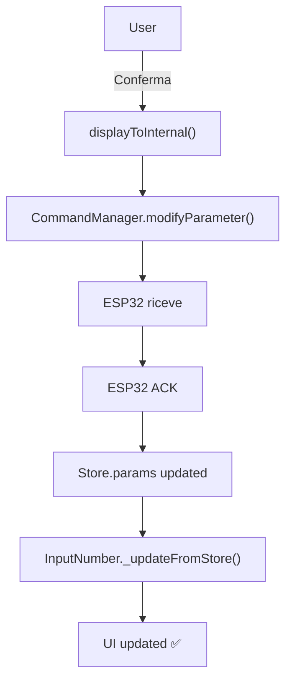

# InputNumber Component

## 📋 Overview

`InputNumber` è un componente parametrico e adattivo per modificare parametri numerici o enum nell'applicazione ESP32-S3 Web UI.

### Caratteristiche principali

- ✅ **Adattivo**: Mostra slider + input per parametri numerici, solo frecce per enum
- ✅ **Gestione Float**: Supporta divisor per convertire valori interni (int) in display (float)
- ✅ **Validazione robusta**: Input manuale con arrotondamento a step e clamp al range
- ✅ **Ciclico**: Incremento/decremento con wrap automatico tra min/max
- ✅ **i18n ready**: Traduzione automatica label e valori enum
- ✅ **Store sync**: Subscription automatica per aggiornamenti in tempo reale
- ✅ **Component lifecycle**: Supporto completo mount/activate/deactivate/destroy

---

## 🎯 API

### Constructor

```javascript
new InputNumber({
  paramId: number,        // ID del parametro (obbligatorio)
  onConfirm: Function     // Callback dopo conferma (opzionale)
})
```

### Props

| Prop | Type | Required | Description |
|------|------|----------|-------------|
| `paramId` | `number` | ✅ | ID del parametro da modificare |
| `onConfirm` | `Function` | ❌ | Callback eseguito dopo invio comando (es: navigazione) |

---

## 📦 Struttura File

```
/components/InputNumber/
├── InputNumber.js      # Componente principale
├── func.js            # Logica e utility functions
├── example.js         # Esempi d'uso
└── README.md          # Documentazione

/css/components/
└── InputNumber.css    # Stili componente
```

---

## 🚀 Utilizzo Base

### Esempio 1: Parametro Numerico Float

```javascript
import { InputNumber } from './components/InputNumber/InputNumber.js';

// Temperatura: 10-40°C, step 0.5, divisor 10
const tempInput = new InputNumber({
  paramId: 10,
  onConfirm: () => NavigationManager.goBack()
});

tempInput.mount(container);
tempInput.activate();
```

### Esempio 2: Parametro Enum

```javascript
// RelayMode: byPass / fan / dispenser / antibatterico
const relayInput = new InputNumber({
  paramId: 20,
  onConfirm: () => NavigationManager.goBack()
});

relayInput.mount(container);
relayInput.activate();
```

---

## 🧮 Logica Parametri

### Tipi Supportati

#### Numerici (con slider)
- `ParamType.NUMBER` → Intero puro
- `ParamType.FLOAT` → Float (gestito con divisor)

#### Enum (solo frecce)
- `ParamType.BOOL` → true/false
- `ParamType.PRESSURE_TYPE` → Tipi pressione
- `ParamType.AUX_TYPE` → Tipi ausiliari
- `ParamType.RELAY_MODE` → Modalità relè
- `ParamType.LANG_TYPE` → Lingua

### Conversione Float

I parametri float sono memorizzati come **interi** nello Store e nell'ESP32.

```javascript
// Display → Internal (per invio comando)
internalValue = Math.round(displayValue * divisor)

// Internal → Display (per visualizzazione)
displayValue = internalValue / divisor
```

**Esempio**: Temperatura 23.5°C con `divisor=10`
- Display: `23.5`
- Internal: `235` (inviato a ESP32)

### Arrotondamento Step

Tutti i valori vengono arrotondati al più vicino multiplo di `step`.

```javascript
// Input utente: 21.56
// Step: 0.1
// Risultato: 21.6 (arrotondamento matematico)
```

### Validazione Input Manuale

Quando l'utente inserisce un valore manualmente:

1. ❌ **NaN o vuoto** → Ripristina valore precedente
2. ❌ **Fuori range** → Ripristina valore precedente (NO clamp)
3. ✅ **Nel range** → Arrotonda a step e accetta

**Esempio**:
- Valore corrente: `20`
- Range: `[10, 50]`
- Input: `70` → ❌ Ripristina `20` (non clamp a 50)
- Input: `5` → ❌ Ripristina `20` (non clamp a 10)
- Input: `25.46` → ✅ Accetta `25.5` (arrotonda a step 0.1)

---

## 🎨 UI Behavior

### Parametri Numerici

```
┌─────────────────────────────────────┐
│  ◀    23.5°C    ▶                   │ ← Arrows + Display
│                                      │
│  ━━━━━━━●━━━━━━━━━━                  │ ← Slider
│  10°C               40°C             │ ← Min/Max labels
│                                      │
│  [ Default ]  [ Conferma ]           │ ← Action buttons
└─────────────────────────────────────┘
```

- ✏️ Click su valore → Diventa editabile
- 🎚️ Slider → Aggiorna valore in tempo reale
- ⬆️⬇️ Frecce → Incremento/decremento ciclico

### Parametri Enum

```
┌─────────────────────────────────────┐
│  ◀    Fan    ▶                      │ ← Solo arrows + Label
│                                      │
│  (no slider)                         │
│                                      │
│  [ Default ]  [ Conferma ]           │
└─────────────────────────────────────┘
```

- ❌ Slider nascosto
- ❌ Input manuale disabilitato
- ⬆️⬇️ Solo frecce per navigare opzioni
- 🌍 Label tradotta automaticamente

---

## 🔄 Component Lifecycle

```javascript
const input = new InputNumber({ paramId: 10 });

// 1. MOUNT - Renderizza DOM e bind eventi
input.mount(container);

// 2. ACTIVATE - Refresh UI (es: quando torni alla pagina)
input.activate();

// 3. DEACTIVATE - Pausa (componente resta montato)
input.deactivate();

// 4. DESTROY - Rimuove DOM e unsubscribe
input.destroy();
```

---

## 📡 Store Integration

### Subscription Automatica

Il componente si **subscribe automaticamente** a `Store.params`:

```javascript
// Nel componente:
this.subscribeToStore(Paths.CONFIG.PARAMS, (params) => {
  const updated = params.find(p => p.id === this.paramId);
  if (updated) {
    this.config = updated;
    this._updateFromStore(); // Aggiorna UI
  }
});
```

### Flusso Conferma



---

## 🌍 i18n Support

### Traduzioni Automatiche

Il componente traduce automaticamente:

- ✅ Pulsanti (`Default`, `Conferma`)
- ✅ Label enum (via `enumMappings.js`)

### Esempio Enum Tradotto

```javascript
// RelayMode con lingua IT (index 0)
value: 0 → "By-Pass"
value: 1 → "Ventola"
value: 2 → "Dispenser"
value: 3 → "Antibatterico"

// RelayMode con lingua EN (index 1)
value: 0 → "By-Pass"
value: 1 → "Fan"
value: 2 → "Dispenser"
value: 3 → "Antibacterial"
```

---

## 🧪 Testing

### Test Manuali

1. **Parametro Float**
   - Verifica slider aggiorna valore
   - Verifica input manuale arrotonda a step
   - Verifica input fuori range ripristina precedente
   - Verifica frecce ciclano tra min/max

2. **Parametro Enum**
   - Verifica slider nascosto
   - Verifica frecce ciclano tra valori
   - Verifica label tradotta
   - Verifica input manuale disabilitato

3. **i18n**
   - Cambia lingua → Verifica pulsanti tradotti
   - Per enum → Verifica label cambia

4. **Store Sync**
   - Invia comando → Attendi ACK ESP32
   - Verifica valore aggiornato automaticamente

---

## 📝 Notes

### Differenze con InputTimer

| Feature | InputTimer | InputNumber |
|---------|-----------|-------------|
| Tipo dato | Solo TIME (secondi) | NUMBER, FLOAT, ENUM |
| Display | h:m:s separati | Valore singolo + unità |
| Slider | ❌ No | ✅ Sì (per numerici) |
| Editabilità | Ogni unità (h/m/s) | Intero valore |
| Enum | ❌ No | ✅ Sì |

### Performance

- ⚡ DOM refs cachati per velocità
- ⚡ Subscription filtrata su `paramId` specifico
- ⚡ Slider progress calcolato solo al cambio valore

---

## 🐛 Troubleshooting

### Il valore non si aggiorna dopo conferma

✅ **Verifica**:
1. ESP32 ha inviato ACK?
2. `Store.params` è aggiornato?
3. `paramId` corrisponde?

### Slider non si vede per parametro numerico

✅ **Verifica**:
1. `config.type` è `ParamType.NUMBER` o `FLOAT`?
2. Non è un enum type?
3. CSS `InputNumber.css` è importato?

### Enum mostra valore invece di label

✅ **Verifica**:
1. `enumMappings.js` ha mapping per quel tipo?
2. `currentLang` è valido?
3. `getEnumValue()` funziona?

---

## 📚 References

- `Component.js` - Base class
- `Store.js` - State management
- `CommandManager.js` - ESP32 communication
- `enumMappings.js` - Enum translations
- `i18n.js` - Internationalization

---

**Version**: 1.0.0  
**Author**: FogExtra Team  
**Last Update**: 2025-10-18
