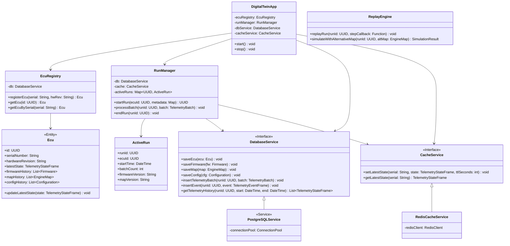
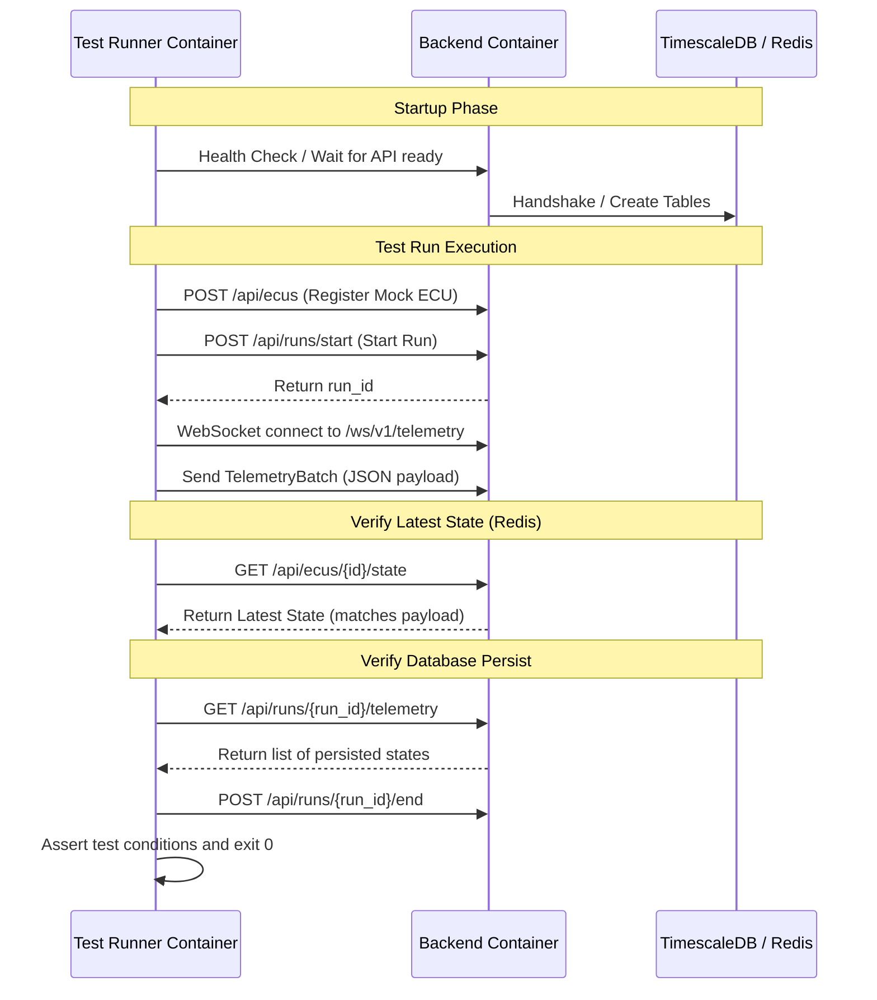

# Implementation Plan - ECU Digital Twin Containerization and Server Design

This plan outlines the implementation of a basic version of the ECU Digital Twin on Docker, aligning with [digital_twin.md](file:///c:/Users/puddu/Documents/Github/ecu-dev-board/idf/docs/dt/digital_twin.md) and [basic_sensor_telemetry_core.md](file:///c:/Users/puddu/Documents/Github/ecu-dev-board/idf/docs/telemetry/basic_sensor_telemetry_core.md). It details the architecture, integration testing setup, backend OOP structure, and the removal of Nginx in favor of Dokploy's Traefik ingress.

## Ingress Design & Frontend Deployment

Since this stack will be deployed on **Dokploy**, which runs **Traefik** as the default edge router and reverse proxy:
- **No internal Nginx container is needed**: Having Nginx run inside Docker Compose behind Traefik adds unnecessary complexity, extra CPU/RAM overhead, and dual-layer configuration.
- **Frontend Deployment**: The WebUI is a separate deployment and shall not be included in the server repository's Docker Compose stack. Dokploy shall deploy and route the WebUI and backend independently through Traefik.
- **Direct Service Routing**: We will expose the backend (implemented in Python using FastAPI) directly to Traefik using Dokploy's native configurations or standard Docker labels. Traefik will handle SSL termination, load balancing, and WebSocket headers (`Upgrade`, `Connection`) automatically. The server Compose stack therefore contains only the backend, PostgreSQL/TimescaleDB, Redis, migrations, and—in the test configuration—the integration-test runner.

---


## Proposed System Architecture & OOP Class Diagram

### Server Backend Class Diagram

The following diagram illustrates the Object-Oriented design of the Main Server backend, separating concerns into controllers, domain entities, repositories, and replay engines:



### Architectural Decisions & Implementation Details

#### Backend Stack
The backend is implemented in Python using FastAPI.
The persistence stack uses:
- **Database**: PostgreSQL with the TimescaleDB extension.
- **ORM & Driver**: SQLAlchemy asynchronous APIs with `asyncpg` as the PostgreSQL driver.
- **Migrations**: Alembic for schema migrations.
- **Cache**: `redis-py` through `redis.asyncio`.

#### Active Runs
- **Authoritative Source**: PostgreSQL is the authoritative source for active-run state.
- **Redis & In-Process Cache**: Redis may store short-lived run leases, heartbeats, and the latest ECU state. An in-process dictionary may be used as a cache, but neither Redis nor process memory determines whether a run exists.
- **Resilience**: Each run stores its current status, heartbeat, and last committed telemetry sequence. After a backend restart, interrupted runs can be detected and resumed without creating duplicate runs.

#### Alternative-Map Evaluation
- **Replay**: The first server version implements deterministic run replay.
- **Alternative-Map Evaluation**: Alternative-map evaluation will later recalculate ECU command outputs using the recorded inputs and a versioned copy of the ECU map algorithm. It may calculate values such as alternative ignition advance or injection command and compare them with the recorded commands.
- **Boundaries**: It shall not claim to predict the resulting RPM, torque, knock, temperature, or combustion behavior.
- **Placeholder**: Until the real evaluator is available, this feature is disabled or returns a clear `not_implemented` result. It shall not produce mocked simulation results.

---

## Ingestion Flow & Serialization mapping

We serialize the C++ `TelemetryBatch` record structure from [basic_sensor_telemetry_core.md](file:///c:/Users/puddu/Documents/Github/ecu-dev-board/idf/docs/telemetry/basic_sensor_telemetry_core.md) into JSON:

1. **Client Bridge**: The Client WebUI receives raw binary or JSON telemetry packets from the ECU, preserves the original ECU monotonic timestamp (browser UTC receive time and synchronization information may be added, but they shall not replace ECU timestamps, as ECU monotonic time remains authoritative for ordering, replay, revolution association, and timing analysis), and forwards them to the server via WebSockets (`/ws/v1/telemetry`).
2. **WebSocket Ingestion**: The WebSocket ingestion path validates the batch and places it in a bounded `asyncio.Queue` managed by `RunManager`.
3. **Database Write**: One or more dedicated writer tasks process the queue, perform a bulk database transaction to `PostgreSQLService` (TimescaleDB), and send a persisted acknowledgement back to the sender only after the transaction commits. The latest state is also updated in `RedisCacheService`.
4. **Backpressure**: Recorded telemetry shall not be silently dropped when the queue is full. The server applies backpressure by delaying further reads or acknowledgements.
5. **Single-Instance Simplicity**: An external broker such as RabbitMQ, Kafka, or Celery is not required for the first single-instance implementation.

---

## Integration Testing & Mock verification Container

To test the entire system automatically, we propose a **Test Runner** container that acts as a headless integration tester. It executes a test script to simulate the ECU and Client behavior. The integration-test container uses Python, with `pytest`, `pytest-asyncio`, HTTPX, and `websockets`.



### Test Runner Docker Configuration (`docker-compose.test.yml`)
```yaml
version: '3.8'

services:
  db:
    image: timescale/timescaledb:latest-pg15
    environment:
      POSTGRES_USER: test_user
      POSTGRES_PASSWORD: test_password
      POSTGRES_DB: test_db

  redis:
    image: redis:7-alpine

  backend:
    build:
      context: ./backend
    environment:
      - DATABASE_URL=postgresql://test_user:test_password@db:5432/test_db
      - REDIS_URL=redis://redis:6379/0
    depends_on:
      db:
        condition: service_healthy
      redis:
        condition: service_started

  # Headless integration test runner container
  test-runner:
    build:
      context: ./integration-tests
      dockerfile: Dockerfile.test
    environment:
      - BACKEND_URL=http://backend:8000
      - BACKEND_WS_URL=ws://backend:8000/ws/v1/telemetry
    depends_on:
      - backend
```

---

## Proposed Changes

### [NEW] [docker-compose.yml](file:///c:/Users/puddu/Documents/Github/ecu-dev-board/idf/docker-compose.yml)
Contains the production-ready Docker Compose services excluding Nginx (letting Traefik route traffic directly).

### [NEW] [docker-compose.test.yml](file:///c:/Users/puddu/Documents/Github/ecu-dev-board/idf/docker-compose.test.yml)
Defines the localized isolation-test compose stack including the `test-runner` integration testing service.

---

## Verification Plan

### Automated Tests
1. **Local Test Execution**:
   Run the isolation tests using:
   ```bash
   docker-compose -f docker-compose.test.yml up --build --exit-code-from test-runner
   ```
   If the `test-runner` exits with code `0`, the integration test succeeds.

### Manual Verification
1. Verify database schemas are properly created by inspecting table logs.
2. Confirm the cache timeout matches expected behaviors (e.g., verifying telemetry updates show "offline" when the simulator container is stopped).
